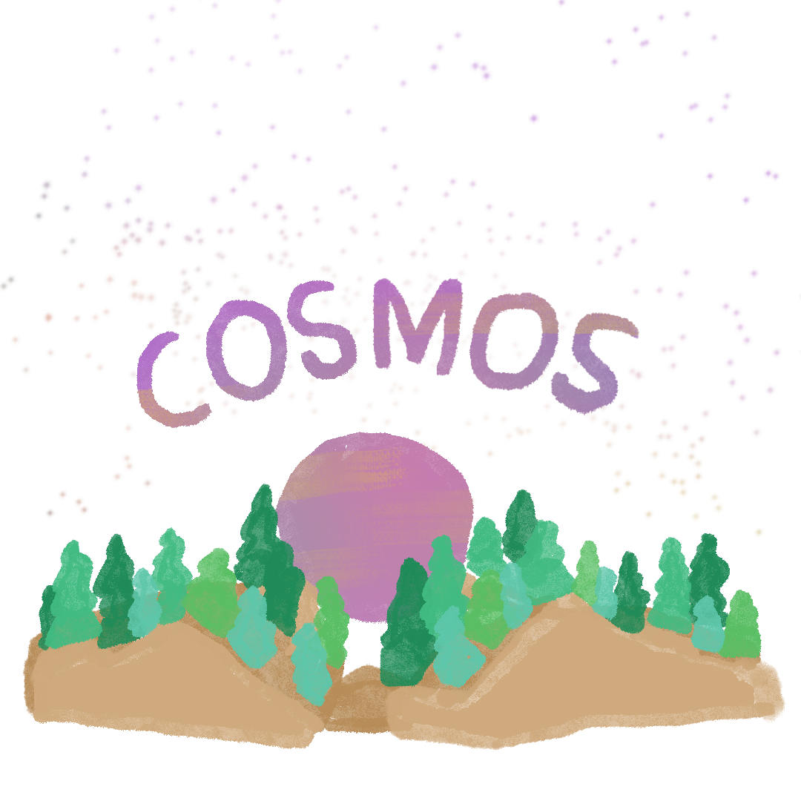

# Cosmos Keyboards

The most adaptable generator for ergonomic mechanical keyboards there is.

<p align="center">
   <a href="https://ryanis.cool/cosmos"></a>
</p>

[Cosmos](https://ryanis.cool/cosmos) is released under an open-core model. 95% of the generator is free and open-source. Pro features (rounded edges, the stilts model, and wrist rests) are not.

## Generator

Most generator code lives at [`src/lib`] and[`src/routes/beta`]. Some files used for pre-generating STEP & GLB files used in the generator are located at [`src/model_gen`].

[`src/lib`]: https://github.com/rianadon/Cosmos-Keyboards/tree/main/src/lib
[`src/routes/beta`]: https://github.com/rianadon/Cosmos-Keyboards/tree/main/src/routes/beta
[`src/model_gen`]: https://github.com/rianadon/Cosmos-Keyboards/tree/main/src/model_gen

To run the generator locally, you'll need to [clone] the repository and [have installed Node.js][nodejs]. Then run these commands on the command line:

[clone]: https://docs.github.com/en/repositories/creating-and-managing-repositories/cloning-a-repository
[nodejs]: https://nodejs.org/en/learn/getting-started/how-to-install-nodejs
[OpenSCAD]: https://openscad.org/downloads.html

```bash
cd Cosmos-Keyboards
npm install # Installs dependencies
mkdir target
make # Compiles protobuf files
make parts # Generates the mx switch geometry
make keycaps-simple2  # Generates keycaps used for collision detection; Ignore the errors
make keycaps2 # Generates geometry for all the keycaps
npm run dev # Hosts and live-reloads the webpage

# Optional
make keyholes # (requires Java and Leiningen): Generates backwards-compatible Dactyl keyholes
export OPENSCAD=$(which openscad) # For the next 2 commands: sets var to openscad executable
make keycaps-simple # Alternative to make keycaps-simple2; Requires OpenSCAD
make keycaps # Alternative to make keycaps2; Requires OpenSCAD
```

Then visit [`http://localhost:5173/beta`](http://localhost:5173/beta).

If you're using Windows and don't have access to the `make` command, you can piece together the commands that are run by referencing the `Makefile` and running them yourself. Or just [install make](https://stackoverflow.com/a/73862277) :)

The `make keycaps-simple2 keycaps2` scripts use a web assembly version of Manifold to render models (and OpenSCAD for running the scripting parts of the scad files), but the translation layer I wrote is not 100% accurate. _Some stuff will be broken, like collision detection for OEM keycaps (expect error-like message to be printed). The relative proportions of keys are not fully correct either, but the scripts are more than good enough for local development._ The `make keycaps-simple keycaps` scripts are what I use for the production site, but they require a recent version of [OpenSCAD](https://openscad.org/downloads.html) (at least 2023) and the Linux version of OpenSCAD seems to struggle rendering the keycaps for some reason. If you wish to use these, either set the `OPENSCAD` environment variable to the location of the OpenSCAD executable or symlink the executable to `target/openscad`.

To generate docs there are a few more commands:

```bash
npm install --include=optional # Make sure optional dependencies are installed
make keyboards # Generates images of keyboards used in the docs.
npm run doc
```

### Contributing

I recommend you first follow the steps above to run the generator locally so that you can test your changes. If you're interested in:

- Adding support for new parts (such as a display or trackball)
- Adding a new microcontroller to the generator

Then follow the instructions [in the documentation](https://ryanis.cool/cosmos/docs/contributing) (source is in `docs/docs`) for complete guide on how to do this.

Otherwise if you're looking to change how the generated keyboards look, the three files you'll be interested in are:

- [`src/lib/worker/geometry.ts`]
- [`src/lib/worker/cachedGeometry.ts`]
- [`src/lib/worker/model.ts`]

[`src/lib/worker/geometry.ts`]: https://github.com/rianadon/Cosmos-Keyboards/tree/main/src/lib/worker/geometry.ts
[`src/lib/worker/cachedGeometry.ts`]: https://github.com/rianadon/Cosmos-Keyboards/tree/main/src/lib/worker/cachedGeometry.ts
[`src/lib/worker/model.ts`]: https://github.com/rianadon/Cosmos-Keyboards/tree/main/src/lib/worker/model.ts

Rendering in Cosmos is split into two parts: geometrical calculations (which determines where parts go), and modeling operations (building the 3d model in OpenCascade). The files `geometry.ts` and `cachedGeometry.ts` perform those geometrical calculations (with the latter acting as a higher-level wrapper over functions in the former), and `model.ts` is responsible for all 3d modeling operations.

## Hand Scanning

The code is at [`src/routes/scan`](https://github.com/rianadon/Cosmos-Keyboards/tree/main/src/routes/scan). Most of the processing happens in [`lib/hand.ts`](https://github.com/rianadon/Cosmos-Keyboards/tree/main/src/routes/scan/lib/hand.ts).

Please feel free to use either GitHub or Discord for submitting issues.

### Building your own keyboard app?

I'm planning on building out an API to make it easy for users to share their scanned hand data with other keyboard-related websites. If you maintain a keyboard-related site and are interested in adding a way for visitors to quickly see how your keyboard fits their hand, send me an email at.cool. You can of course use this code to build out your own hand scanning solution, provided you abide by the terms of the [AGPL-3.0 license](https://github.com/rianadon/Cosmos-Keyboards/blob/main/LICENSE).
