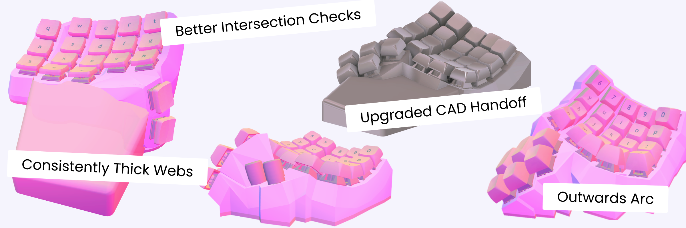
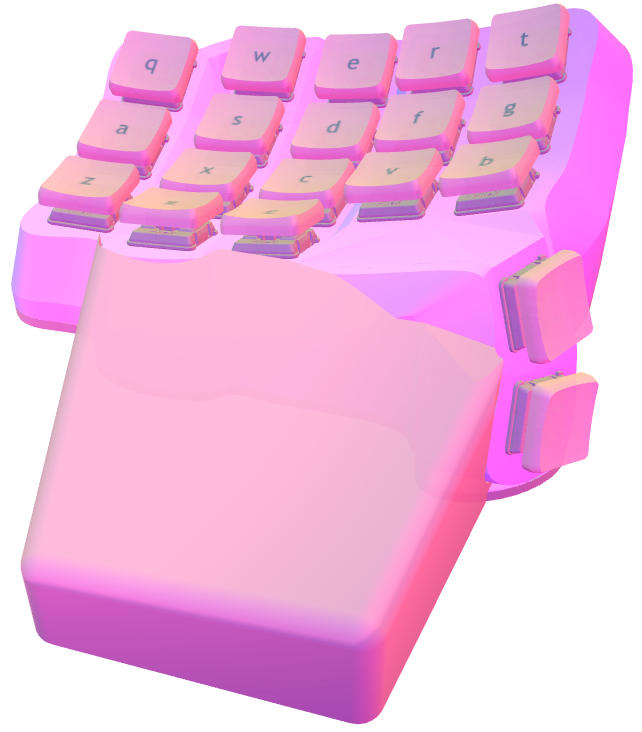
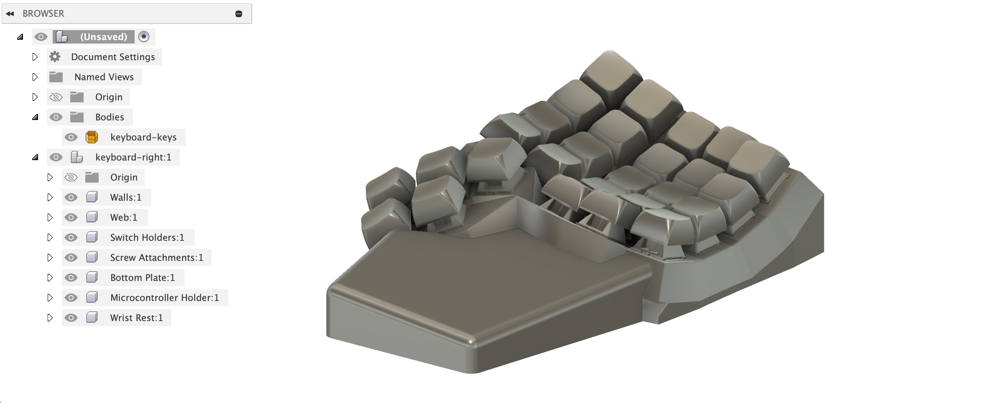
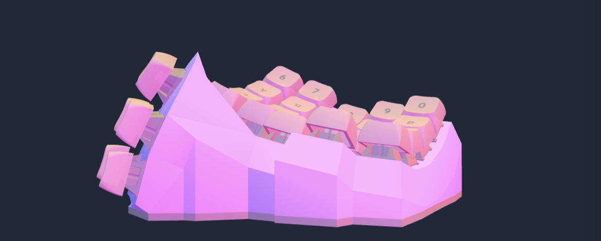

# The Better-Geometry Release

{ .header }

Keyboards with vertical thumb clusters! Plus consistently thick parts when staggering keys to fit your hand and stable STEP export.

<!-- more -->

The big highlight of this update are the [new algorithms](./thickening-walls.md) for making the part thickness around the keys consistently thick. Now, you can make wacky stuff [like this](https://ryanis.cool/cosmos/beta#cf:ChYIBRAFWAAYBCAFKNIBMM0BUAJAAEgAWpUBChEIy4vMpdAxEI3FlK3is4rkARIRCKCDoIzACBDCmaCVkLyB5AESDwi8ieAwENCVgN2Q9YPkARIQCPSWiqgFEMKZoJWQvIHkARIPCP+DwI3ABxDmmfSnkItyEhEIq4Wcj7ANEPCZzLXQsIDkARIRCN6Sh5jfQBCOoZCdkpCC5AESEwiEhZSVsJeCARCim+CU8tCB5AE=):

{ width=500 .center .pad }

Or [like this](https://ryanis.cool/cosmos/beta#cf:ChYIBBAFWAAYBSAEKNcBMM0BUAJAAEgAWjkKEQjFjbSf4AEQl9HUvILTi+QBEhEIoIOgjMAIEMKZoJWQvIHkARIRCJ+FoI3ABxCsnbS8oL2A5AFCUwgD4AEBeAbYAQEQAUgASABIAEgASABIAEgAYABoAHABGAAgASgBmAHYBKgB8AagASewAcgBkAGEB7gBAIABADAAOChYCogBAcABAMgB2ATQAYQH):

{ width=400 .center .pad }

Both of these are made using the custom thumbs mode. By pressing ++p++ or clicking the up icon in the toolbar, you can move and rotate the whole thumb cluster at once.

## Keyboards Always Generate

I've removed the restriction that the sockets in the 2D Keys view must not intersect. Instead, I've added intelligent checks utilizing the geometry of switches and sockets. You'll be warned if either of these parts intersect, but the warnings won't stop your keyboard from generating.

In total, Cosmos's intersection checks now include 3 errors and 2 warnings:

Keycap + Walls Intersect
Keycaps Intersect
Parts Intersect

Sockets Intersect
Socket + Walls Intersect

To prevent intersections in 2D view, sockets automatically separate themselves until they no longer intersect. This change allows designs with high-curvature to now successfully generate.

## Outwards Arc

{ width=500 .center .pad }

In the spirit of creating high-curvature keyboards (like [the one pictured](https://ryanis.cool/cosmos/beta#cf:ChYIBRAFWAAYASAFKM0BMM0BUAJAAEgAEhEIxgoYyhEg5Qg4jgIoWjC4CCoMCMEDEIMHGMgBIM0BUhQwJwgAEIDwTBiAzvABIAAoqO7BAkJTCAPgAQF4BtgBARABSABIAEgASABIAEgASABgAGgAcAEYACAAKACYAfQDqAHoB6AByAGwAQCQAYQHuAEAgAEAMAA4KFgBiAEBwAEAyAHYBNABhAc=)), there's a new curvature settings: Outwards Arc. This parameter bends the keys outwards, which allows you to push them closer together while avoiding any intersections. If you have smaller hands, this is for you!

## Upgraded CAD Handoff

{ .center }

STEP export should be more stable now, due to work both removing imperceptibly small geometry that tripped up CAD programs and better utilizing OpenCascade. It's the perfect time to improve this handoff as you may wish to fillet some of the edges produced by the updated webs.

Speaking of which, the same STEP files work with both OnShape and Fusion. No more stitching walls together.

GLB Files are also downloadable for rendering. If you'd like to render your keyboard in Blender (or any other 3D software), these files contain keyboard, keycap, and switch geometry. They're also useful for importing keycaps and switches meshes into Fusion. I've detailed the process in the [CAD docs](../../docs/cad.md).

## And More...

Since this release took a while, I've bundled in a lot more:

- The thickness view has new colors and more accurate thickness measurements, making it easier to identify problematic areas.
- Spacing values for Choc switches (and all switches for that matter) are now accurate. I've figured out how to reconcile spacing values and Cosmos's adaptive key placement, and the way things work in basic/advanced mode should feel just as intuitive. For expert mode, you can read the details [here](../../docs/expert.md#how-keys-are-positioned).
- Key sockets preview faster. This is especially noticeable with the built-in-hotswap socket, which now previews just as fast as the others. Be on the lookout for even faster previews in the future! Changes for making these instant are in the works.
- The Choc keycaps were too big, but now they're accurately sized. The socket's boundary is smaller as well to match the keycap size.
- Toggling Developer Mode in the [parts](../../parts) or [keycaps](../../keycaps) pages allows enables the new Dev Mode view within the generator. This page is helpful if you're modifying the generator's source and is on by default in local builds.
- The microcontroller has grooves to slide in soldered microcontrollers, and 4 column boards include pinky keys.

That's all till the next release! If you're interesting in the math and algorithms behind these updates, check out the [technical post](./thickening-walls.md).

{ width=540 .center }

--8<-- "docs/blog/.footer.md"
