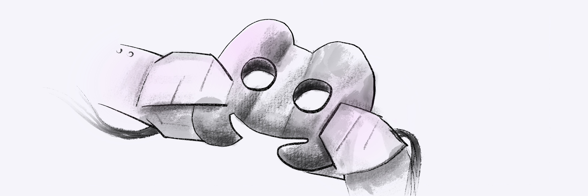
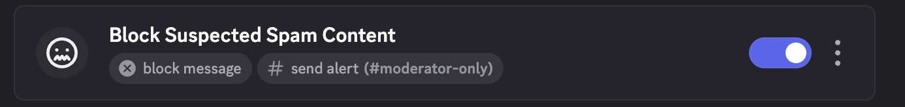
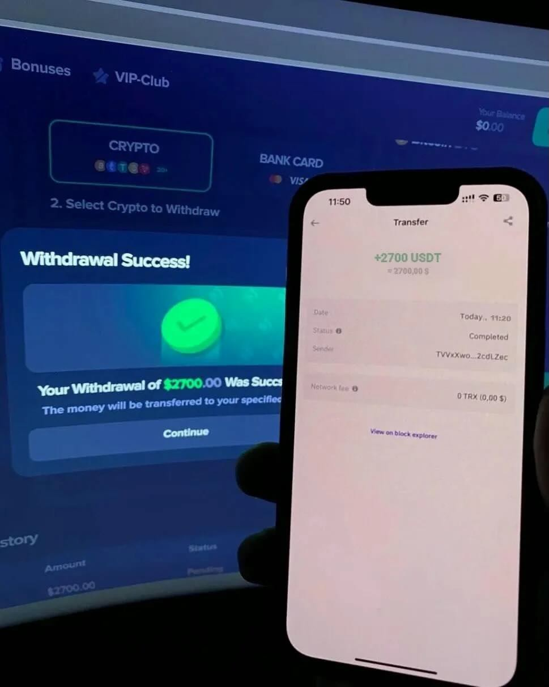
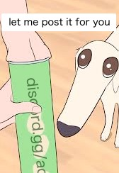
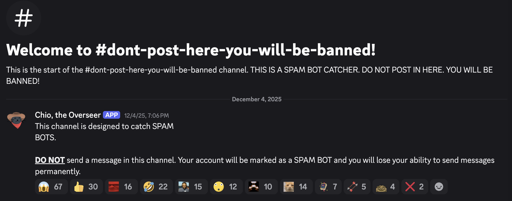
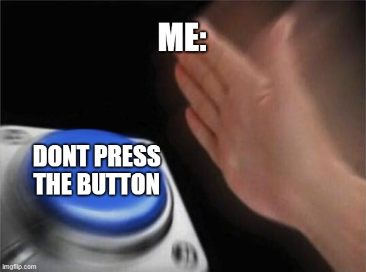

# Solutions for Discord Spam

{ .header }

I get spam phone calls, spam emails, and now that I run a public Discord server, spam on Discord. It's not fun at all, and Discord's built-in anti-spam tools are ineffective at obstructing the unwelcome messages. Read on to see how I put a stop to this madness.

<!-- more -->

<figure markdown>
   { width=90% .center }
   <figcaption markdown>This only blocks about 10% of all spam.</figcaption> </figure>

Since the start of the year, I've been able to keep my server spam-free, with no involvement on my part. Because spam is prevalent across Discord, I figured it would be helpful to share my solutions so that other server owners can benefit. After all, it would be nice if we all could take a vacation without worrying about _Benjamin_ sending his crypto investing proposition to every channel while we're gone.

## Spam Campaigns Lack Creativity

If I've learned anything from the unfortunate experience of reading every spam message that leaked into my server, it's that they fit into only 3 different campaigns:

_Warning: may contain sarcasm. All messages are real ones I've seen._

1. **Links to Join a Server.** They sometimes promise what great, sensual things you will supposedly find if you join their server. You know what I mean. I have no idea what _truly_ goes on in these servers. Maybe fake OnlyFans? I don't intend to find out.

   Usually this invite is sent to every channel in the server, and sometimes the spammer pings everyone, because it's just really important you know about this.

   

    

    
spamlord3000

    discord.gg/████████████ @everyone
    

2. **Make Money with Me.** Whether it be dropshipping or investing, they share a simple hook: The spammer brags about how much money they have made and invites you to join them. It seems like a romance scam but where you skip the romance part. That's to say, a scam.

   This first message is the spam I've seen the most. The spammer keeps the same exact text, including that strange uppercase HOW, but substitutes their own contact information.

   

    

    
hunter2

    I'll help the first 10 people interested in how to start earning $100k or more from the crypto market within 72 hours but you will reimburse me 10% of your profits when you receive it. Note: Only interested people should send me a dm! ask me (HOW) via Telegram or WhatsApp ████████████
    

   

    

    
sixseven

    I’m 17 and still in school. I tried betting, trading, reselling—none of it worked and honestly it was discouraging. I kept experimenting until I finally found something that clicked for me: dropshipping. Now I’m making around $3K per day, and it’s the first time I’m seeing real results. If you’re on your own grind, don’t quit. DM me or send a friend request and I’ll happily share tips
    

3. **Fake Images of Fake Money.** Rather than any text, they post an image showing a successful transaction. If it worked for them, of course it's going to work for you, right? It's not like they could be stealing your money by deceiving you into sending cryptocurrency to a difficult-to-trace wallet. Besides, they photoshopped Mr. Beast and Elon Musk tweeting about it, so you know it's legit.

   The spammers are so insistent you know about this secret, exclusive opportunity that they send these images to every channel in the server. Thanks, really appreciate it.

   

    

    
spayum

    
    

The close similarity of spam messages makes any spam response, even if it overfits to a certain writing style or word usage, surprisingly effective. You'd think the rising popularity of LLMs would make these scammers smarter, but it seems the only creative writing they can do is substituting in their own Whatsapp number into a copy-pasted message.

Nevertheless, the solutions I'm sharing below are pretty general that I believe they'll catch new types of spam as they're rolled out to to spammers worldwide.

## A Good Block Words Setup

All the spammers seem to want something out of you. If they were spamming fun facts about penguins, then they're just a troll. _Did you know that we call a group of penguins in water a raft, but when they're on land we call them a waddle? There's also 8 species of crested penguins, penguins with those yellow crowns on their foreheads. Not only are 3 of those species rockhopper penguins (that's Cody from_ Surf's Up*), but the coolest sounding species of crested penguin has to be macaroni penguins!* Now that the penguin facts have been delivered, let me continue. The scammers aren't in it for the trolling–if they were, they'd be more creative with their word choices. They're in it for the money.

One of the most effective ways I've found with blocking them is to block their ways of getting the victim off the platform. They can't scam you in public, because others will catch on and dissuade you from paying the scammer. The three most common methods I've seen them employ are linking to another discord server, a telegram channel, or a whatsapp number. Therefore, I've blocked all messages sending contact info for these platforms. It sucks that people can't share discord links, but this is something I've seen other servers do as well. Their solution is to have a moderator post the link themselves in place of the original poster.

{ width=168 .center }

Here's a list of most of the words I block, using _AutoMod -> Block Custom Words_:

- `*discord.com/invite*, *discord.gg*`: Blocks links to Discord servers.
- `telegram`, `whatsapp`: Blocks messages that are trying to send you to telegram/whatsapp.
- `$100k`, `dropshipping`: Blocks financial scams. As I've mentioned before, these use the same copy, so `$100k` catches most of them.
- `@everyone`: Blocking users from using @everyone in server permissions stops the pings, but it doesn't stop the messages from sending. Having this in your block words stops scammers, who are the only people inconsiderate enough to use @everyone.

The nice thing about block words is that Discord itself prevents the message from sending. That way, you no longer wake up to every channel looking like it has unread messages, and anyone brave enough to have notifications for all messages enabled doesn't get a notification.

## Fighting Spam Requires a Bot

Unfortunately, block words don't go far enough on their own. In the case of image spamming, there's no possible way to filter images with Discord's built in tools. Let me repeat so the point is clear: With Discord's built-in tools, you cannot block all the platform's spam! This saddens me because running a bot is something not many users have the know-how or means to do. Third-party bots aren't a solution either, because who knows what that bot is doing with your data.

Anyways, I already run a custom bot for assigning reaction roles, so the next step in spam prevention was to make the bot detect and block spam.

The most annoying spam to deal with is spammers who send the same message to every single channel. One approach I've seen in several servers is to create a [honeypot](https://en.wikipedia.org/wiki/Honeypot_(computing)) channel, like `#dont-post-here-you-will-be-banned!`. If you send anything there, all your recent messages are deleted and you're instantly timed out/kicked/banned.

This is the simplest way to deal with the problem, but I don't like it because:

1. Depending on what order the spammer decides to spam each channel, the honeypot may only catch the spammer after they've sent their message to every other single channel, making them all appear unread and delivering notifications to anyone who has that enabled.
2. I'm conceding to the spammers by making a channel just for them. What good did they do to deserve their own channel? My channels are only supposed to be for good folk.
3. Intrusive thoughts.

{ width=350 .center }

My approach is a little more complex but has worked thus far. I posit that sending the same message across more than one channel, at any time, is bad. I think that's a perfectly fine line to draw, but as cross-posting is sometimes allowed and encouraged on other social media, there's a chance that someone with good intentions breaks the rule.

I make the consequences minor (a 3 minute timeout), but significant enough to put a temporary pause to the spam campaign. I also delete the duplicated message from all channels, and the bot sends a DM to the user explaining what happened.

Cosmos Bot

This is Cosmos Bot. Spam is a pretty big problem on Discord, so I take aggressive anti-spam maneuvers including blocking cross-posting (sending the same message to multiple channels). 
 
You've been timed out for a few minutes. I apologize if you're a human. The timeout is to stop spam bots from continuing to spam. 
In the future, please post your message in only one channel. If you realized you posted to the wrong channel, delete the original message first. 
Don't worry, the active server members read every message no matter in which channel it's posted. 

The Bot takes action after the same message is sent to any 2 channels, so it times out the spammer sooner than the honeypot channel method. The bot took a while to tune as I did not realize the Discord API sends images in a separate field than the rest of the message content. Roadbumps notwithstanding, the bot has been running smoothly since I started modifying it to catch spam.

I've published the bot's source, which is a fork of another Discord bot, to [https://github.com/rianadon/ReactionRoleBot](https://github.com/rianadon/ReactionRoleBot) if you'd like to adapt it for your own purposes. It's there just for your own reference, I'm not going to be maintaining or upstreaming my fork.

Anyways, that's how I've been fighting back against the spam. Hopefully you learned a few things or were at least entertained.
