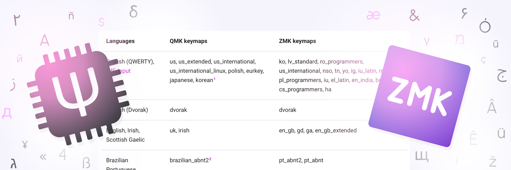

# Comparing QMK and ZMK Language Support

{ .header }

If you get your keyboard firmware from an American and try to use it in Germany, your ++y++ key will type **z**. I'll explain why later on, but this example is to show that supporting language-specific OS layouts is critical to making a keyboard type what it's supposed to. The QMK and ZMK firmwares solve this problem by creating headers to add to your firmware for some/most languages' layouts. Here I'll be comparing what layouts both firmware support and which ones only one support.

<!-- more -->

I'm doing this not because I like creating tables or telling you that you should use X not Y, but rather I need to figure out how to structure the planned layout selection for Cosmos. Right now the generator only supports English QWERTY; if you want a different layout you'll need to edit all the legends yourself. My goal is to add a menu for which keyboard layout you use on your operating system, starting with layouts supported by both QMK and ZMK; this way, no matter which firmware you use, the [firmware autogeneration](../../docs/firmware.md) will be able to create for you the correct keymap.

## Too Long; Read Table

If you'd like to skip right to my findings, here you go. I've cross-referenced all the languages in QMK and ZMK and made a table of the commonalities. If you're using a custom layout and switching between firmwares, this will help you quickly locate which locale-specific keymap you should use.

The methodology is explained later in this article, but to summarize so you know what you're reading: The table only compares the layouts _without_ modifiers (Shift, Alt, AltGr and the like), because with modifiers there's occasionally multiple ways to type the same letter, which complicates the comparison. Discounting modifiers means you'll sometimes see unexpected similarities between languages, like German and Sorbian—the only difference being that you can type capital ẞ on the German keyboard using modifiers but not on Sorbian.

| Languages                       | QMK keymaps                                                                                     | ZMK keymaps                                                                                                                                            |
| ------------------------------- | ----------------------------------------------------------------------------------------------- | ------------------------------------------------------------------------------------------------------------------------------------------------------ |
| English (QWERTY), [IME Input]   | us, us_extended, us_international, us_international_linux, polish, eurkey, japanese, korean[^1] | ko, lv_standard, ro_programmers, us_international, nso, tn, yo, ig, iu_latin, mi, pl_programmers, iu, el_latin, en_india, bg_latin, cs_programmers, ha |
| English (Dvorak)                | dvorak                                                                                          | dvorak                                                                                                                                                 |
| English, Irish, Scottish Gaelic | uk, irish                                                                                       | en_gb, gd, ga, en_gb_extended                                                                                                                          |
| Brazilian Portuguese            | brazilian_abnt2[^2]                                                                             | pt_abnt2, pt_abnt                                                                                                                                      |
| Canadian French                 | canadian_french                                                                                 | fr_canadian_french                                                                                                                                     |
| Canadian Multilingual           | canadian_multilingual                                                                           | fr_canadian_standard                                                                                                                                   |
| French, Central Atlas Tamazight | french                                                                                          | fr, tzm                                                                                                                                                |
| Czech                           | czech                                                                                           | cs                                                                                                                                                     |
| Danish, Kalaallisut             | danish                                                                                          | kl, da                                                                                                                                                 |
| Belgian Variants                | belgian                                                                                         | fr_belgian, de_belgian_period, nl, nl_period, fr_belgian_period, de_belgian                                                                            |
| Estonian                        | estonian                                                                                        | et                                                                                                                                                     |
| Finnish, Swedish                | swedish, swedish_mac_iso, swedish_pro_mac_iso, finnish                                          | fi, fi_sami, sv, sv_sami                                                                                                                               |
| Swiss French, Luxembourgish     | swiss_fr                                                                                        | fr_swiss, lb                                                                                                                                           |
| Swiss German                    | swiss_de                                                                                        | de_swiss                                                                                                                                               |
| German, Sorbian                 | german_mac_iso, german                                                                          | de, de_ibm, dsb                                                                                                                                        |
| Hebrew                          | hebrew                                                                                          | he, he_standard                                                                                                                                        |
| Hungarian                       | hungarian                                                                                       | hu                                                                                                                                                     |
| Icelandic                       | icelandic                                                                                       | is                                                                                                                                                     |
| Italian                         | italian_mac_iso, italian                                                                        | i, it_142                                                                                                                                              |
| Lithuanian (QWERTY)             | lithuanian_qwerty                                                                               | lt                                                                                                                                                     |
| Lithuanian (AZERTY)             | lithuanian_azerty                                                                               | lt_standard                                                                                                                                            |
| Greek                           | greek                                                                                           | el                                                                                                                                                     |
| Norwegian                       | norwegian                                                                                       | nb, nb_sami                                                                                                                                            |
| Persian                         | farsi                                                                                           | fa_standard                                                                                                                                            |
| Portuguese                      | portuguese                                                                                      | pt                                                                                                                                                     |
| Romanian                        | romanian                                                                                        | ro                                                                                                                                                     |
| Russian, Kirghiz                | russian                                                                                         | ru, ky                                                                                                                                                 |
| Serbian, Bosnian                | serbian                                                                                         | sr, bs                                                                                                                                                 |
| Serbian Latin                   | serbian_latin                                                                                   | sr_latin                                                                                                                                               |
| Slovak                          | slovak                                                                                          | sk                                                                                                                                                     |
| Slovenian                       | slovenian, croatian                                                                             | sl                                                                                                                                                     |
| Latin American Spanish, Guarani | spanish_latin_america                                                                           | es_latin_american, gn                                                                                                                                  |
| Spanish                         | spanish                                                                                         | es                                                                                                                                                     |
| Turkish Q                       | turkish_q                                                                                       | tr                                                                                                                                                     |
| Turkish F                       | turkish_f                                                                                       | tr_f                                                                                                                                                   |
| Ukrainian                       | ukrainian                                                                                       | uk_enhanced                                                                                                                                            |

Things that are only in QMK:

- Mac Variants: ZMK only supports Microsoft Windows keyboard layouts. This leaves out `portuguese_mac_iso`, `french_mac_iso`, `czech_mac_iso`, `czech_mac_ansi`, `swedish_mac_ansi`, `swedish_pro_mac_ansi`
- Standardized French Layout: `french_afnor`
- International Ergonomic Layouts: `dvorak_fr` (French), `bepo` (French), `neo2` (German)
- Steno Layouts: `steno`, `plover_dvorak`, `plover`
- Russian Typewriter Layout: `russian_typewriter` flips symbols and numbers on the number keys and changes the location of ё.
- Generic Nordic Layout: The `nordic` is a combination of all Nordic layouts to give something that's approximately correct.
- Dvorak Programmer Layout: `dvorak_programmer`.

Some of these ergonomic layouts are QMK-only because ZMK only includes keyboards included in Windows by default, whereas they are third-party configurations that need to be installed separately.

Things that are only in ZMK:

- Dyula, Bambara, and Mandingo: `dyu`, `bm`, `man`. All have equivalent (same criteria as above) layouts.
- Syriac: `syr`, `syr_phonetic`. Equivalent layouts.
- And all the following unique layouts: `ar`/`ar_102`/`ar_azerty` (Arabic), `as` (Assamese), `az`/`az_cyrillic`/`az_standard` (Azerbaijani) `ba` (Bashkir), `be` (Belarusian), `bg`/`bg_phonetic` (Bulgarian), `bn`/`bn_inscript` (Bengali), `bo` (Tibetan), `bug` (Buginese), `chr`/`chr_phonetic` (Cherokee), `ckb` (Central Kurdish), `dsb_extended` (Lower Sorbian), `dv` (Divehi), `dz` (Dzongkha), `el_220`/`el_319`/`el_latin_220`/`el_latin_319`/`el_polytonic` (Greek), `es_variation` (Spanish), `fa` (Persian), `fo` (Faroese), `got` (Gothic), `gu` (Gujarati), `haw` (Hawaiian), `hi`/`hi_traditional` (Hindi), `hu_101` (Hungarian), `hy`/`hy_phonetic` (Armenian), `jv` (Javanese), `ka`/`ka_ergonomic`/`ka_qwerty` (Georgian), `khb`/`khb_tai_le` (Lü), `kk` (Kazakh), `km`/`km_nida` (Khmer), `kn` (Kannada), `la_old_italic` (Latin), `lis`/`lis_standard` (Lisu), `lo` (Lao), `lt_ibm` (Lithuanian), `lv`/`lv_qwerty` (Latvian), `mk` (Macedonian), `ml` (Malayalam), `mn`/`mn_phags_pa`/`mn_traditional` (Mongolian), `mr` (Marathi), `mt`/`mt_101` (Maltese), `my` (Burmese), `ne` (Nepali), `non` (Old Norse), `or` (Oriya), `pa` (Panjabi), `pl` (Polish), `ps` (Pushto), `ru_phonetic` (Russian), `sah` (Yakut), `sat` (Santali), `se`/`se_finland_sweden` (Northern Sami), `si` (Sinhala), `so` (Somali), `sq` (Albanian), `srb` (Sora), `ta` (Tamil), `te` (Telugu), `tg` (Tajik), `th`/`th_pattachote` (Thai), `tk` (Turkmen), `tmh`/`tmh_extended` (Tamashek), `tt` (Tatar), `ug` (Uighur), `uk` (Ukrainian), `ur` (Urdu), `uz` (Uzbek), `vi` (Vietnamese), `wo` (Wolof)

As you can see, ZMK covers many more languages in its supported keyboard layouts than QMK. However, just because your language or region is lacking from these lists, that doesn't mean you can't use QMK or ZMK. As the next section explains, it'll just add a hurdle in writing your keymap.

## How Keyboards Work

If you were hoping for an explanation of how the mechanical bits work, I've linked some great resources [on the switches guide](../../docs/parts/mechanical-switches.md#how-they-work). Here, I'm going to cover how your keyboard sends key presses to your computer.

The funny thing is, there isn't much difference in how this works over USB compared to Bluetooth. For USB, there is no doubt the keyboard communicates using the USB protocol, for you plug it in with a USB cable. USB is just a way of sending arbitrary data between widgets; the computer needs to know how to interpret that data. Therefore, the keyboard uses a protocol called [HID](https://en.wikipedia.org/wiki/USB_human_interface_device_class) (Human Interface Device) to report key presses to the computer. This is also used by mice, joysticks, and media controllers. Now, because HID worked so well, it was adapted for both [Blutooth and Bluetooth Low Energy](https://novelbits.io/bluetooth-hid-devices-an-intro/). This means that whether your keyboard is wired or wireless, it speaks the same language.

When you press a key on the keyboard, your keyboard does not sending over the letter printed on that key. Instead, it sends over a [key Usage ID](https://github.com/tmk/tmk_keyboard/wiki/USB:-HID-Usage-Table), which loosely maps to a position in the physical keyboard, but that's not entirely true because there are many keys with key usage ids that aren't physically present on many keyboards or have no standardized spot. Anyways, it's up to the operating system to then map these usage IDs, which are codified in the USB HID specification, into a letter that appears on screen. This puts your operating system, rather than the keyboard, in charge of managing languages. It's also what critically enables [IME](https://en.wikipedia.org/wiki/Input_method) to show visual feedback. If character selection happened on the keyboard, then you would not be able to see what character you are about to type.

## How Languages work in QMK/ZMK

Both QMK and ZMK by default name each Usage ID by its corresponding English (QWERTY) letter. This makes it very easy for Americans; we can use `KC_Y` (or `&kp Y` in ZMK) in the keymap rather than some hexadecimal number. However, this doesn't work for the rest of the world; it could happen that on your layout the a key has a different usage ID, and if you type the key mapped to `KC_Y` you will see a different letter appear on screen. Repeating the example in the beginning, on a German OS layout (QWERTZ), you would see **z**.

Therefore, the firmwares have prepared C header files that you can include in your keymap that map the language you are using on your computer into these English-named usage IDs. With QMK, these are already included in the source code; all you need to do is [include the correct header](https://docs.qmk.fm/reference_keymap_extras) and use the language-specific letter names. All the keyboard layouts in QMK are user-contributed, so if your language isn't there, it's because someone from your country hasn't contributed the layout yet.

ZMK uses similar header files but doesn't bundle them in the source code. Instead, the de facto repository for these is [zmk-locales](https://github.com/joelspadin/zmk-locales/). The files here are generated using keyboard layout data from the [Unicode CLDR Project](https://cldr.unicode.org/), so it covers many more languages than QMK.

## Methodology

The table at the top of the article was not purely written by hand. Instead, I had the help of a program I wrote to compare keymaps between both firmwares. The program created the initial version of the table, then I manually sorted the table and made a few edits to combine very similar layouts with some inconsequential differences, which I've noted in the footnotes of this article.

For each layout, I create a mapping from physical key on the keyboard to the character that gets typed without any modifiers. I filter out non-alphabet keys like return, caps lock, shift, and enter, but not [dead keys](https://en.wikipedia.org/wiki/Dead_key), what's on the number key row, or the symbol keys next to the alphabet keys (brackets, slashes, etc). Two keyboard layouts are considered equivalent if they have the exact same mapping.

ZMK's layouts publish the unicode character that maps to each key on the keyboard. This data comes from the CLDR project and is very accurate, so the mapping is created directly from this data. QMK also publishes what character maps to each key in the header file's mapping, but there is inconsistency in whether lower case letters are capitalized. Therefore I couldn't use this data and needed to create my own mapping from the name QMK gives to the key to the character that gets typed. This mapping converts from (physical key, QMK name) -> (physical key, typed character), which is the format I can compare.

I've published the script that I used and supporting data [to GitHub](https://github.com/rianadon/intl-keymap-comparison) if you'd like to take a look.

## Conclusion

The differences between QMK-only and ZMK-only is very telling of the differences between the two approaches of writing language-specific keycodes. QMK has many ergonomic layouts for a English, French, and German; this is not surprising as QMK is used on many ergonomic keyboards, whose owners perhaps previously used an ergonomic layout on their operating system. ZMK doesn't include these as it exclusively derives its layout files from Windows, but it does include nearly every keyboard layout available in Windows.

If one is to ever expand the language-specific keycodes in QMK to more languages, I think adapting the [zmk-locale generator](https://github.com/joelspadin/zmk-locale-generator/) to QMK is the right choice.

It would also be great to see more support for MacOS keymaps in both firmwares. QMK has some support, but ZMK has none. For some languages, these will be similar, but for others they won't be.

Finally, even if your firmware supports your operating system keymap, the software you use to create or edit your keymap (e.g. Via ZMK Studio) does not. As far as I know, Vial is the only tool that has support.

--8<-- "docs/blog/.footer.md"

[IME Input]: https://en.wikipedia.org/wiki/Input_method

[^1]: Because of IME, this is equivalent to the English (QWERTY) layout. However, QMK believes typing `\` types the Won sign (`₩`) in Korean layouts. While technically true, it's a little more complicated because system fonts in Korean versions of Windows display the `\` as a `₩`. This means you really are still typing just a `\`, even though you'd see the Won sign. For this reason I'm considering Korean and English layouts equivalent.
[^2]: There's a small difference in that the QMK version of Brazilian Portuguese specifies that `/` is typed through the special international keycode (`KC_INT`), whereas the ZMK version uses the `/` key on the same physical spot as English QWERTY. It appears ZMK is correct in this case, and QMK's way is more roundabout.
