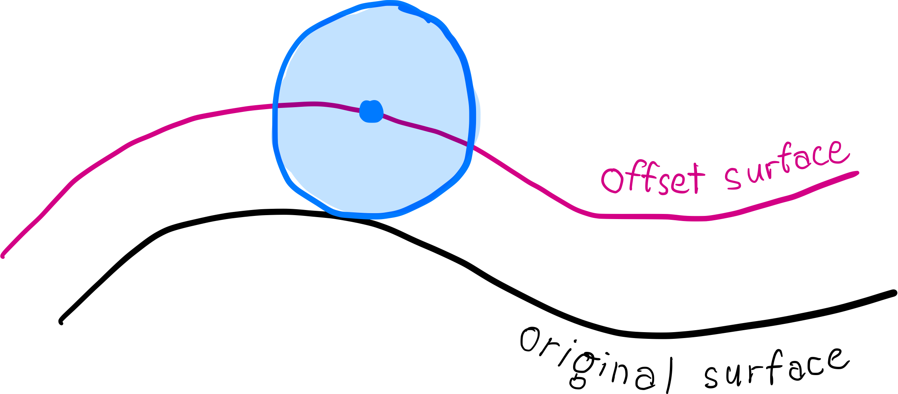
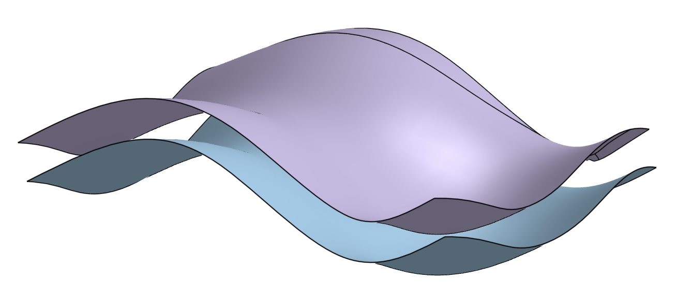
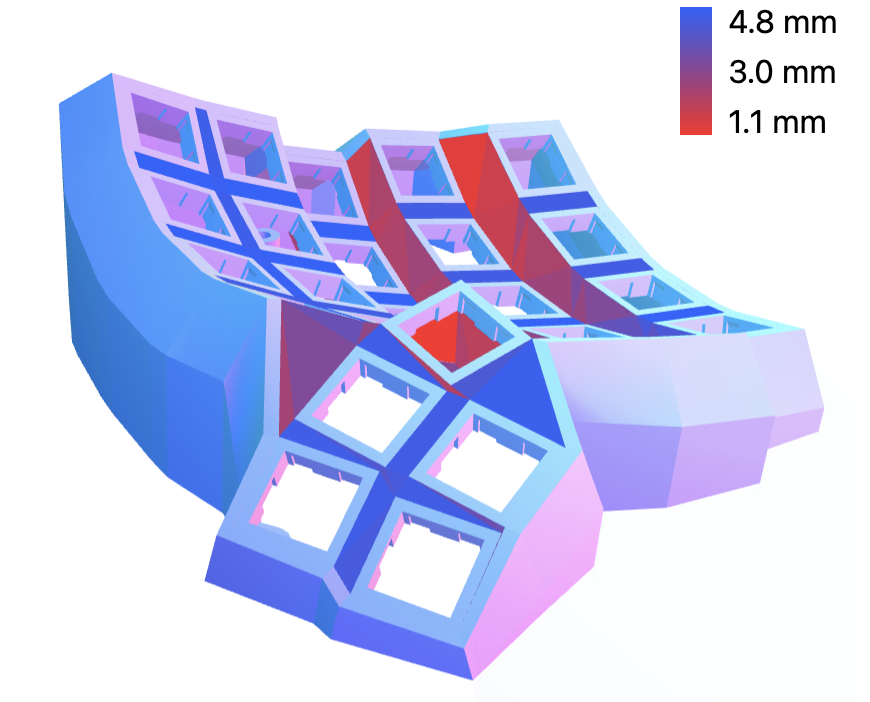
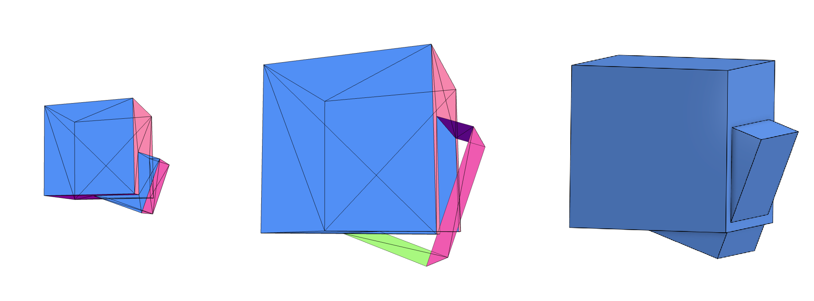
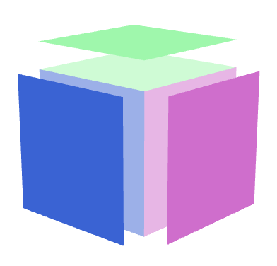
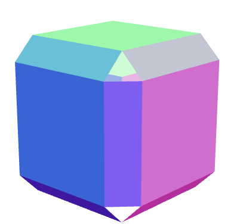
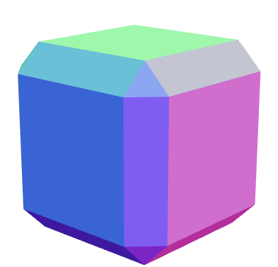
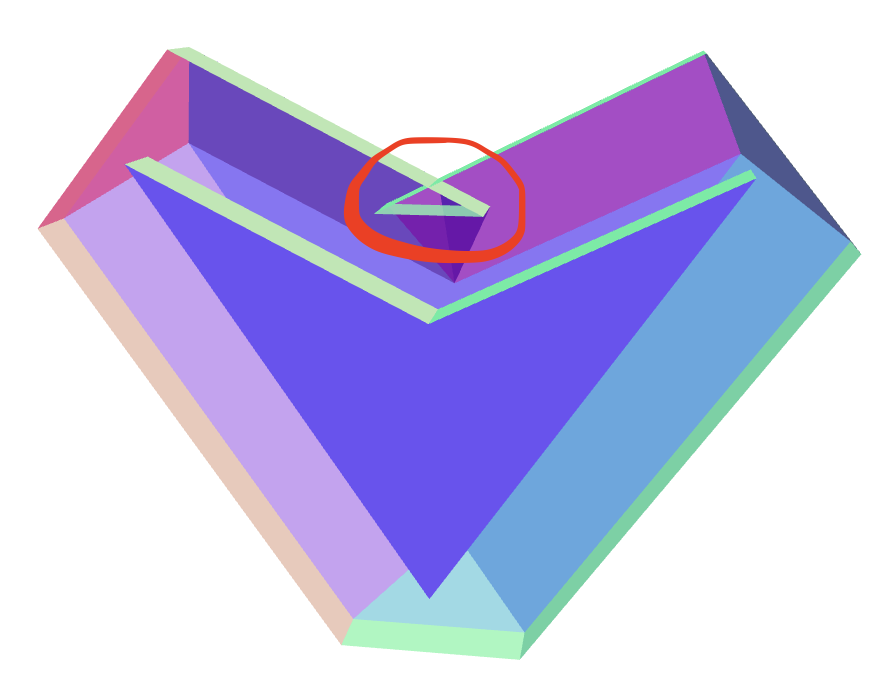
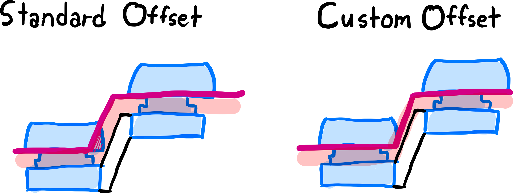
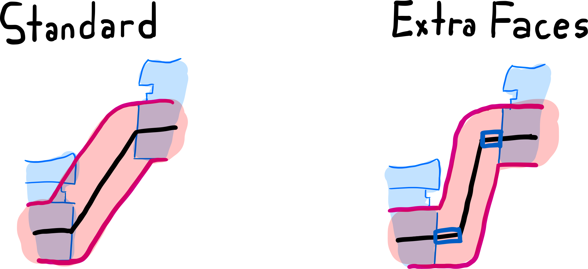

# Offset Surfaces: The Panacea for Bad Geometry?

{ .header }

Tools like Cosmos are huge time-savers in that they can take a simple design (such as the choice of where each key goes) and generate something much more complex. But once you give the task of designing to the computer, you better be sure the computer does a good job.

Which brings me to the subject of surface offsetting...

<!-- more -->

## What is an Offset Surface?

{ width=500 .center .pad }

Imagine there's a ball sitting on some surface, and you roll it all around. You'll find the center of the ball traces out a new surface–the offset surface. What's neat is that if you fill the region between the two surfaces, the thickness will be constant, no matter the shape of the underlying surface.

{ width=350 .center }

You may have seen them used in CAD operations like [Move Face](https://cad.onshape.com/help/Content/moveface.htm) or [Press Pull](https://help.autodesk.com/view/fusion360/ENU/?guid=GUID-02F9ADA3-7556-42A9-8AD1-552728D537AB). These tools fill in (or subtract) the region between the original and offset surface.

## Pretty Cool. So Cosmos Uses Offset Surfaces?

No.

## Actually?

Well, not in the way I described them. The algorithm for wall generation achieves something similar.

{ width=500 .center }

However, this isn't uniform thickness: The walls become thinner when they pinch together. If I was using a true offset surface, the walls wouldn't be so thin in these spots.

## So How Does This Apply to Cosmos?

### Filled Keywells

The primary reason I'm looking into offset surfaces is to add support for filling in the gaps between keys. Take a look at your keyboard. Chances are, unless it's a DIY keyboard, you can't see the switches under every key. How _aesthetic_. There's a layer of material (perhaps metal or plastic) bordering the switches and hiding them from sight. On mechanical keyboards, this layer is often a separate part that's been laser-cut to add holes for all the switches.

In order to build this feature, I'll need an algorithm that can offset the top surface of the keyboard to be as tall as the switches while resolving any self-intersections that might happen by extruding so high.

### Stilts Bottom

I really needed this algorithm for computing the bottom of the stilts case. It's the same scenario as filing the keywells, except rather than extruding upwards I'm extruding downwards.

I made this feature before thinking about offset surfaces, and so it works a little differently. I start by moving all the faces, just as I'd do for the offset surface. But to handle intersections, I re-mesh the bottom surface by recomputing the Delaunay triangulation between all vertices. This avoids any self-intersections, but it also introduces weird behavior since the vertex positions never change. There may be giant caves in the model formed by putting a triangle where it really shouldn't go, and the bottom will certainly no longer be offset a constant amount from the original surface. I try to mitigate these problems by preemptively removing vertices that could lead to problems, but this doesn't always work.

Replacing this algorithm with the offset surface will lead to much greater stability.

### Web Thickness

One long-standing bug in Cosmos is that the top of the case can get very thin in spots when adding a large stagger to the model. It's been there for so long I added a viewer just for inspecting the model thickness.

{ width=350 .center }

This is because the current thickening operation does not behave like the offset surface; it instead only adds material in the direction of the neighboring switch's "up" direction. So if the direction of the keycap happens to be different than the surface's normal vector (which happens in all cases except when the keys are laid out flat), the surface is going to get thinner. And in cases where the switch is facing up but the wall is running vertically, the wall will have zero thickness.

## The Library that Solves all My Problems

Here I wish I could describe to you the great library I found online that efficiently computes offset surfaces and handles removing any intersections that arise. Unfortunately, I couldn't find any such codebase.

OpenCascade, the geometry kernel I use, has [support for mesh offsetting](https://dev.opencascade.org/doc/refman/html/class_b_rep_offset_a_p_i___make_offset.html). However, the documentation advises not to use it with offsets so thick that the resulting surface might intersect itself–and for good reason: It struggles with intersections. With the arc join type, OpenCascade throws an error as soon as surfaces begin intersection. With the intersection join type (pictured below), faces go missing. Sadly the OpenCascade kernel is the only open-source geometry kernel out there with offset surfaces implemented,[^1] so I have few alternatives.

<figure markdown>
{ width=600 .center }
<figcaption>Left: Original shape. Center: Offset shape in OpenCascade, using intersection join type. Right: Offset shape in OnShape.
</figure>

Therefore, I've decided that I need to write this library. If you're curious how the mesh offsetting algorithm works and the nuances of applying it to Cosmos, read on! Otherwise, you know what I'll be working on for the meantime :D

---

## The Offset Surfaces Algorithm

There are two parts to a robust algorithm for offset surfaces. The first part is offsetting all the surfaces and is relatively straightforward. The second part is handling any self-intersections, and that's where stuff gets really tricky.

{ align=left width=100 }

I'll start off with a simple example and walk through how to create an offset mesh for it.[^2] Take a cube. I'll first move every face a fixed distance away. You can see that this creates gaps around each face.

{ align=left width=100 }

The second step is to look at every edge and fill in the gap created along that edge. I have the choice of filling this region in smoothly, using a flat face. I'll fill it in with a flat face for simplicity.

{ align=left width=100 }

The final step is to address the gaps that occur around the original vertices of the model, using information on which faces touch this vertex. Now no gaps will remain.

This algorithm needs information on which faces are adjacent to every edge and to every vertex. The [half-edge data structure](https://jerryyin.info/geometry-processing-algorithms/half-edge/) works well for these types of queries. There's also a variant of offset surfaces where you don't add any extra faces and instead move vertices to the points where the offset faces, if extended infinitely, would intersect. This is the intersection method that most CAD software uses, but I'm less interested in this method since it adds more material than necessary.

For the cube, this method works great. But what happens if I try this on another model, such as the heart shape? The offset surface is no longer perfect because it intersects itself! Plus, there are extra faces that need to be removed.

{ width=300 .center }

It turns out there's a lot of extra logic involved in handling these self-intersections like:[^3]

1. Determining which faces intersect, and if they do, [determining the line segment of intersection](https://github.com/erich666/jgt-code/tree/master/Volume_08/Number_1/Guigue2003)
2. Splitting faces up into sub-faces about the line segment of intersection (if I limit the meshes to triangle meshes, I can use constrained Delaunay triangulation[^4])
3. Keeping track of how these sub-faces are connected
4. Traversing the mesh and determining which sub-faces belong and which do not (this is the especially difficult part)

My hope was to find a library to do all of this for me. My first attempt used the [Manifold](https://github.com/elalish/manifold) geometry kernel, and it's awesome at handling computing the boolean unions and fixing the self-intersections. As of writing, they're even working on a [built-in implementation of Mesh offsetting](https://github.com/elalish/manifold/issues/192). Unfortunately, boolean-unioning every face together is too slow for the complexity of meshes I'm hoping to handle. I'll have to implement the mesh offset myself.

## The Nuances of Offset Surfaces in Cosmos

### Filled Keywells

In order to hide the switches, I need to make sure the wall is offset by the height of the switch. However, the thickness everywhere else doesn't matter. In fact, making the offset uniform-thickness could easily interfere with the switches.

{ width=500 .center .pad }

I'll solve this by taking the normal vector of every vertex to be in the Z direction of the nearby switch. Since every vertex will have only one normal vector, there will be no gaps between edges or vertices that need filling. I can skip the first part of the offset algorithm and begin with eliminating self-intersections.

With the exception of self-intersection removal, this is the same way that the web between switches is currently computed. But unlike the web, it's okay that the thickness of the fill is nonuniform.

The other part I conveniently left out is that holes for the part sockets are often different sizes than the holes I need to make in the offsetted keywell fill. For example, encoders have square bases, so the mesh that gets drawn for encoders has square holes. Meanwhile, the encoder shaft is round and requires a much smaller round hole in the fill. I'll probably resolve this by first drawing the offset surface without holes, then adding holes as the final step by splitting faces and deleting the subfaces inside holes.

### Web Thickness

Just as with the filled keywells, naively implementing web thickness will lead the switches being blocked by the added material. How I solve this problem is that I add extra faces around the switch (outlined in blue below) before computing the offset. These faces are just big enough to ensure the offset surface clears the switches. And as a bonus, if I fill in the gaps created during offsetting with arcs, then I get fillets on the edges for free. One step closer towards a smooth top surface!

Adding new faces is easier said than done. Each new face requires that two new vertices be added to the mesh. Adding each vertex can be done using an edge split operation (finding an edge, splitting it into two edges, then updating all adjacency information).

{ width=500 .center .pad }

## Conclusion

Hopefully this is an insightful glimpse into some of the work that goes into ensuring the generator is built on solid generation algorithms. It will definitely be a while before some of these changes make their way to the generator. I'm focusing on making offset surfaces work really well with triangle meshes then moving onto adding smooth arcs, testing the last breaths of life out of the self-intersection resolution, and releasing a mesh offsetting library as its own open-source project before even touching Cosmos.

I also plan to write more articles like this soon, so if you have any feedback, I'd love to hear it so I can make that the next article even better.

--8<-- "docs/blog/.footer.md"

[^1]: [Fornjot](https://github.com/hannobraun/fornjot) is super promising and hopefully gives OpenCascade some competition, but it's still in early development.
[^2]:
This method of creating offset surfaces for each face, then edge, then vertex comes from Kim et al. at the Korea Advanced Institute of Science and Technology. [[pdf]](https://www.cad-journal.net/files/vol_1/CAD_1(1-4)_2004_285-291.pdf) 
S.-J. Kim, D.-Y. Lee, and M.-Y. Yang, “Offset Triangular Mesh Using the Multiple Normal Vectors of a Vertex,” _Computer-Aided Design and Applications_, vol. 1, no. 1–4, pp. 285–291, Jan. 2004, doi: 10.1080/16864360.2004.10738269.
[^3]:
The algorithm for handling self-intersections comes from Jung et al, also at the Korea Advanced Institute of Science and Technology. [[pdf]](https://www.cad-journal.net/files/vol_1/CAD_1(1-4)_2004_477-484.pdf) 
W. Jung, H. Shin, and B. K. Choi, “Self-intersection Removal in Triangular Mesh Offsetting,” _Computer-Aided Design and Applications_, vol. 1, no. 1–4, pp. 477–484, Jan. 2004, doi: 10.1080/16864360.2004.10738290.
[^4]: I already use constrained Delaunay triangulation in Cosmos to generate the triangles that connect keys to each other & form the web mesh, so it's great I get to use this algorithm more.
