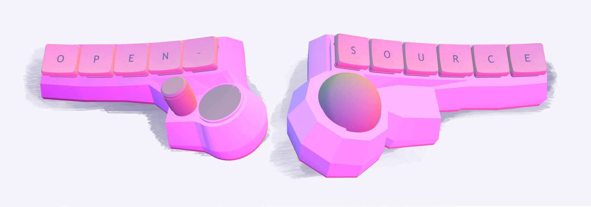
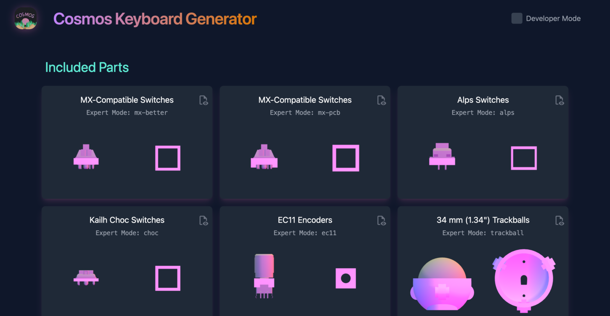
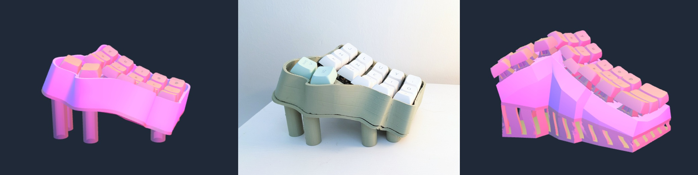

# Open Sourcing Cosmos

{ .header }

**The Cosmos Keyboard Generator is now Open Source on [GitHub]!**

It's 2023, and you can scan your hand, 3d-print a keyboard designed to fit it, send the electronics to be fabricated, and then plug your new keyboard into your computer and start typing.

Pretty crazy huh? And I bet we'll be living in a whole different world next decade.

All this is built on the hard work of many, many people that's been open-sourced: From open-source-hardware 3D printers to projects like KiCad and the Dactyl keyboard, open codebases have created a thriving community of forks & contributors, and they have helped bring cutting-edge technology to so many people. So now I'm excited to announce that the Cosmos Generator is open-source as well.

[GitHub]: https://github.com/rianadon/Cosmos-Keyboards

<!-- more -->

The version that I've open-sourced is, by lines of code, 95% of what's online. Anything supporting the mission of creating hand-fitting keyboards (which includes hand scanning, modeling something that will print well, and programming) will forever be free and open source. I'm keeping private the remaining 5% which relate to cosmetic features under the one-time-purchase Pro plan so that I have a budget to continue this project. Keyboard parts are not cheap!

I started this project in March after releasing my [web-based generator for Dactyl keyboards](https://ryanis.cool/dactyl). I wanted to incorporate different types of thumb clusters, but much of these models, even how every switch socket connects to its neighbors, is laid out manually. Cosmos began as an experiment to see if algorithms could automate the tedious parts of keyboard design, and it's now safe to say the project has met that goal and more.

!!! info annotate ""

    If you'd like to see the mathematics and algorithms behind the project, [sign up for my newsletter](https://newsletter.ryanis.cool/subscription/form) or [join the Cosmos Discord server](https://discord.gg/nXjqkfgtGy) so you can be notified when I publish an article on all the inner workings.  (1)

1. If you're unlike me and actually keep up with your RSS subscriptions, you can also follow this blog with RSS! I'll be posting the article here.

## Parts, Parts, Parts!

In addition to helping the new ideas in the generator proliferate, I also hope that open-sourcing the repository will help seed a complete collection of sockets for every switch or component that could fit on a keyboard.

<figure markdown>
   { width=90% .center }
   <figcaption markdown>If you're interested in using some of these parts in your own project, you can now browse and download [the list of parts](https://ryanis.cool/cosmos/parts) at your leisure.</figcaption> </figure>

This benefits not only everyone who prints a keyboard from Cosmos but also anyone designing their own keyboard. Plus, if you're looking to build your own keyboard from scratch, [Cosmos can help you design the key curvature and export switch sockets to a STEP file](../../docs/cad.md).

??? info "What Parts will Be Added in the Future?"

    I launched Cosmos with a minimal set of parts, but I hope to add more soon. The planned additions include:

      - More OLED displays
      - More trackball sizes (based off a variable-sized trackball model)
      - Topre switches
      - Sockets for switch PCBs that can twist into place
      - Sockets for switch PCBs that don't require soldering

    If you'd like to suggest another part, let me know [on Discord in the #ideas-and-feedback channel](https://discord.gg/nXjqkfgtGy).

## Looking Forwards

There are a lot of exciting new features making their way soon to Cosmos. By the end of this year I'll be employing some much more accurate computer vision techniques to the hand-scanning page to increase the accuracy of the scans. This will enable some new hand-fitting features in the future.

I'm also be adding two new case styles to the generator to give you even more flexibility in how your keyboard looks. All of these are share the same parameters, so you can switch between designs like trying on new clothes.

## Conclusion

So if you haven't already, go [try out the generator](https://ryanis.cool/cosmos-beta) and [give it a star on GitHub][GitHub]. And be sure to share whatever you come up with! Since the introduction of draggable keys, I've seen some really novel key placements, and I can't wait to see them catch on.

--8<-- "docs/blog/.footer.md"
