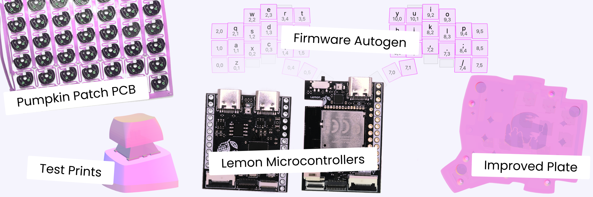
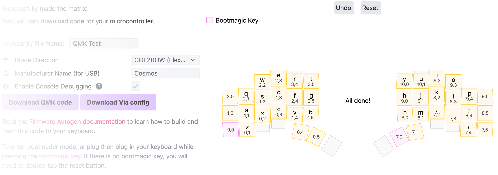
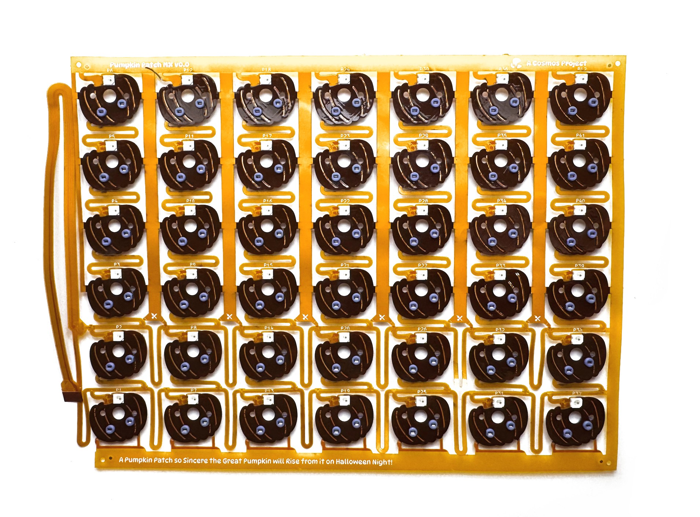
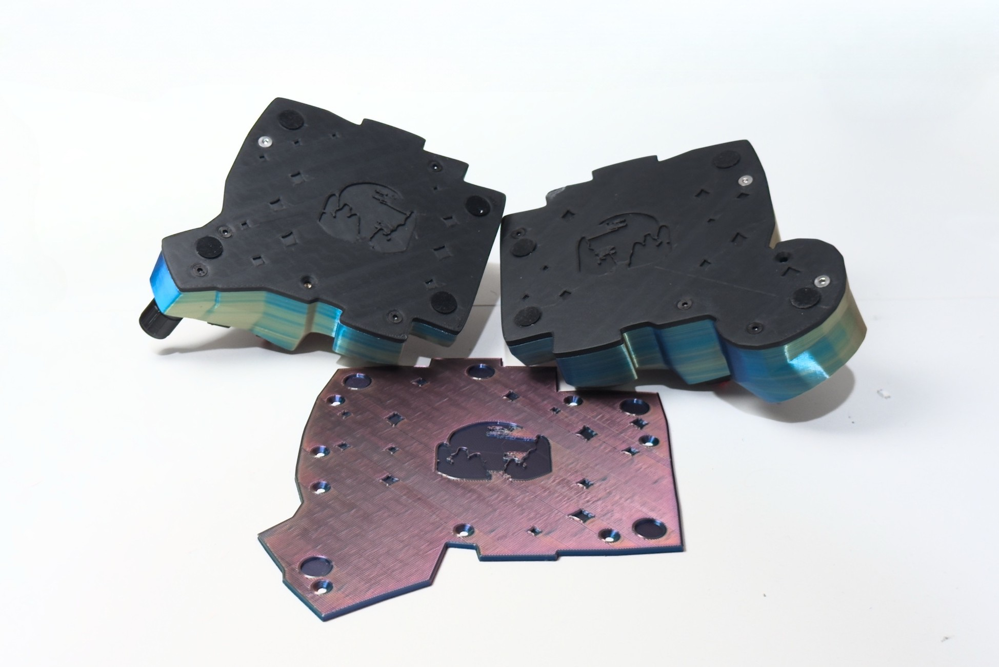
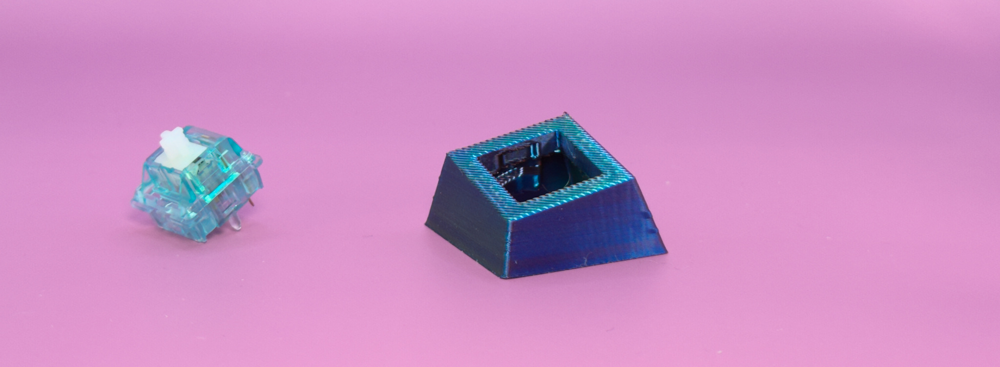

# The Summer Hardware Release

{ .header }

Making your own keyboard with Cosmos just got so much easier. Introducing firmware autogen, an improved plate with artwork, and several new PCBs.

<!-- more -->

As Cosmos slowly creeps towards exiting beta, I am working on making it more accessible to everyone. I really hope that one day, you'll see _Make Your Own Keyboard_ on a _Top 10 Things to Make with Your New 3D Printer_ list. We're not there yet, but this release should bring us a whole lot closer.

## Firmware Autogen

Sometimes, it feels like only a computer can keep straight all configuration options in QMK and ZMK. Which is fine[^1], because now your computer can code your firmware for you :)

I've made a brand-new interface to automatically map your keys to their matrix positions as you press them (this is inspired by [Pog's coordinate mapping](https://pog.heaper.de/docs/setup-a-keyboard/#step-5-coord_mapping)). I've also noticed many people using Cosmos to label what every key does before building their keyboard. Firmware autogen will now use this information, whether in the format of simple labels like `A`.`2`,`F3`,`;`, or more verbose ones like `esc`, `bspc`,`space`, etc, to assign what every key does in your firmware. The generator also supports Via and will soon support ZMK studio, so you can also change the keys afterwards.

I'm releasing the autogenerator in a state where it can handle everything key-related (the most important part of your keyboard), and a few peripherals. Even if it's missing support for your trackpad/encoder/display, it's easier to start with the auto-generated firmware then ask your favorite LLM to add whatever you need for your peripheral than it is to forge your own path. You can keep up to date on what's implemented in the autogenerator by visiting the [Are we Programming Yet?](https://ryanis.cool/cosmos/areweprogrammingyet) page.

<iframe class="rounded-2" scrolling="no" style="height: 33rem; zoom: 0.5;pointer-events: none;" src="../../areweprogrammingyet?embed" />

The big gotcha here is that until I finish everything on that list and the V2 and V3 milestones on the [peaMK](https://github.com/rianadon/peaMK) repository (peaMK is what I'll be naming my upcoming configurable-in-place firmware variants for QMK and ZMK), firmware autogen will only be supported on my Lemon microcontrollers[^2].

[View the Firmware Autogen Documentation :octicons-arrow-right-24:](../../docs/firmware.md)

## Lemon Microcontrollers

After working on Cosmos for a while, I've built up a list of things I'd like to see in microcontrollers:

- FPC connectors for easy connection of flex PCBs and modules. _Reduces wiring and makes it easy to swap out modules like trackballs or displays._
- USB-C interconnect for wired keyboards, built in on/off switch for wireless. _TRRS can damage your microcontroller if you unplug it as your keyboard is powered on. USB-C will not damage your keyboard, and you probably have more USB-C cables at home to use for interconnect._
- Relay to turn off power to LEDs, level translator to run LEDs at 5V. _Each RGB LED uses ~1mA of power even when off. This adds up if you have many LEDs or are running on a battery. The relay shuts off power to the LEDs so they can't consume any mA, and running LEDs off 5V lets you add more LEDs at higher brightnesses._
- Lots of documentation. _Documentation is important!_

Some of these items you can already get, but others require building your own circuits. The Lemon microcontrollers have all these things built in. I also try to reasonably price them.

[Lemon Microcontrollers Homepage :octicons-arrow-right-24:](https://ryanis.cool/cosmos/lemon/)

## Pumpkin Patch PCB

Most keyboards I have seen made with Cosmos have been wired by soldering to every key PCB. Not only does this process take at least a whole day (and more if it's your first time), but it gets frustrating when you have a short or bad solder joint, and it's in no way newcomer friendly. There are so many more better projects through which to practice your soldering.

The keyboard community has been making flexible PCBs for a few years (and have been officially supported in Cosmos since last year), but I haven't seen them catch on. From what I've gathered, the problems are location and price. I'm not in a position to fix location (everyone offering these is based in the US), but I can tackle pricing.

{ width=600 .center }

Unlike other flexible PCBs, the Pumpkin Patch PCB comes as one unit. There is no separate PCB for each column, no separate PCB joining the columns, and in many cases the PCB covers the entire keyboard including the thumb cluster, so no separate PCB for connecting the thumb cluster is needed (you can check the nifty [wiring check](https://ryanis.cool/cosmos/pumpkin/wiring) to see if they cover your keyboard. With this reduced complexity, the cost of making these is much lower, so I can pass off those savings to you. I'm selling these for just $1 more than the Plum Twists with LEDs.

I'm starting out with a small batch of MX Pumpkins produced, but if they're well received, I will make more and make ones for Choc keys too.

[Pumpkin Patch Homepage :octicons-arrow-right-24:](https://ryanis.cool/cosmos/pumpkin/)

## Plate Art and Improved Plate 

Add some bling to your bottom plate! You can now add the Cosmos logo to the bottom of your keyboard. The artwork is procedurally generated, so it will fit any shape of keyboard.[^3]

The improved plate also adds cutout holes for circular rubber pads. These help bring your keyboard lower to the ground keeping it slip resistant.

Altogether these really bring an element of extra polish to the keyboard. These design is available to anyone who's sponsored Cosmos, but if that's not you, hopefully you're at least still inspired to decorate your plate. Most slicers allow you to cut out text and SVG files, and if you'd like to make some really cool-looking plates, you can use [modifier meshes to expose the infill](https://www.youtube.com/watch?v=6PVeh43Or-g).

## Test Prints

As I'm working on a new socket, I'll make a lot of test prints of just that socket at an angle so that I can test how well the part prints with supports. This gets me really familiar with my printer, but it was never obvious how you can do the same and run these tests.

With this update I've added a button to the model download dialog that lets you export a test print consisting of a single socket from your keyboard. This lets you make sure your switch (and PCBs) will fit into whatever sockets Cosmos generates before printing the whole keyboard.

## Configuration Improvements

- The dialog for changing custom screw indexes now lists the current calculated indices.
- Plate thickness is now configurable. The default is 3mm, but I like using 2mm.

## Bug Fixes

A minor behind-the-scenes upgrade is that the codebase is now free of TypeScript errors, save for a few files that were too tricky to clean up that I ignored them. This was a big effort, affecting [98 files](https://github.com/rianadon/Cosmos-Keyboards/commit/16264ba462d9766beb6a7e2303b332c837e0fb9f)! I've added error checking to the CI system, so it will permanently stay that way.

As a result of fixing these errors:

- I fixed some regressions in how the keyboard shell is thickened when using Choc keys. Because Choc keys are smaller, the material between sockets can be made thicker.
- Collision checking is now done on all Choc switches. Before, I only took into account switch-switch collisions for the old Choc hotswap socket.

And other fixes:

- Now only one of the custom dropdowns used for part and profile selection can be open at once. This matches the behavior of the OS's native dropdowns.
- The keycap count in the BOM is now correct. It used to include shaper keys.

## The Road Ahead

If you've visited the Cosmos Discord, you might have run into the roadmap. With this release, I've crossed off 3 of the items!

Back when Cosmos was very new and I constantly had small features to release, I had divided it up into milestones and dates. Then after I completed all the easy work, it started to get stale with big ticket items. Since last year, I've probably only added to it. I don't think that I got to remove any items.

Finally, I get to cross a few items off.

~~:knot: Do something about the pain of handwiring and soldering~~
~~:technologist: Export full qmk source code and suggested keyboard matrices~~
~~:minidisc: USB-C interconnect~~
:writing_hand: Edit the thumb clusters to have more sensible layouts
:clown: Fix stilts mode bugs
:hand_splayed: Explore some alternative curve options (instead of just circular arcs)
:raised_hands: In Shrouded Walls mode, also raise OLEDS, trackpads, and areas without keys
:hand_splayed: Make the thumb in the hand model behave like a thumb + better hand pose
:gloves: Better connection between wrist rest and model (magnets or screws)
:robot: Suggest curvature, finger splay, etc options based on scanned hand
:shopping_bags: Help find places to buy parts
:art: Redesign things again
:magnet: Magnetic switches
:radio: New way of calculating the web that's resilient to upside-down keys & weird geometries
:axe: Center Cluster
:musical_keyboard:  Easily switch between different legends (colemak, miryoku, etc)
:boom: Finish writing collision detection for all parts

Maybe (+ things that have been requested more than once):
:earth_asia: Version history
:high_heel: Add a case that works well with high tenting
:playground_slide: Rounded Top (not rounded top edges, but make the whole top smooth)
:wrench: Add more wrist rest configuration options
:raised_back_of_hand: Export hand model to Blender
:magnet: Magnetic mounting for base plate
:musical_keyboard: KLE import
:axe:  Separate out columns and thumb cluster when exporting STEP

By the way, Cosmos now has a [YouTube channel](https://www.youtube.com/@CosmosKeyboards). Please subscribe to help spread the word. I have a few videos in the works.

--8<-- "docs/blog/.footer.md"

[^1]: { width=300 }

    It was silly to make these firmwares with only a hard mode. Dressing up these firmwares with a simple-looking configurator doesn't excuse the mess of options underneath.

[^2]: This is because the PeaMK roadmap has several big architecture shifts down the road in terms of how I'm doing firmware generation (namely, transitioning from code generation to either modifying memory before flashing or configuring via USB communication). Any effort spent now adapting it will be thrown out the next evolution, so trying to support every microcontroller immediately is going to slow down the project. Feel free to fork and make the changes necessary to get your microcontroller working, but I likely will not be merging them.

[^3]: The process for generating these is that I estimate the center of the keyboard, scale the logo to fit within a circle inscribed in the plate, then draw the stars using poisson disk sampling.
