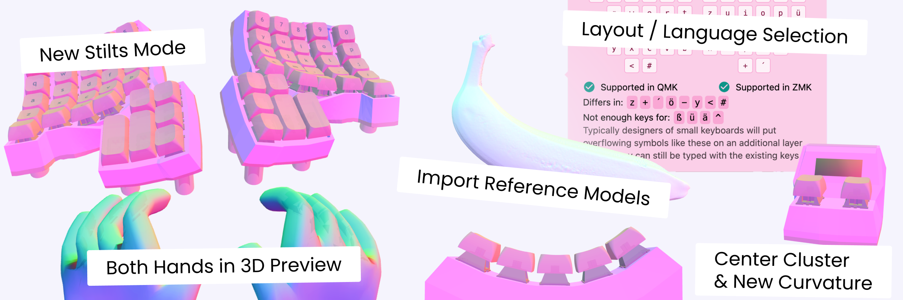
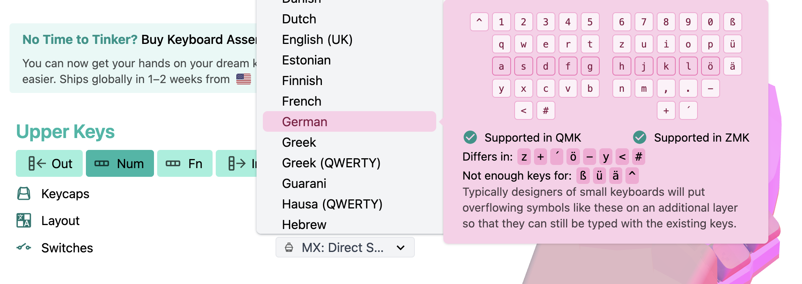
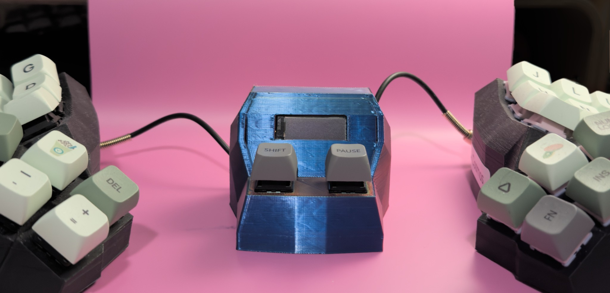
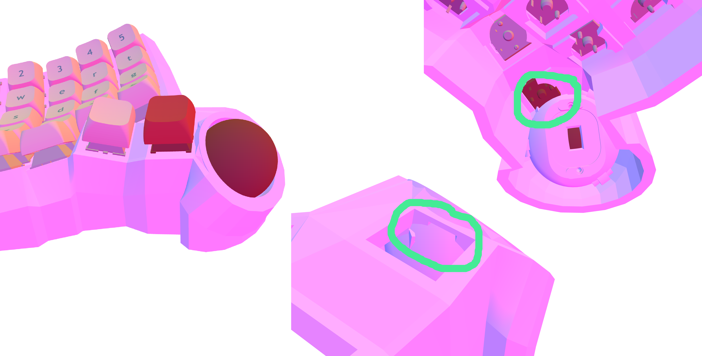
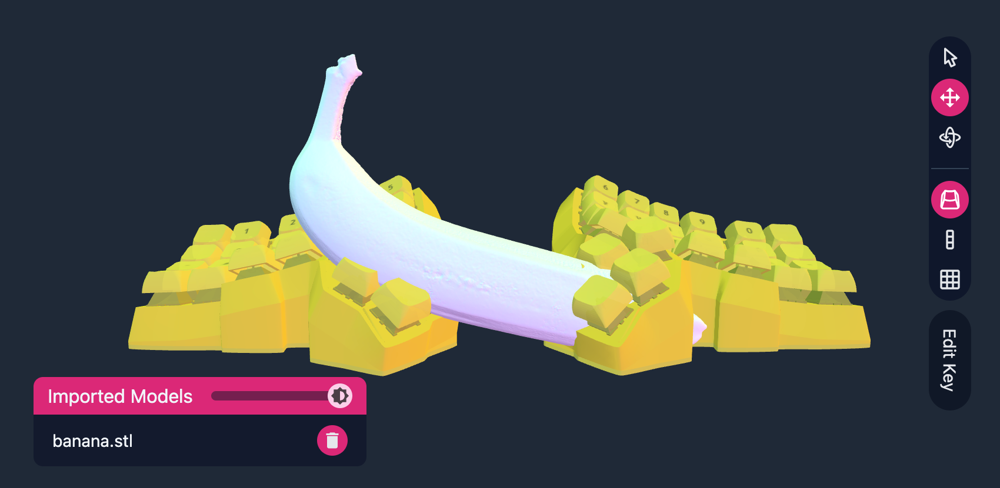
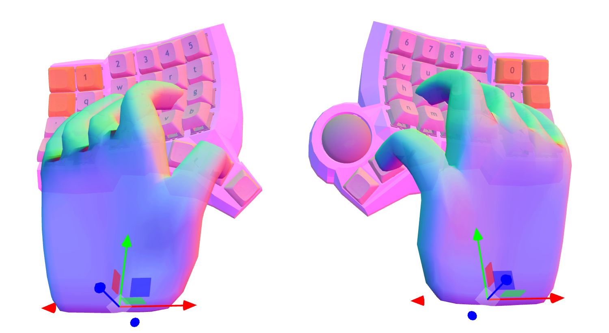
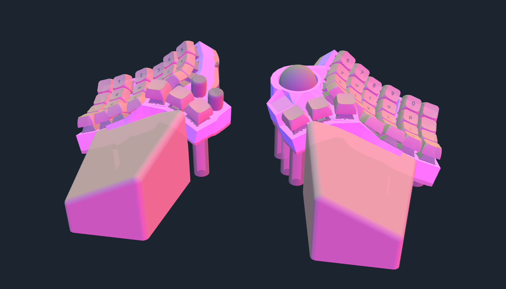

# The Summer Software Release

{ .header }

Did I hear you say you want more customization options in Cosmos? More? Really? This release brings new possibilities for layouts and keyboard design, plus stability in Stilts Mode, part intersection detection, and hand previews.

<!-- more -->

Last summer we had the [Summer Hardware Release](./summer-hardware-release.md). The reception has been amazing; I can barely keep up production of the Pumpkin Patches with the demand. Since then, I've released a [Choc Version](https://cosmos-store.ryanis.cool/products/pumpkin-patch-pcb-choc), a [new version of MX Pumpkin Vines](https://cosmos-store.ryanis.cool/products/pumpkin-vine-pcb-new-version-mx) for the thumb cluster, and new revisions of the Lemon microcontrollers. As the hardware that allows you to turn your custom 3D print into a custom keyboard nears stability, it's time to set the focus back to the software that powers the keyboard generator.

The highlight here is the new algorithm behind Stilts Mode. The feature is far more stable, although it is more picky about which models it will accept. I made this video earlier this year describing how it works, and it's still apt.

{ .youtube }

Now onto everything new...

## Layouts Go International

Thanks to [lots of prototyping](https://github.com/rianadon/Cosmos-Keyboards/pull/87) by Scott Olson, if US QWERTY is not what you use, you can now quickly configure your preferred layout in Cosmos. Whether you need support for your own language, or you need an easy way to change to a more ergonomic layout, you'll find the layout selection menu a useful way to change all the key legends at once.

If you're using the [Firmware Autogeneration](../../docs/firmware.md), your firmware now works out of the box with whatever Operating System language you use. Choose the appropriate language when you export the firmware, and Cosmos will convert the legends shown in the keyboard preview into the correct keycodes, whether it be your abcs, ábçs, or αβγs. When you need to hand-edit your firmware, Cosmos includes the appropriate language-specific header file so that the key names in the firmware match what's on your keyboard.

## Center Clusters

What do you do with that empty space between the two halves of your split keyboard? More keyboards, of course. The new center cluster option allows for adding trackballs, displays, or a macropad in the center of your split keyboard. If you're working in unibody mode, you instead have an easy way to add keys in the center of your keyboard.

My intention behind adding the center cluster is to better support what the community calls "dongles." When you connect your split keyboard wirelessly, the half connected to your computer draws more power because it manages both sending keypresses and maintaining the Bluetooth connection. Dongles allow for you to save battery on both of your splits by making both halves talk to the dongle, then the dongle talk to the computer over USB, very similar to the receiver dongles that Logitech and other keyboard companies use.

Many dongles have a display tucked in them, but if you'd like to use your own parts or add to them, they're difficult to modify. If you can configure your keyboard in Cosmos, then why not configure your dongle too?

## Intersection Checks Come to All Parts

<figure markdown>

<figcaption markdown>You can see in the areas circled green that the trackball overlaps where the switch goes. If you 3d printed this model, it would be impossible to insert the switch.</figcaption>
</figure>

Every time you make an edit, Cosmos checks all the parts in the model against what's nearby to make sure every component fits, so you can be confident your 3d print is useable. The new release extends support from only keycaps and some switches to nearly every part in Cosmos.

Cosmos detects intersecting parts by first converting the web and all parts to [low poly](https://en.wikipedia.org/wiki/Low_poly) triangle meshes. The triangles in every mesh are stored in a data structure for efficient lookup (as of writing, Cosmos uses an octree). The intersection checker then determines which triangles intersect and marks the two parts owning these triangles as colliding. This release's contribution is that all parts which require low-poly meshes now have one.

I've been bitten before by switches that were too close to the trackball holder, creating a socket with an incomplete switch hole. Now, as shown in the image above, you'll see an error if your switch won't fit in.

## Compare Your Keyboard

You can now drag your old models into the keyboard preview area to compare them to your design. Any STL file works; you can also drag in other open source models or 3D scans you've made yourself.

You can even drag in a banana for scale.

## Double the Hands, Double the Fun

The left hand preview is finally bug-free! Now that both hands work, I've updated the 3D Viewer to show a preview of both your hands next to your keyboard, so that you have a good idea of how the keyboard will fit your hands. :raised_hands:

## New Curvature Controls

{ autoplay width=500 .center .rounded }

Trace the path created by curling your fingers. It turns out they don't curl in a perfect circle. Instead, the circle's radius is decreasing as you curl further in. The consequence for keyboard design is that in order to best fit your hand, you'll want the keys close to you to have more curvature and the ones further from you to have less.

You'll now be able to tune this difference in curvatures by changing the row and column disparity settings. A positive column disparity will increase the curvature of keys close to you, making them easier to reach.

We can throw a lot of mathematics at the problem. For instance, if we assume that the curvature increases at a fixed rate (linearly) with respect to the arc length, we derive a [clothoid (or Euler spiral)](https://en.wikipedia.org/wiki/Euler_spiral). Computing these curves requires numerical integration, which isn't exactly fast. Instead, Cosmos approximates these curves by splitting the circular arc in two parts and changing the ratio of the two arc radii. At the small disparity that keyboards require, the error between this approximation, clothoids, and logarithmic curves are all small. That's a fancy way of saying that unless your fingers require a very wacky curve, the curvature and disparity controls will be able to create it.

If you're getting started with this setting, I recommend using between 1.0 and 1.5 for the column curvature disparity.

## All-New Stilts Mode 

For several years, I've been experimenting with how to make the Stilts mode more stable and more generalizable. Finally, I'm ready to release that work. Since the project has taken so long, I've had the chance to use all my new knowledge from working on Cosmos to either rewrite or improve every part of Stilts Mode.

- Screws are now placed tightly near the keyboard edge and avoids area that would intersect the case or switches.
- Bottom plate generation is entirely new. The plate now clears all interior parts and has no creases.
- Walls more smoothly transition between large angles.
- Microcontroller holders use less space and better tuck into the case.

After lots of iteration and tuning, the system should be able to deal with most keyboards. If it doesn't work, you'll see an error explaining what you can change in your model to avoid the situations where stilts mode can't compute a good 3D model.

## Everything Else

Although they aren't as big as the other features, these changes are nonetheless worth mentioning:

- You can now tune the depth of the foot inset when Improved Plate is enabled. Now Cosmos can accommodate any size of rubber foot.
- In Firefox, the Edit Key button now longer changes size when it's clicked.
- The default model has different legends than before. The ++bracket-left++ key is gone, and ++equal++ and ++backslash++ have been added. This isn't because one layout is better than the other: Arguably they're both bad, because such symbols should be on their own layer. The change is simply to align the default layout with the new default QWERTY layout.
- I've fixed the bug where the URL starts out very long. Now, the default model encodes to the URL `ryanis.cool/cosmos/cosmos/beta#cm` as it used to.
- You can now configure the depth of shaper keys.
- There was a recent regression where the hand models showed two move controls each. They're back to only showing one now.

--8<-- "docs/blog/.footer.md"
