# Better than CAD Part 1: Thickening Webs

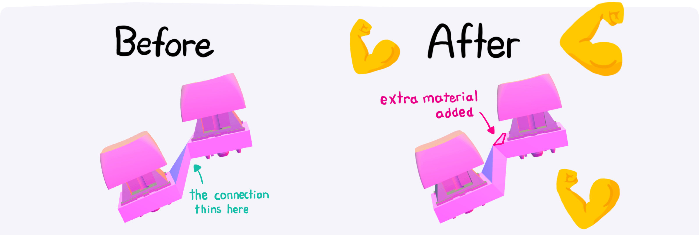{ .header }

If you followed the [last blog post on offset surfaces](./offset-surfaces.md), you'll know improving part thickness has been a long-time goal of Cosmos. Many times, the naive approach of lofting the sides of key sockets creates solids too thin to print. This is a problem for both keyboards exported from Cosmos and keyboards built with CAD tools. Let's discover how the generator fixes these issues!

<!-- more -->

The goal here is to not only increase the thickness of every part, but ensure to the best of the generator's ability that they are consistently thick, efficiently using material.

Below you'll see two keys. On the left is the old web. That's what I call that piece of purple-colored material connecting the two keys. It's formed by drawing lines connecting the first key's side to the second key's side. On the right is the new web, with all the changes I'm about to describe applied. Why don't you move the keys around and see how the webs change?

<iframe scrolling="no" style="aspect-ratio: 160 / 50" src="../../embed/thickness" />

In the new web, I've strategically added some extra shapes. The top and bottom surfaces on the key sockets have been extended. This is the new magic that's making the web thicker.

{ width=70% .center}

_I'll pull out my spline toolbox and fix this with some nice curves instead_, I hear you say. _My CAD software can fix this!_ Alright, but how do you ensure your splines never intersect the adjacent keycaps or switches? That the thickness is always consistent? That's the advantage of using these straight lines. Plus, you can always fillet the corners later.

Before diving in, here's a preview of what this post will walk through building. On the left is the original web from a keyboard. You can see the socket clipping through the side of the web. That means the thickness is going negative! On the right is the web automatically generated using these new algorithmic improvements.

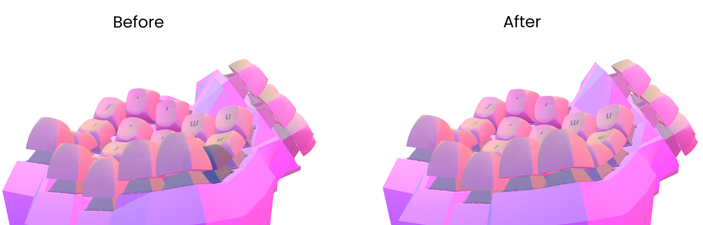{ width = 400 .center }

## A Tale of Two Lines

The rest of this post is be structured as follows:

1. Figure out how big to make these extra shapes, assuming everything is in 2D.
2. Survive the challenge of thickening the web, but in 3D.

Without further ado, let's get mathin'.

### Math Time

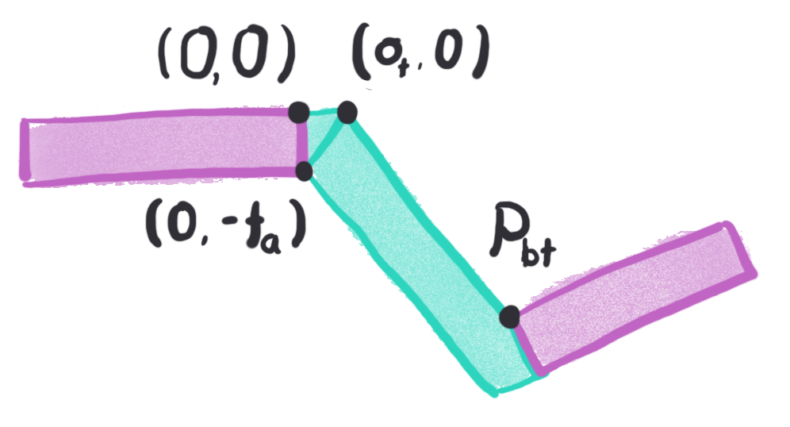{ width=300 .center}

Here's a diagram of the sockets from the perspective of socket A. I've fixed the location and orientation of the socket to make the math simpler. The socket on top, positioned at the origin (0,0), is the socket by which this extra triangular shape will be added. This new shape is parameterized by only one variable, $o_t$, that controls by how much the top surface is extended.

I shall find the slopes of the lines describing the top and bottom of the web. If you survived your math classes, you should remember your formulas. This line is going from $(o_t, 0)$ to $(p_{btx}, p_{bty})$:

$$
m = m_{bot} = m_{top} = \frac{p_{bty}}{p_{btx} - o_t}
$$

These slopes are equal because the lines are parallel (which gives constant thickness). The nifty trick that'll become apparent soon is that I'll solve for the top and bottom offsets independently. Notice I'm writing the equation of the slope using the top set of points. This means that only one variable, $o_t$, will show up in the equations. If you turned your screen upside-down, you might notice this problem looks pretty similar, except that all the text is unreadable. All this math therefore also applies to finding the offset on the underside.

I write the equations of both lines:

$$
\begin{align*}
\text{top: } y &= m(x - o_t) = mx - mo_t \\
\text{bottom: } y &= mx - t_a
\end{align*}
$$

To know the thickness, I need to measure the distance between the two parallel lines. What's that distance? [Wikipedia has our back!](https://wikipedia.org/wiki/Distance_between_two_parallel_lines). Because the equation for $t_{desired}$ contains absolute values and square roots, I use $(t_{desired})^2$ to make the math nicer .

$$
(t_{desired})^2 = \frac{(t_a - mo_t)^2}{m^2 + 1}
$$

There you have it! To solve for $o_t$, you plug everything into the equation above and solve. As there are some squared terms, you get a quadratic equation.[^1] The solution is pretty big, so I won't write it out. I figure you're already tired of math. Which is why we're about to do more math, because there's one small issue...

[^1]: A quadratic equation! Multiple solutions!? Imaginary solutions!? It's an unfortunate situation. If there is no real solution, I use the maximum offset (i.e. how big the offset can get before running into adjacent keycaps or switches). If both solutions are negative, I use half the maximum offset. Zero and the maximum offsets are both reasonable offsets in this case, so I choose both by averaging :D Otherwise, I use the smallest nonnegative solution.

### Avoiding the Keycaps and Switches

There's a limit to how thick the web can be made. If it's too big in spots, it might run into the keycaps! Or it may run into the switches! Neither would be great.

To find the maximum offsets on the top surfaces of the web, I extend the line that passes through the $p_{bt}$ (the top point on the second socket) and the keycap's corner.

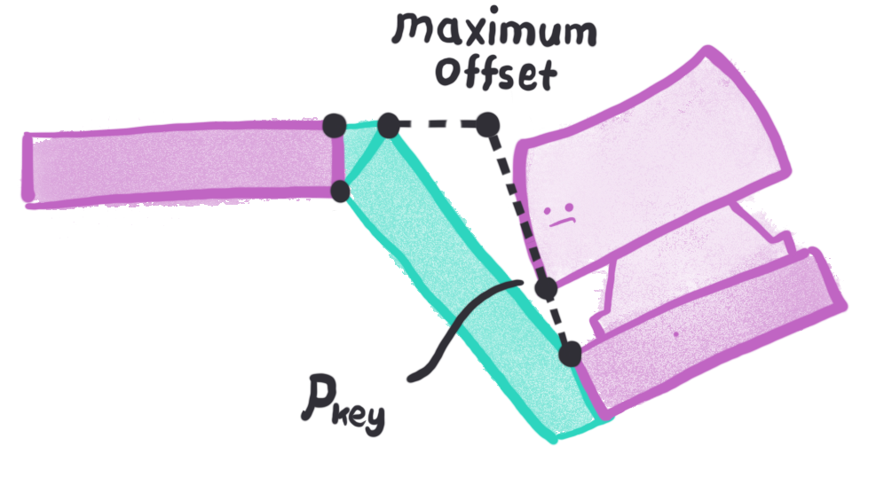{ width=300 .center}

In reality, finding this $p_{key}$ point is pretty difficult since keys can be oriented skew. Everything looks nicer in 2D :) Instead, I define $p_{key}$ relative to $p_{bt}$ using the switch's compressed height and offsetting some margin in the horizontal direction.

$$
o_{t,max} = p_{btx} - p_{bty} \frac{p_{keyx} - p_{btx}}{p_{keyy} - p_{bty}}
$$

For points on the bottom surface, the maximum offset is found pretty similarly. However, instead of working with keycaps, I instead project the socket's edge line straight. I also set the lower bound for this offset to be $t_{desired} / 2$ because switches typically don't come lose to the edge of the socket. That way, _some_ material always gets added on the bottom if required.

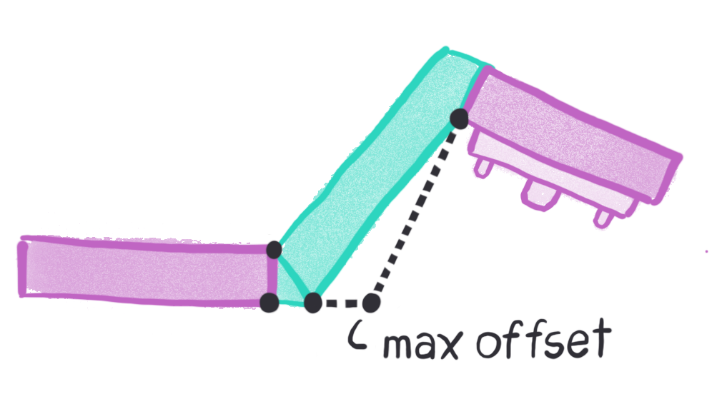{ width=300 .center}

There's one more check performed to limit the offset: the wall boundary check. If offsetting moves a nearby wall, the wall can only be moved so much before it runs into the nearby walls. Therefore, I check that the offset does not lead to any wall intersections, and if it does, I decrease the offset until there are no intersections.

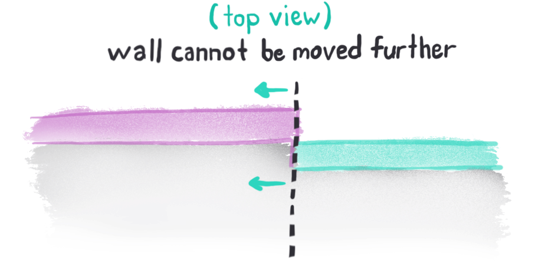{ width=360 .center}

### Conclusion

As you play with the demo above, you'll see the effects of the keycap and switch avoidance on the webs. It's a pretty smart algorithm!

I should also note that in all my diagrams, the web thickness matches the sockets thickness. Yet in reality, setting the web thickness to 80% of the socket thickness produces thick enough results but with fewer sharp edges. In expert mode, `webMinThicknessFactor` sets this ratio.

Anyways, that's all find and dandy for a 2D solution---but I've conveniently left out the fact that keyboards are in 3D, keys can be oriented skew to each other, and that the act of adding a line in 2D corresponds to adding a face in 3D. Besides, how do you even determine which sockets are neighbors? What if three keys are laid out in a triangle? Who's neighboring who now, huh?

## All Around Me Are Familiar Faces

In Cosmos, the web is computed as many interconnected triangles. Every vertex of a triangle is associated with some corner of a socket. Therefore, every triangle connects 2-3 distinct sockets.

{ width=320 .center}

Why triangles and not, say, quadrilaterals? Not every web can be subdivided into quadrilaterals. Take, for instance, three keys laid out in a triangle. Such a configuration will require a triangle at its center. A triangle is also the shape with the fewest sides.

### Triangles all the Way Down

In order to compute thicknesses, we'll need a way to examine a cross section of the web and examine it in 2D, just as described above. One logical point to take this cross section would be along the sides of every socket, as pictured below on the left.

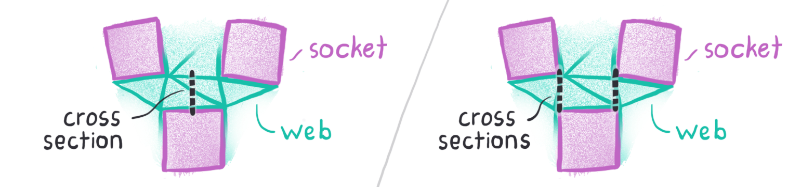{ width=640 .center}

However, this isn't quite the best. Imagine there are two sockets, positioned skew, such that their corners nearly touch on one side but diverge on the other. In this case, the divergent side should have some thickness added, while the touching side needs no extra material. Because of cases like these, the generator independently considers how much thickness to add for the left and right sides of the socket's edge, as shown above on the right.

Because of the specific way that the web is computed, every side of every socket neighbors a triangle. Two vertices of that triangle belong to this socket, while the third vertex belongs to a different socket. The two cross sections from the side's vertices to this third vertex make good candidates.

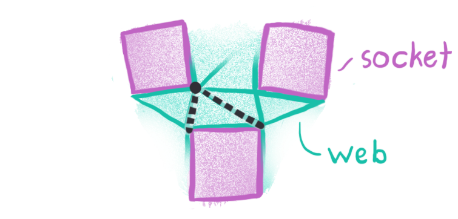{ width=320 .center}

These candidates don't work as well when two keys are placed side by side. Instead, some other vertices on the neighboring socket would work better. What's required instead is to consider not only the neighboring triangle's vertex, but also vertices on neighboring triangles _of the neighboring triangle_. It's triangles all the way down!

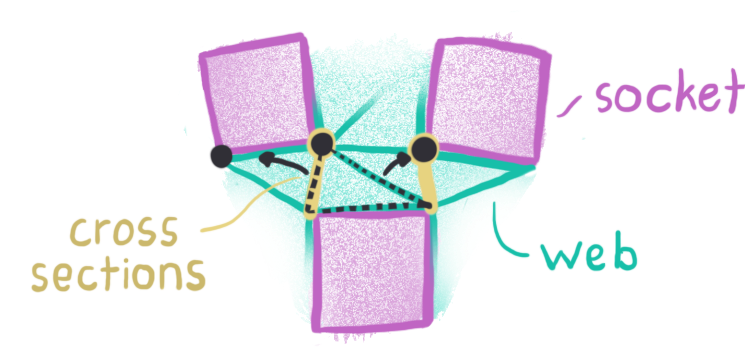{ width=320 .center}

In all, there are 3 neighbor points to consider and 7 total pairs. In addition to the 6 permutations of these three points, the assignment of two cross sections to the original point (2 pictures up) counts as an extra pair. The chosen pair will be closest to the vertices of the side (i.e. minimize the length of the yellow lines above) and be near-equally spaced from these vertices (i.e. the yellow lines have similar lengths).

The precise algorithm is as follows: First clamp the measured distances from side vertex to neighbor vertex to be at least 1mm. This allows the algorithm to work with tiny lengths. If one vertex is 1mm away and the other is 0.01mm away, the lengths are for all purposes equal. Then calculate the ratios of the distances between the pairs. If any pair has a distance ratio greater than 3:1 (or less than 1:3), it is discarded. Finally, the pair with the smallest sum of distances is chosen.

### Adding New Faces

At this point we have two cross sections, and with them we can compute how much each endpoint of the edge needs to be offset. So now, just move the vertices and call it a day right?

_Right?_

_Right?_

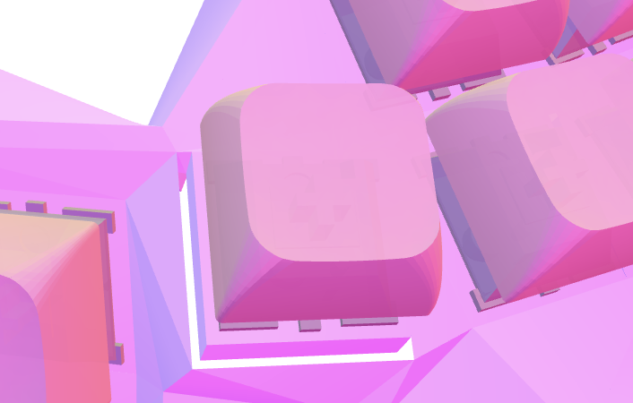{ width=300 .center }

There's more work to be done. Moving the vertices creates empty holes around the key socket. Not only will these holes need to be filled with new triangles, but the nearby triangles must be split to avoid further holes.

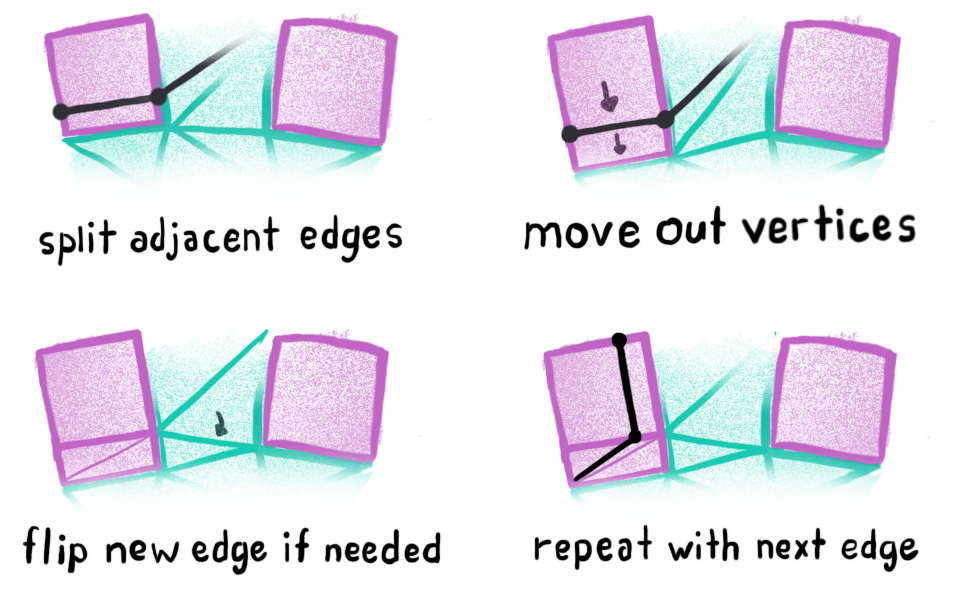{ width=500 .center}

This section describes the face-splitting algorithm I developed for Cosmos. It operates on an array of vertices and an array of triangles containing pointers to the vertex array (or more accurately, every triangle records indices into the vertex array). There's a few desirable properties for it to have:

1. If a `vertices[i]`needs to be offset, then `vertices[i]` will be updated with the new vertex location. Then, wall computation will use the new vertex positions.
2. Every original vertex position must still be stored in `vertices`. That is to say, if a vertex is moved, its original location must be pushed to the end of `vertices`. Otherwise, there will be holes in the model.
3. If an edge is split, each face on either side of the edge must be divided into two faces. This also ensures no holes are added.
4. The order through which edges are traversed should have little effect on the resulting model.

The most critical decision in this algorithm is the choice of which edges to split. I choose to split the two edges on the key socket adjacent to the current edge. These edges are special in that they only have one adjacent face each, which means only one face per side must be split into two.

The new vertex is shifted into the location of the original vertex, while the original vertex is offset in place. Additionally, the references of vertices in the socket's points are updated so that the next socket edge that is examined has the correct set of points.

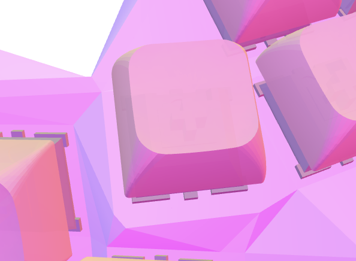{ width=300 .center }

This is how the same area looks after the new faces are added.

### Face Flip

This algorithm produces long thin faces when it splits edges. Sometimes they are desired. Other times, they are not.

{ width=260 .center }

This image shows a socket sticking through the web in the Manuform thumb cluster. The keycap is orange/red because the generator is complaining that this model is not going to print well. The socket is intersecting the web because the dark purple triangle directly below the model is facing almost downwards, which pushes the triangle directly below it into the socket. These two triangles need to be modified in order to produce a well-formed model.

Therefore, the final step of the algorithm is to flip any edges that 1) Don't satisfy the Delaunay condition and for which 2) flipping them increases the "bubbliness" of the model. I'll explain what both of these mean in a moment, but here's what an edge flip does:

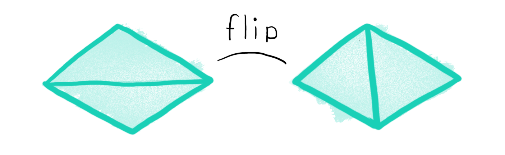{ width=440 .center }

In the image above, the edge on the right might look nicer division to you than the edge on the left. Perhaps because the edge length is shorter, or maybe you see that the angles on average are larger. Optimizing for large angles in fact generally leads to good divisions.

The first condition comes from the [Delaunay triangulation](https://gwlucastrig.github.io/TinfourDocs/DelaunayIntro/index.html) algorithm, which is also used to draw the triangles in the original mesh. This algorithm creates triangles such that no point lies within the circumcircle of any triangle. Very optimized algorithms use checks based on this property, but I prefer the definition that for every edge, the sum of the two angles opposite that edge is always less than 180°. This property eliminates many thin triangles, maximizes the minimum angle, and leads to an even, nice-looking mesh.

When the Delaunay triangulation is performed, all points are projected to 2D. However, when doing this algorithm I'm working in 3D, so I calculate the angles in 3D (i.e using the [dot product](https://math.stackexchange.com/questions/116133/how-to-understand-dot-product-is-the-angles-cosine) of the 3D vectors instead of their 2D projections) to check if an edge is locally Delaunay. This goes against the definition of the algorithm, and maybe it's not the most optimal. However, performing the checks in 3D yields better results as orientation information is lost in the 2D projection. In fact, it works so well that I've added a preprocessing step after creating the web through Delaunay triangularization that checks the 3D angles and flips any non-locally Delaunay edges. This helps fix some web meshes, even if none of the other improvements in this blog post apply.

The second check prevents pockets from being punched into the model, decreasing part thickness. The goal of this edge flipping step is to remove pockets, not create them. This check is implemented by calculating and checking the angle between the two triangles about their common edge.

These two conditions identify the problematic areas and flip the appropriate edges so that the web is better formed:

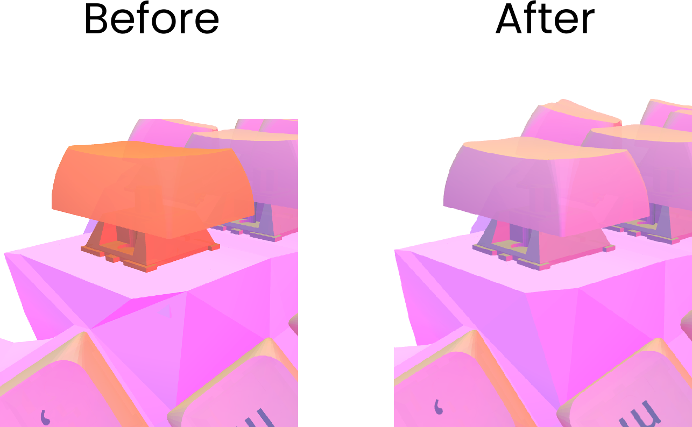{ width=440 .center .pad }

## What about the Thickness Viewer?

You may be curious after all of this, how is the thickness viewer working? How is _it_ calculating thickness?

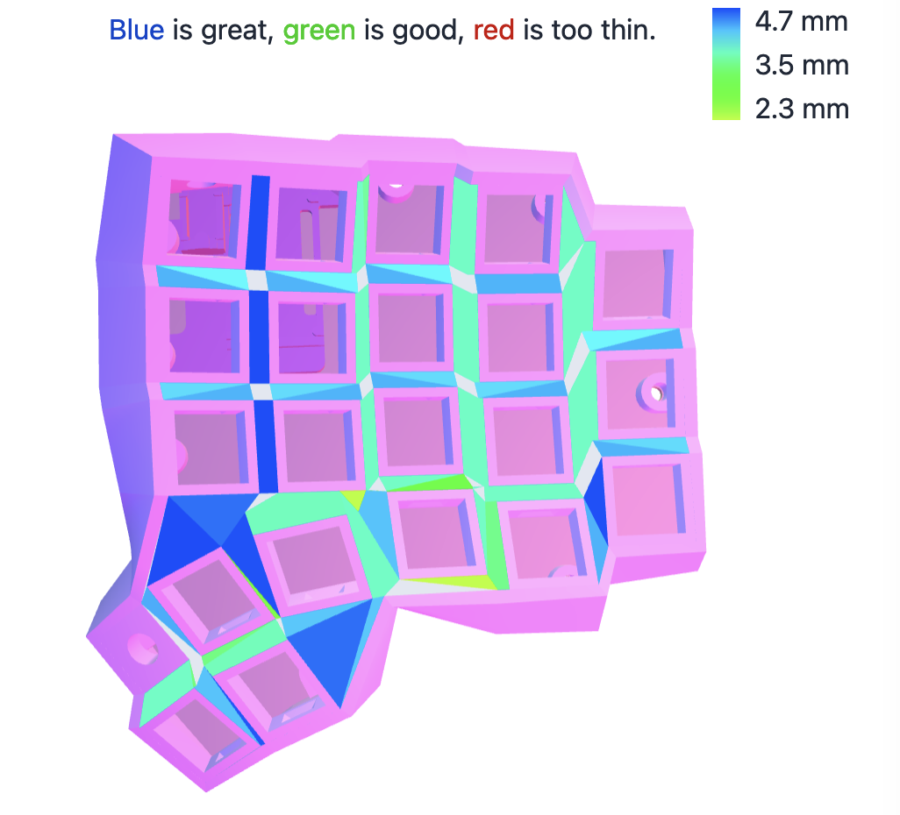{ width=440 .center }

The answer: using the same formulas from the first section of this post. Recall that maximum offset by which a vertex is moved is limited by nearby keycaps and switches. Furthermore, the generator targets 80% of the web thickness. The web is 4.7mm thick in the keyboard above (determined by the socket's height), so the generator targets 3.8mm. That is to say, parts of the web any smaller than 3.8mm will be thickened to 3.8mm, space permitting. This is why many spots are colored teal and cyan.

Rather than substituting a desired thickness and solving for the offset, the generator calculates part thickness by substituting the offset it's using and solving for thickness. Thickness information is propagated to any newly created faces as well as from top to bottom and bottom to top of the mesh. The thickness information will only be as accurate as the approximations used in the algorithms. A more accurate approach would utilize [signed distance functions](https://www.shapeways.com/blog/visualizing-wall-thickness-in-a-3d-model), but for prototyping it's more helpful to have fast feedback than accurate feedback.

## Conclusion

This concludes our discussion of how the web thickness is made consistent in Cosmos. We journeyed from using geometry math to create an exactly consistent mesh in 2D to developing algorithms and heuristics to extend this process to 3D.

I think the ability to place a bunch of parts in 3D and then automatically generate a consistently-thick mesh between them is super powerful and one of the coolest algorithms behind Cosmos, and I hope this post helps you see it that way too.

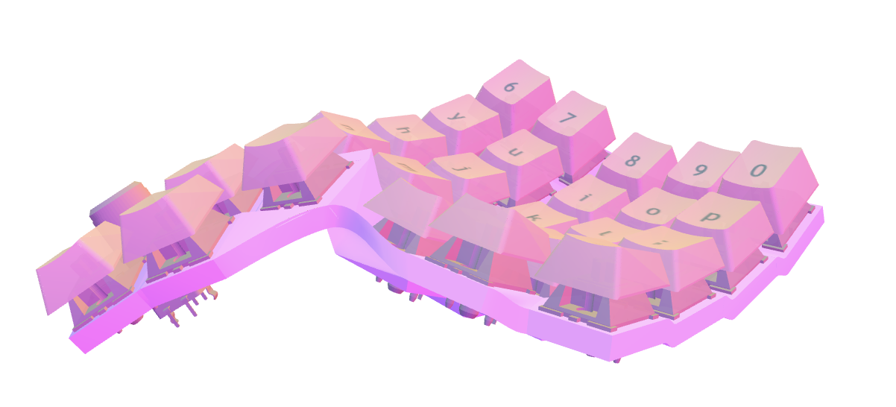{ width=540 .center }

--8<-- "docs/blog/.footer.md"
