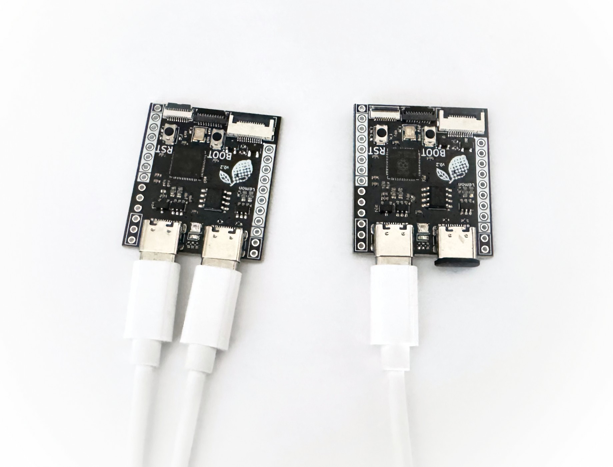
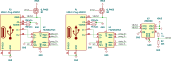

# Dual USB-C on Split Keyboards Is Hard

{ .header }

The header image on this post is a microcontroller [I'm developing](https://github.com/rianadon/Cosmos-Keyboard-PCBs/tree/main/lemon-microcontroller) to be put in split keyboards. I decided to add two USB-C ports for interconnect, a decision which has resulted in numerous hard decisions, hours of my time I'll never get back, and a blog post.

<!-- more -->

Using USB-C to connect split keyboards is rare. I can probably count the number of commercial boards using USB-C for interconnect on my hands. _Every single other_ split keyboard uses 3.5mm audio jacks, except for a few projects using ethernet or even stranger connectors.[^1] There are a few reasons for this:

- Inertia. Split keyboards were invented before USB-C, and changing connectors is a big deal. You remember what it took the EU to make Apple ditch the lightning connector?
- Few Good Implementations. There are a few open-source designs using USB-C interconnect, but these [have issues](#the-hacky-approach). Despite the big open-source community pushing custom keyboards forwards, many of the commercial designs using USB-C interconnect are closed source.
- Difficulty. As the post is titled, this is hard. Hopefully as you read on you'll understand why. It's mostly a firmware thing.

By the way, if you're curious why I opted for two USB-C ports over the typical combination of USB and TRS/TRRS, you can jump to the [appendix](#appendix-why-did-i-do-this).

## USB Background: Hosts and Devices

USB-C cables are reversible, but the devices on both ends have unique roles: one is a host and the other is a device. The host is responsible for _enumeration_: figuring out what devices are connected so that it can load appropriate drivers. The device replies to enumerations and tells the host which protocols it uses. For example, when you connect a mouse to your computer, the computer assumes the host role and asks the mouse "what do you do?" and the mouse replies "I'm a mouse and I use the HID protocol."

<figure markdown>
{ .pad-s }
<figcaption markdown>The USB Enumeration process. Adapted from [FTDI's flowchart](https://ftdichip.com/wp-content/uploads/2020/08/TN_113_Simplified-Description-of-USB-Device-Enumeration.pdf).</figcaption>
</figure>

Connect a host and device, and they will function normally. Connect a device to a device, and nothing will happen.[^2] This will be important later on.

## The Hacky Approach

_Update: When I initially published this article, I [claimed](https://github.com/rianadon/Cosmos-Keyboards/commits/main/docs/blog/posts/usb-c-hard.md) this approach was dangerous. However, after talking to others and reading the USB spec, I realized it is not harmful to any of your devices._

I've seen many open-source designs simply ditch the USB protocol and replace the USB-C socket's D+/D- data lines with UART lines. The voltages are at least spec-compliant, but the signals sent over the lines are very different than what the USB protocol expects. If you decide to connect your keyboard and PC using this socket, the PC will supply power but it won't recognize the keyboard as a USB device, as it won't respond correctly to enumeration requests (which is fine! That's not what the port is for).

Despite sending the wrong signals, this approach is safe and will not harm your PC if you plug in the wrong socket. This is because the USB-C spec specifies that USB-C ports be resilient to shorted cables (section 7.1.1). Specifically, the transciever must survive any of D+/D-/GND/3.3V being shorted for 24 hours. This means that even if your UART USB-C connector and your PC are driving D+/D- different voltages at the same time, no electrical damage will occur.

!!! info "Prove It!"

    I've verified this by writing a short program running on the microcontroller that randomly toggles D+/D- between GND, 3.3V, and floating, and my Raspberry Pi 2B did not sustain any damage after leaving the microcontroller plugged in for 12 hours. Likewise, the USB-C on a Pi Pico and cheap CH552 microcontroller I had were not damaged after leaving the naughty microcontroller plugged in for several hours.

The two disadvantages of this approach are:

1. No feedback when you plug the USB-C socket running UART into your computer. If you don't quickly realize that you plugged in the wrong socket, it may seem like the keyboard is simply dead. That's not a great feeling to have.
2. It requires two microcontrollers with dual USB-C ports. It would be nice if you only needed one microcontroller with dual USB-C and could use any microcontroller of your choice (as long as it has one USB-C port) on the other side.

## The Four Port Problem

In a typical split keyboard, each half of the keyboard gets its own microcontroller, and these chips connect to each other. With four indistinguishable ports across two microcontrollers, I'll need to ensure the system works if I accidentally plug wires into the wrong ports. Here's one way of doing that using a dust plug:

{width=500 .center}

On the microcontroller with the plug, there's only one choice of USB port. If you adhere to symmetry, there's only one possible configuration of both cables, However, there's nothing stopping you from wiring them asymmetrically.

Ideally, the keyboard works no matter which cable goes where. This is only accomplished by requiring that the ports switch between device mode when connected to the computer and host mode when connected to the other keyboard half[^3] (remember, communication can only happen between a device and host). These ports both start off in device mode, but when you connect the other keyboard, magical goblins inside the port detect it's now connected to a keyboard and switch it to host mode. I explain how this can be done without a supply of magical goblins [in the appendix](#appendix-swapping-the-sockets).

## Reality Sets In

I'm trying to design something that's easy to use, easy to manufacture, and cheap, and you can't always achieve all three. One of the early decisions I made was to design around the RP2040 microcontroller. There are some other good choices: Some of the STM32 chips have 2 USB interfaces, but they are several times the cost of RP2040. Some CH32V2 chips also offer multiple USB interfaces and are cheaper, but I haven't seen them used much in keyboards. I would need to extensively test them before seriously considering them. The RP2040 is readily available, supported by most keyboard firmwares, comes with a built-in bootloader, has plenty of I/Os and speed, and is cheap. However, there is only one set of USB data lines. Using any more is outside of what's supported by the chip's SDK. The only way to send data through multiple USB connectors is to use [Programmable I/O (PIO)](https://www.raspberrypi.com/news/what-is-pio/) to write a program for pushing in/out data (such as [Pico-PIO-USB](https://github.com/sekigon-gonnoc/Pico-PIO-USB)) then use a USB stack like [TinyUSB](https://github.com/hathach/tinyusb) to implement the USB protocol. I can alternatively substitute some of this software complexity with hardware complexity by using a chip like the MAX3421E to talk USB and present a standard SPI interface to the microcontroller. Regardless, the complexity isn't going away, so the cheaper PIO option better fits the design goals.

Ultimately, the complexity of implementing device-mode on the PIO-controlled USB port forces me to make it a host-only port.
Host and device modes both use the same electrical protocol for sending and receiving data, but the actual data sent is very different on each side. Therefore, the code for implementing a USB device over PIO looks very different than the code for implementing a host. Adafruit sells [RP2040-based microcontrollers with USB host connectors](https://www.adafruit.com/product/5723), so they've put in a lot of effort into making sure host-over-PIO is supported in their libraries and frameworks. In [CircuitPython](https://circuitpython.org/), you can `import usb`, then start querying connected devices. Adafruit also spends a lot of time debugging the underlying PIO code and USB stack (they even sponsor TinyUSB), so thanks Adafruit! On the other hand, device-over-PIO has few real-world applications outside of split keyboards. CircuitPython has no library for using PIO to create a USB device, and even if I added one, I'd likely be the only one using it.

### Firmware Limitations

The [KMK](https://github.com/KMKfw/kmk_firmware) firmware is built on top of CircuitPython, so there's already built-in support for making the second USB-C port a host. You can also create secondary com port exposed through the main USB-C port in CircuitPython.[^4] I can use these two frameworks to make the microcontrollers talk to each other and transfer all the necessary data.

In [QMK](https://qmk.fm/) and [ZMK](https://zmk.dev/), support for USB host-over-PIO is going to be extremely difficult. It's not something that currently exists. Both firmwares use real time operating systems (RTOS) for dealing with close-to-hardware functions like I/O, USB, etc. QMK uses [ChibiOS](https://www.chibios.org/dokuwiki/doku.php), and ZMK uses [Zephyr](https://zephyrproject.org/). This functionality is better implemented in the RTOS rather than the keyboard firmware, but that's a task easier said than done. One of the large roadblocks will be that these RTOS often come with their own USB stack. Pico-PIO-USB has been well-tested with TinyUSB, but it may be incompatible with other USB stacks, and an RTOS will be reluctant to ship two USB stacks.

Support will be similarly difficult in up-and-coming keyboard firmwares like [RMK](https://github.com/HaoboGu/rmk). Using an RTOS has become a must for firmwares trying to target a broad range of microchips, and RMK uses [Embassy](https://embassy.dev/). Embassy also ships its own [USB stack](https://docs.embassy.dev/embassy-usb/git/default/index.html).

For keyboard firmwares that directly utilize the Pico SDK, like [PRK](https://github.com/picoruby/prk_firmware), it might be possible to implement the ideal vision, where either USB port can switch between device and host mode. Even better, PRK is already using TinyUSB! That said, PRK is a much smaller firmware, so I don't think developing a proof of concept around it would be worthwhile. The same could be said for any custom Arduino-based proof of concept I could create.

### The Way Forward

If you're creating a keyboard, you're probably going to be using QMK or ZMK. Besides having larger userbases and commercial backers, QMK is the only firmware supporting everything in [Via](https://caniusevia.com/) and [Vial](https://get.vial.today/), and ZMK has the up-and-coming [ZMK Studio](https://zmk.dev/docs/features/studio). Similar things exist for other firmwares (e.g. [POG](https://pog.heaper.de/) for KMK), but they're not as capable. If you're using QMK or ZMK and using my microcontroller, the best you can do is stick with the [hacky approach](#the-hacky-approach) and hope one day I get the firmware working. The wiring also won't be symmetric; you'll need to connect the left port of one microcontroller to the left port of the second and leave the right ports for connecting to your PC. This is because the left port is connected to the GPIO pins whereas the right port is connected to the RP2040's D+/D- pins.

However, I was able to create a KMK solution using the USB protocol for anyone who wants a taste of the future. Better yet, the wiring with KMK is symmetric. It requires some changes to the CircuitPython firmware, so I'll work on getting those at least published on GitHub and hopefully merged into mainline CircuitPython and KMK before I release the microcontroller.

## Conclusion

Unfortunately, I've found myself stuck in an unsatisfactory spot after chasing down these loose ends. With QMK and ZMK, it is possible to run UART over the USB connectors, but the UX is confusing. KMK should be better, but unless I can swap the two sockets on demand, you can only plug the right half into your computer. Part of me wants to optimize and re-examine my choice of microcontroller, look at more hardware USB controllers, and try to make a dual USB microcontroller that functions no matter how you plug it in. The other part just wants to ship what I have.

Sometimes, perfectionism doesn't win.

## Appendix: Why did I do this?

I didn't have a choice. If I used two different connectors on the microcontroller, I'd either have to live with the fact the connectors will be asymmetrical when two boards are placed side by side (which my perfectionism would never allow), or I'd have to make the microcontrollers symmetric. There's a few ways I can do the latter: make a left and right version of the microcontroller, flip the microcontroller upside down on one side (e.g. [Cyboard Imprint](https://cyboard.digital/products/imprint)), or split the PCB into multiple PCBs (e.g. BastardKB's [Splinktegrated](https://docs.bastardkb.com/bg_charybdis/08splinktegrated.html)). These all have serious disadvantages: either because of inventory and revision cost or because of size.

Here's a variation of my [Limbo](https://ryanis.cool/cosmos/showcase/d85e682f/) keyboard in Cosmos with the walls hidden. If you look closely, you can see the switch pins come very close to the microcontroller. I can't afford to allocate any more vertical space for the microcontroller. This is a low profile keyboard, or as low profile you can get with a curved keywell, so the point is to keep keys as low to the ground as possible.

{ .pad-s }

## Appendix: Swapping the Sockets

About those magical goblins... I have a potential electrical design to intuitively swap ports so you can program the microcontroller from either socket.

The key piece of this design is to use two USB muxes for swapping the data connections. The FSUSB42MUX is quite cheap! At large quantities you can get 2 of them for under 50 cents. They also have ESD protection, so I'd no longer need a separate ESD chip. Put two of these muxes together, and you can use a pin on the microcontroller to swap the programming and data USB connections.

Here's an unproven design using two muxes. Changing `sel` will swap the pins connected to the USB socket. I've also added LM66200, an ideal diode that detects which USB port has power and puts that information on `sense`. The PMOS at the top are used to drive the second USB port with the power that comes from the first port.

{ .pad-s }

When the microcontroller boots up, it reads `sense` with `drive` high, changes `sel` accordingly, then pulls `drive` low. This sets the muxes to connect the programming pins to the first USB socket to be powered, then powers both sockets. You can also think of the programming port as the device port and data port as the host port. Not only does this design allow you to program by plugging in either port, but it also lines up the host and device ports. However you wire together the sockets, things should just work.

There are two issues here. The first is that if you are holding down the boot button, the program will never run and set the `sel` pin! It would be better to set `sel` in hardware instead of software. Second, this design is only useful if I can make the two halves talk USB to each other. I cannot think of a way to use a similar design that links up the two data ports.

--8<-- "docs/blog/.footer.md"

[^1]: I've seen Mini XLR, VGA, and ribbon cables too. The really huge connectors with lots of pins (like VGA) are nice in that you can share the matrix wires across halves, which allows you to use one microcontroller for the whole keyboard.
[^2]: This is a simplification. Some USB devices, such as your smartphone, can act as both devices and hosts. This is why you can not only connect both a flash drive and a smartphone to your computer, but also connect the flash drive and smartphone to each other. This is called [USB On-The-Go (OTG)](https://en.wikipedia.org/wiki/USB_On-The-Go).
[^3]: To properly switch to host mode while obeying the USB spec, the CC lines would need to switch from being pulled down with 5.1k resistors to being pulled up to VBUS with 56k (or 22k if I'm supporting 1.5A draw, or even smaller if I'm instead pulling up to 3.3V). If I don't do this, most devices connected to the host will still work; only ones that check the CC voltage to determine their power budget will fail. I believe properly implementing this part of the spec is not worth the extra hardware. So, maybe don't charge your battery bank from your keyboard's interconnect port?
[^4]: You can do this using the `usb_cdc` library. KMK already uses this module for stenography. Programs like Plover use their own protocol, so KMK opens an additional port to communicate with the stenography engine.
