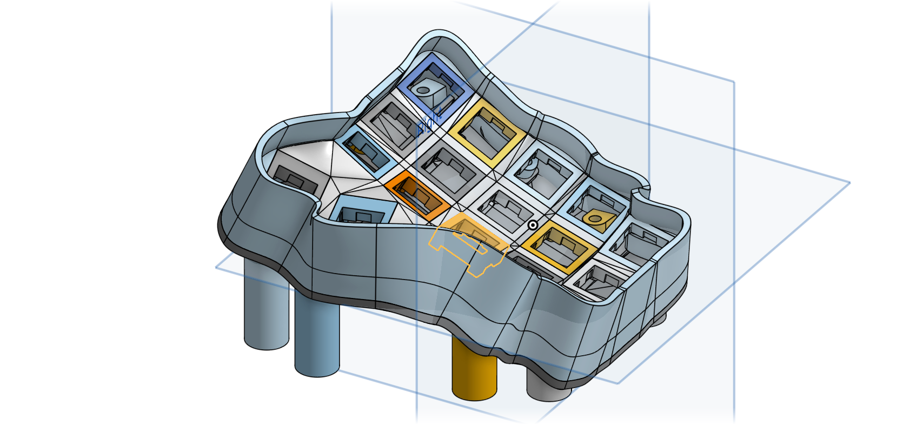
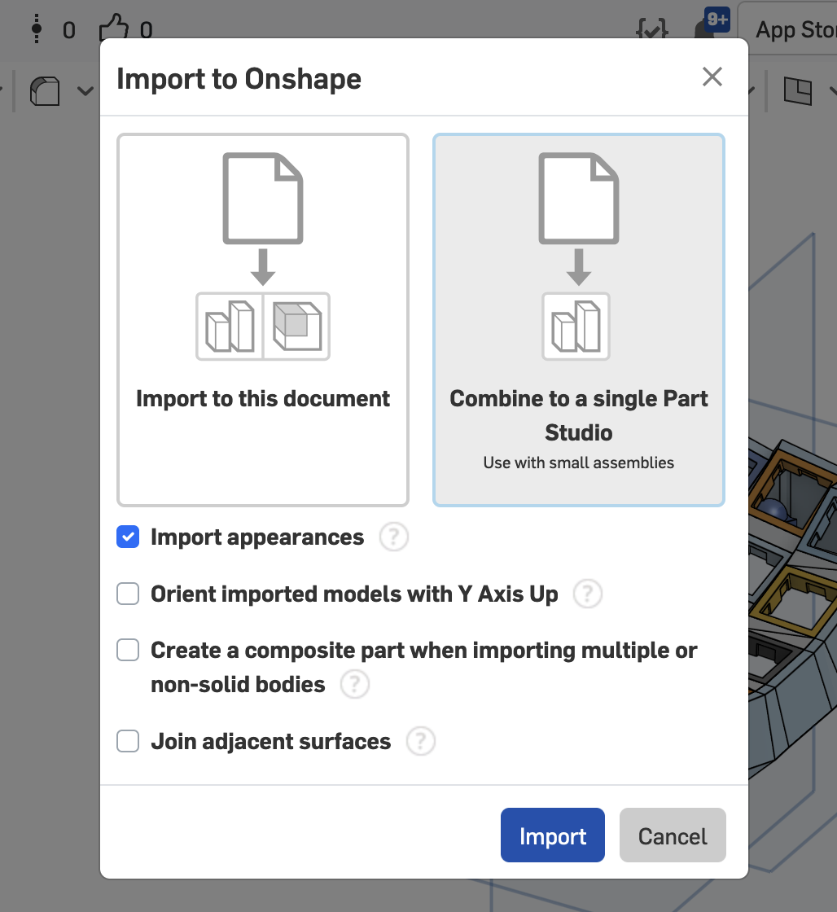

# Importing into CAD Software

While it's great at getting a prototype into your hands, Cosmos will never be a replacement for CAD Software like OnShape, Solidworks, and Fusion. Tools like these will always have a role in product design (until the robots take over), and Cosmos integrates with these so that you can and add all the bells and whistles you like to your keyboard. _After all, what good is a keyboard if it can't whistle? /s_

## Preparation

Not every model imports correctly into CAD software. You'll need to ensure your model is free of any errors including:

1. There must be no areas where the switch sockets intersect the model. Open the thickesss viewes, and ensure that the triangles have no intersections.
2. Walls with zero thickness in the thickness viewer are also a bad sign. Adjusting keys so that there is a smoother transition between them helps thicken these walls.
3. If using smooth mode, none of the walls must intersect each other. Sometimes when using large staggers, the smooth wall will do loop-de-loops. These do not work well with both 3d printing or CAD. Decreasing stagger helps fix these

If you'll only be using the switch sockets or using the model as a guide to design your own keyboard, you do not need to follow these steps.

## Using the STEP File

Cosmos exports multi-part assemblies in the STEP format, the most commonly used standard for CAD files. Every component of the keyboard is split into a different part to make it easy to say, delete everything but the switch sockets, then model the shell yourself. Unlike STL files, STEP files include face data and can represent smooth curves with much higher precision, making them much easier to use when modeling.

Here's some things you can do with the STEP file:

- Add a mount for your microcontroller
- Change the shape. You can go as far as deleting the walls and re-making them yourself!
- Add a mount for a custom part (trackpad, joystick, etc)

!!! tip "If You're Thinking of Adding a Custom Socket/Mount"

    I encourage you to think about contributing your socket to Cosmos! You'll be able to customize the size of its cutout, ensure the mating part doesn't collide with the floor, and best of all many others will be able to benefit from your work. Even if you've never used GitHub before, I'm more than happy to answer dumb question about contributing.

### Which CAD Software to Use?

Cosmos is tested using both OnShape and Autodesk Fusion. Both are very capable and have free plans. If you're new to CAD I'd recommend OnShape since they have [great tutorials](https://learn.onshape.com/learning-paths/introduction-to-cad) and I personally find it a little more intuitive, but Fusion has much advanced features for [working with curved surfaces](https://www.youtube.com/watch?v=SYLJyOuDKmo) if that's something that interests you.

Nevertheless, STEP is a standardized format and supported in every CAD software. I often use [FreeCAD](https://www.freecad.org/) and [Mayo](https://github.com/fougue/mayo) for viewing models.

### Import to OnShape

I recommend you put everything in the same Part Studio (not required). OnShape may warn you that it encountered geometry errors while importing. This is to be expected while Cosmos is still in beta.

{width=50% .center}

To prepare the model for printing, I recommend you use the boolean tool, make sure the operation is set to union, and add all the parts. Then you can right-click the part and export it to an STL file for printing. Alternatively, you can create a composite part, but there are a few rare slicers that do not like working with STL files that have intersecting parts.

### Import to Fusion

After importing to Fusion, each component of the keyboard (walls, web, key sockets, etc) will display in the outline as separate objects. It's often easiest to work on these parts separately, but if you'd like to fuse all the solids together, use the Combine tool.

If there are geometry errors when combining, add the key slots one by one. You'll be able to figure out which one is causing problems, so you can go back to Cosmos and adjust it.

To export the model for printing, right click the body in the outline view, then choose "Export Mesh" to create an STL file. Some old slicers require that you combine parts together, because they do not like working with STL files that have intersecting parts.

_NOTE: This video is outdated. You no longer need to stitch the walls together._

## Using the STL File

CAD software takes a large time investment to learn, so if you have no interest or time, the STL file can also be edited with 3D modeling tools such as [Blender](https://www.blender.org).
Even if you're familiar with CAD software, Blender's sculpting tools allow you to add intricate detail and organic shapes to the mesh.

To get started, import the STL file with File -> Import -> STL. The video below uses the draw & inflate tools, but I don't recommend draw (you'll see in the video it removes some material from the sides). Instead I recommend inflate & smooth. The video shows how to turn on dyntopo mode so that your sculpting adds vertices to the model for greater sculpting resolution.

