# Configuration

## Modes
There are three modes for the configuration. This documentation is written for the Advanced mode. When you refresh the page, you might have to select the advanced mode again.

### Basic
Only shows the most used configuration options.

### Advanced
Shows most things, that you'll need to create your keyboard.

### Expert
Allows to edit the code directly, to enable even more possibilities. See [expert mode](expert.md) for that.

## General
Some setting groups allow you to edit the vaues for one side of the keyboard. When you edit want to edit them together, the values of the left half will be overridden by the values of the right half.

## Upper keys
This section steers the general look / layout of the keyboard.

The "Out", "Num", "Fn" and "Inner" buttons allow you to add rows on the outside or inside, and add a number and/or fn row.

!!! info "The "Fn" button automatically selects the "Num" button."

Ø removes the keys and only leaves the thumb cluster.

The `r`x`c` button allows you to manually specify how many rows and columns you want.

The keycap and switch settings work the same as [the ones in the edit key menu](editor-basics.md#switch-and-keycap-size).

The horizontal and vertical spacing do the following:

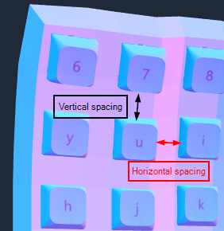

## Curvature
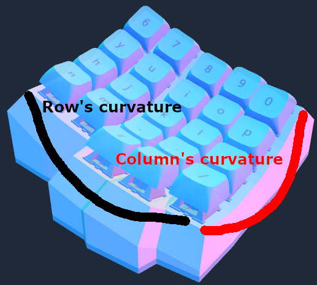

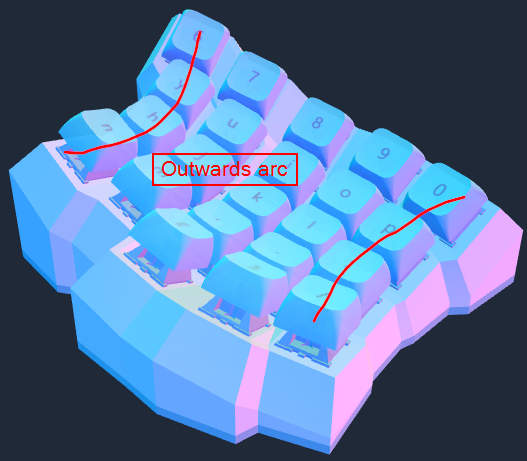

!!! info "The tenting angle only changes the angle of the keywell, and not of the thumb cluster."

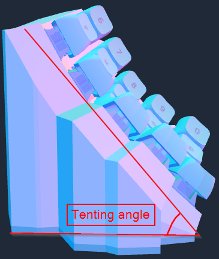

## Thumb cluster
With the buttons, you can cycle through a few preset thumb clusters. You can also remove the thumb cluster with Ø.
If you want to make a custom thumb cluster, choose one of the presets and then edit the keys manually. If you need more keys on the thumb cluster, make sure to select a thumb cluster key to [add a new one](editor-basics.md#adding-keys) to keep the clusters.

The curvature can be adjusted and changes the angle of the keys like with the keywell. This option only changes some thumb clusters, other presets are unaffected.

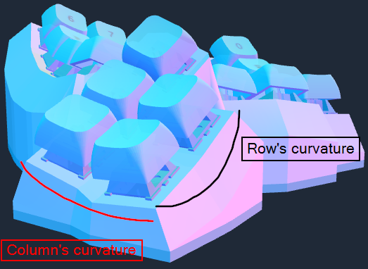

## Case
### Case modes
#### Default
The default mode creates the outer walls and a base. This can be subobtimal for high tenting angles, as there is a lot of unnecessary material (and a lot of supports).

The add lip options creates a little lip around the base. This hides warping and can create a cleaner look.

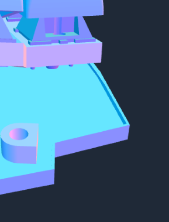
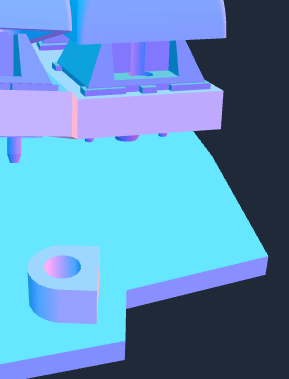

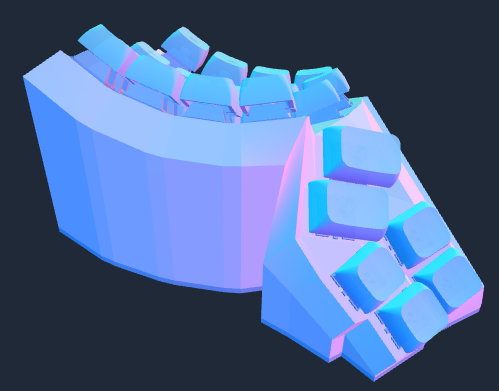

#### Stilts
The stilts case mode creates stilts for the keyboard to sit on. This works better for high tenting angles. This feature is experimental as of now, so not everything might behave as it is expected.

The tuck in bottom plate option seems to push in the bottom plate a bit further.

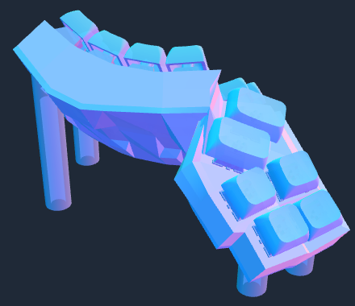

#### Tilting base
The tilting base case mode separates the base into two pieces. There is a tenting part (the one with the slits) and the normal base. This enables you to print that part with less / without supports, and the top part with less supports. This setting also makes your keyboard a bit higher, so be aware of that.

The case tenting angle setting allows you to controll how much the bottom is tented, and how much is tented in the top.

The use pillars option allows you to remove the pillars, makin a solid base. You can also adjust how spaced out the pillars are. The first number specifies how thick the pillars are, the second number how much space there is in between the pillars.

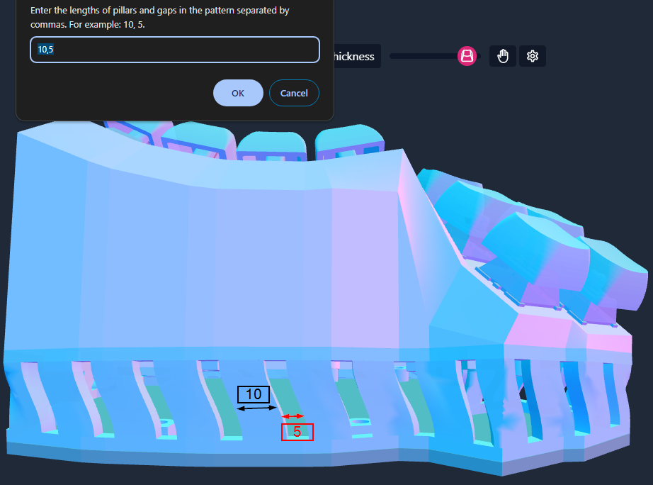

The raise case by option allows you to specify, by how much the upper case should be raised.

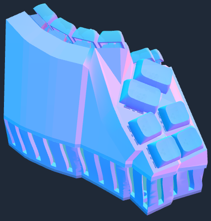

### Other case settings
#### Connectors
You can add more / less connectors in the edit connectors dialog.

The bigger the X value for the custom position, the further away from the middle that connector is. The microcontroller holder will be generated for the values that you put in.

If you choose the type custom, you can specify what width and height you want. If you want to create a circle, set the width and height to the diameter and the radius to the radius. You can also set the X and Y position here.

For the connector index (L/R) see [the expert documentation](expert.md#microcontrollers-and-screw-inserts)

#### Microcontroller holder
The microcontroller setting changes, for which microcontroller the holder is generated.

You can set the angle for the microcontroller. Be careful, too high values will mess the holder up.

Here you can see the holders for the microcontrollers.

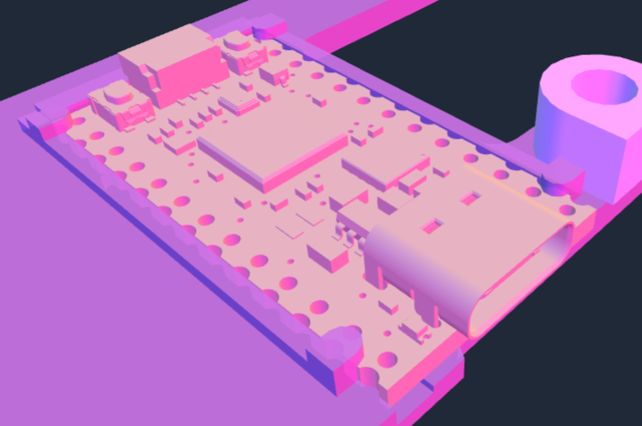
vs the microcontroller without holders

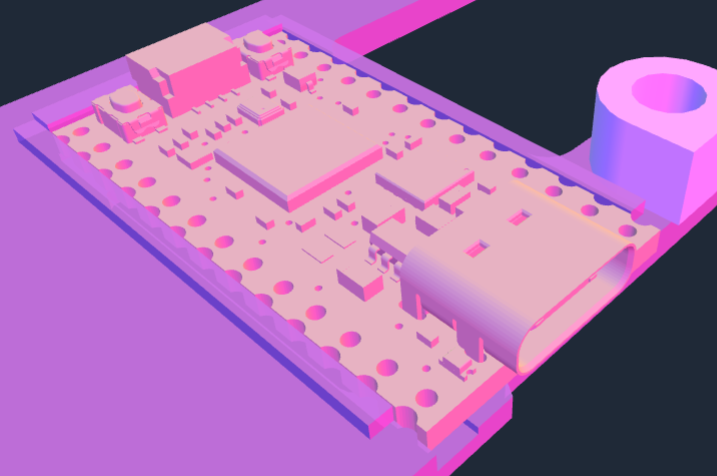

#### Base settings
If you want to glue your base on (or fix it in any other way), turn off the fasten the base with screws setting. Below that you can choose how many, what screws and what fasteners you want to use (check [screws and inserts for that](screws.md).

You can also choose to not countersink the screws, but you will have screw heads sticking out of the bottom with this setting.

#### Wall settings

The rounded edge settings rounds off all of the "sharp" edges that were generated.

Normal walls

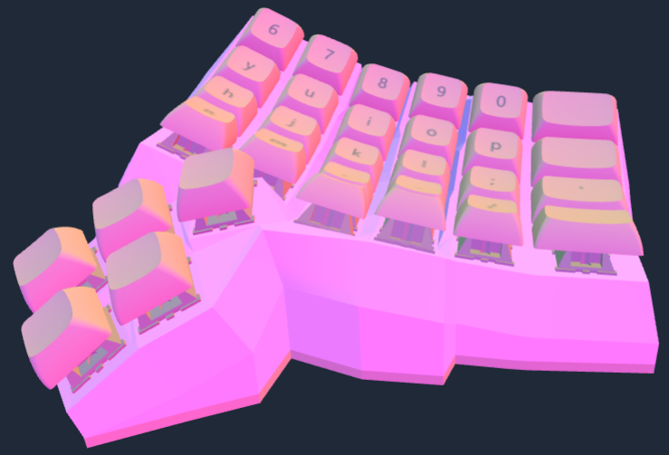

vs smooth walls

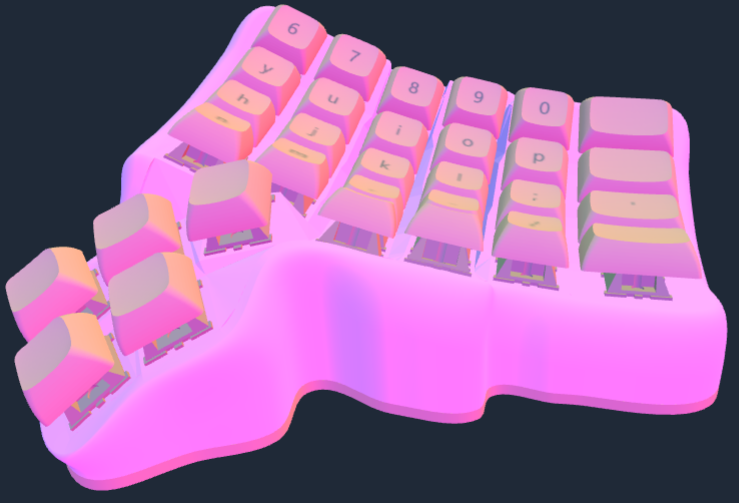

With these settings enabled you get another pair of settings to controll the smoothing. TODO explain these settings

No wall shrouding

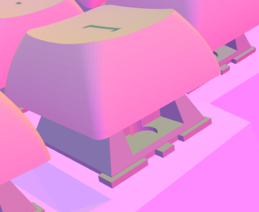

vs wall shrouding

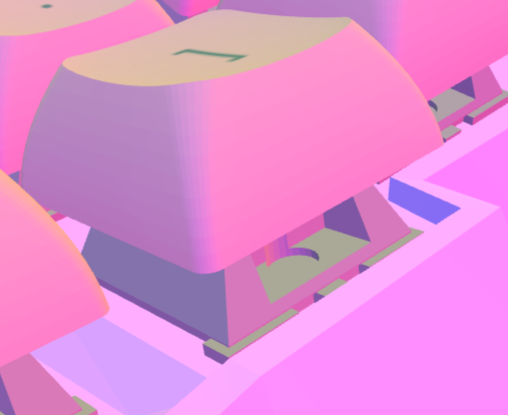

The wall thickness controlls the tickness of the wall. If you make it thicker the footprint will get larger, as the additional wall is added on the ouside.

Minimum web thickness TODO

The vertical part clearance adds clearance on the bottom so you have more space for wiring or other stuff.

The auto clear screw inserts adds additional height so all scre inserts fit in there. TODO

## Extras
Show wrist rest shows / hides the wrist rest.

### Unibody
When activated, the unibody setting converts the keyboard to a unibody keyboard.

You can set the separation and the angle with their respective settings.

### Wrist rest

