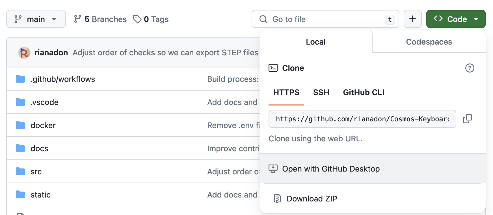
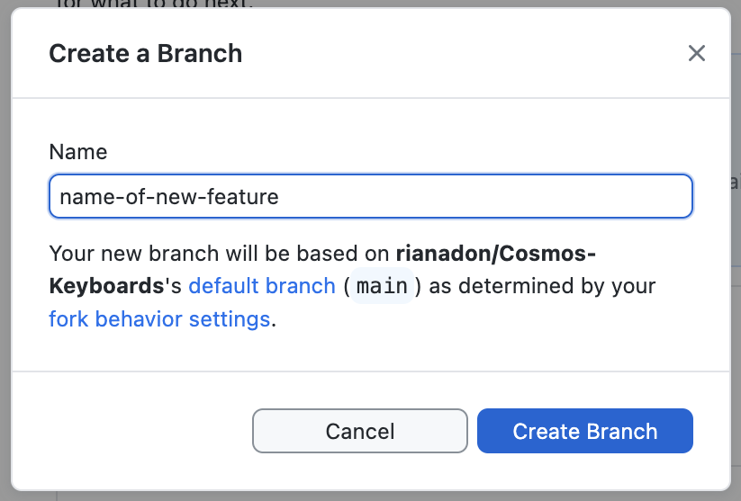
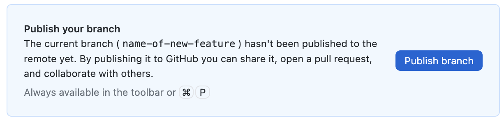
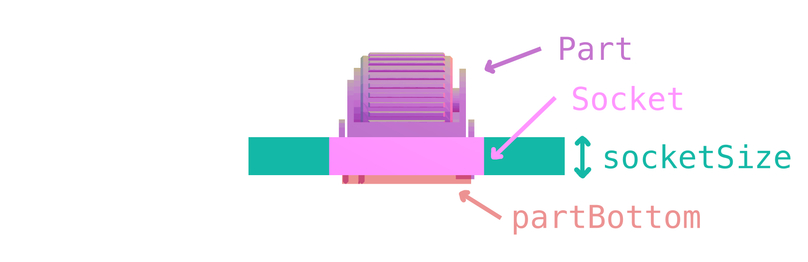
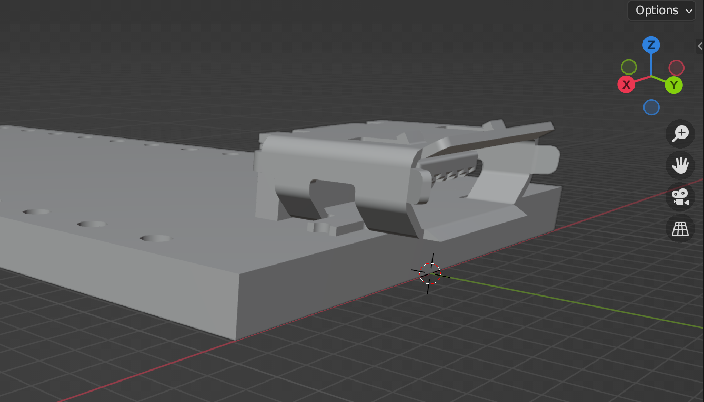
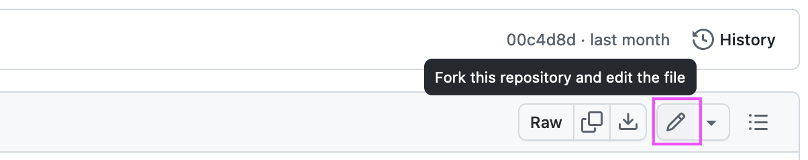
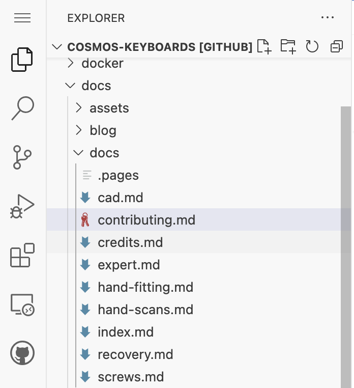
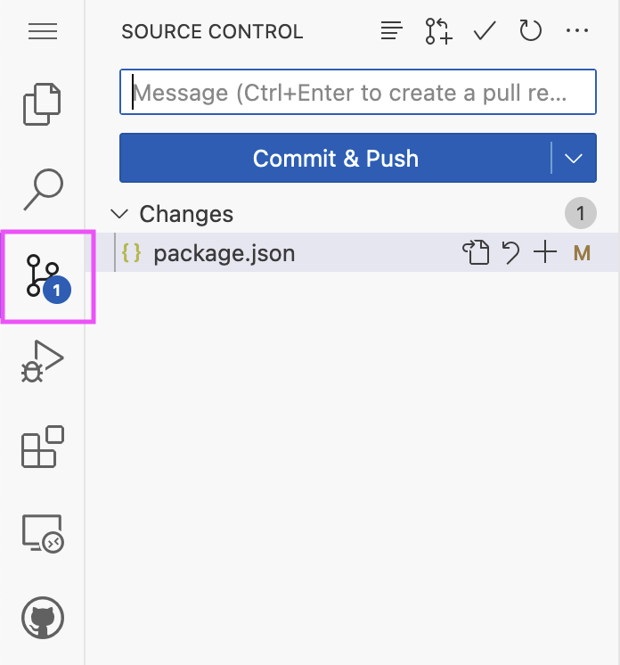

# Contributing to Cosmos

## Building the Project

For quick instructions, refer to the [README](https://github.com/rianadon/Cosmos-Keyboards/blob/main/README.md#start-of-content). If you're not a programmer but would still like to contribute, check out the [Contributing CAD Models](#contributing-cad-models) section and the [Contributing Docs](#contributing-docs) section. If you'd like more details on the build system, here you go:

### Building Documentation

If you are using the docker setup, the docs server will be started as well.
Otherwise, install Python&nbsp;3 then run the following commands:

```bash
npm install --include=optional # Make sure optional dependencies are installed
make venv # Creates virtual environment and installs python dependencies.
make keyboards # Generates images of keyboards used in the docs.
npm run doc # Serves the documentation
```

If you'd like to run the dev servers for the generator and docs simultaneously, use `npm run dev:all`. Vite is set up to proxy the documentation, so you can go to the main page, click the link to the docs, and view your local changes.

### Quickstart, in Detail

The `make quickstart` command recommended in the README bundles together several useful commands in the `Makefile`:

```bash
npm install --omit=optional # Installs dependencies
mkdir target
make # Compiles protobuf files and expert mode autocompletions
make parts # Generates the mx switch geometry
make keycaps-simple2  # Generates keycaps used for collision detection
make keycaps2 # Generates geometry for all the keycaps
```

This will set you up for a pretty complete generator. There are a few more commands available for building the production site, which are not included in `make quickstart` since they require optional dependencies

```bash
make keyholes # (requires Java and Leiningen): Generates backwards-compatible Dactyl keyholes
export OPENSCAD=$(which openscad) # For the next 2 commands: sets var to openscad executable
make keycaps-simple # Alternative to make keycaps-simple2; Requires OpenSCAD
make keycaps # Alternative to make keycaps2; Requires OpenSCAD
```

??? info "What's the difference between keycaps and keycaps2?"

    The `make keycaps-simple2 keycaps2` scripts use a web assembly version of Manifold to render models (and OpenSCAD for running the scripting parts of the scad files), but the translation layer I wrote is not 100% accurate.

    _The relative proportions of keys are not fully correct, but the scripts are more than good enough for local development._

    The `make keycaps-simple keycaps` scripts are what I use for the production site, but they require a recent version of [OpenSCAD](https://openscad.org/downloads.html) (at least 2023) and the Linux version of OpenSCAD seems to struggle rendering the keycaps for some reason. If you wish to use these, either set the `OPENSCAD` environment variable to the location of the OpenSCAD executable or symlink the executable to `target/openscad`.

### Why so many Make targets?

Everything except `make` (i.e. running `make` by itself which triggers the default target) will trigger a script that takes several minutes to execute and depends on too many files to use Make's dependency system. They're broken up so that you don't need to re-run the entire build process if you have, say, only added a new keycap.

You'll probably find yourself needing to run `make` (the default target) once in a while, which is intelligent enough to only re-compile things that have changed.

## Contributing CAD Models

### Super Simple Contributing

_(relative to the other methods of contributing)_

This guide will cover how to make changes to the CAD files in Cosmos so you can add a new part, without needing to use the command line or downloading any programming environments.

The end goal is that you'll be able to create a pull request [like these](https://github.com/rianadon/Cosmos-Keyboards/pulls?q=is%3Apr) on GitHub. This is how you can contribute your own changes to the repository.

1. Fork the [the repository](https://github.com/rianadon/Cosmos-Keyboards/) by clicking the Fork button at the top right. A fork is a copy of the repository in which you can make your changes.
2. Open the fork in [GitHub Desktop](https://desktop.github.com/). You can find this button by clicking the green Code button. In the likely case you don't have GitHub desktop installed, the button will take you to the download page.

   

3. Open GitHub Desktop once it's downloaded. You'll be prompted to sign in. Create a GitHub account if you don't already have one.
4. Click on the forked repository in GitHub Desktop then click the blue Clone button (alternatively, follow step #1 again). At this point you'll be asked to choose a Local Path for the repository. This is the place on your computer where all the files will be downloaded.

   { width=500 .center }

5. Click Clone, make sure Contribute to the parent project is selected, and then click Initialize Git LFS. GitHub will place you on the main branch, but it's cleaner to put each big change in a new branch so that we can discuss each change independently. To create a new branch, click "Current branch" at the top, then "New Branch", and give the branch a name.

   { width=400 .center }

6. Now you can view and open the files on your computer! All CAD assets are stored in the `src/assets` folder. Go ahead and make your modifications.

7. Once you've made changes, they'll show up in the list of files. Give a short summary and description for your changes, then click "Commit to &lt;branch&gt;". You can commit as many times as you like. Think of each commit as a saved version you can go back to.

8. Upload your changes to GitHub by clicking Publish branch.

   { width=600 .center }

9. This button will be replaced with a new button to create a Pull Request with your changes. Write up what work you've done, and we'll discuss the changes in the comments section in the Pull Request!

   When you create the Pull Request, the Vercel bot will deploy a preview of the entire Cosmos website, with your changes applied. You don't have install any additional software to preview your changes; it's all managed in the cloud. ☁️

### Contributing Parts

In the codebase, the part integrated into the keyboard that holds a switch, trackball, screen, etc. is called a **socket**. Whatever is placed within the socket is called a **part**. Both the socket and part share the same name, which is used in Expert mode as the `type` property for a key. This short guide covers adding a new socket & part to the codebase.

{ width=550 .center }

Here's how to add a new socket to the codebase:

1. Give the socket a name. The standard I've been loosely following is `thing-dimensions-vendor`. The vendor & dimensions can be omitted if they are obvious. For example, `trackpad-23mm-cirque` and `oled-128x32-0.91in-adafruit`.
2. Design a STEP file for both the socket and part with the origin located at the socket's top center. The Z axis should face up. Place it at `src/assets/key-(name).step`. If you're using someone else's STEP file, make sure it is licensed for reuse. Give the part the name "Part" and the socket the name "Socket" before exporting the two as a STEP assembly.

!!! tip "Socket Sizing"

    Try to make the width and height (X and Y axes) of the socket as small as you can. The smaller the socket, the closer it can be placed to other parts on the keyboard! However, try to keep the part at least 4mm thick for stability.

3. The boundary of the socket must be a either a rectangle or circle, but it can be of any size. Take note of the dimensions.
4. Edit `src/lib/geometry/socketsParts.ts`. Add an entry like the following:
   ```typescript
   'ec11': {
      partName: 'EC11 Encoder',
      bomName: 'EC11 Encoders',
      category: 'Encoders',
      stepFile: '/src/assets/key-ec11.step',
      socketSize: [14.5, 14.5, 4.5],
      partBottom: [box(12, 12, 14.5)],
   },
   ```
   The part/socket pair has two names: `partName` is the name shown in the editor, whereas `bomName` is shown in the bill of materials. Unlike `partName`, `bomName` is plural. Usually these are similar, but it's helpful to include vendors and part numbers in the `bomName`, whereas `partName` should be concise.<p>
   The field `stepFile` is the location where you saved the STEP file (`src/assets/key-(name).step`), and `socketSize` refers to the part boundary from step 3. The order of dimensions is `[x, y, z]`.</p><p>
   Finally, `partBottom` is a box describing the boundary of the part, referenced from the top of the socket. This is used to raise the model high enough so that your part doesn't collide with the ground!</p>

5. Edit `src/proto/cosmosStructs.ts` and add your socket/part to the `enumeration('PART', {` declaration. You'll need to give your part a unique number used to identify it in the URL. Switches get numbers from 1–15, and everything else uses 16–109.

#### Previewing Locally

Assuming you've already cloned the repository and ran `make quickstart` and have just made your part changes:

1. Run `make` to update the configuration parser and regenerate the Typescript type declarations for Expert mode.
2. Run `make parts` to convert the STEP file to GLB so the parts preview page can efficiently display the model.

After these steps you can visit [http://localhost:5173/parts](http://localhost:5173/parts) to see your part's socket displayed.

#### Rounded Sockets

For some parts like trackballs and trackpads it makes more sense for the socket boundary to be a circle instead of a square. To configure one of these, `socketSize` should be configured as follows:

```typescript
socketSize: { radius: 10, height: 3, sides: 20 }
```

The radius is the dimension in X and Y dimensions (make this slightly smaller than the model radius), height is the Z dimension, and `sides` is the default number of sides used to inscribe a polygon into the circle. It should be left at 20.

#### Part Override

In some cases it's more efficient to share a part model across multiple sockets (for example the MX switch part is shared by many different sockets), or you have a STL file of the part handy but not a STEP. In these cases you can design the STEP file with the socket only then specify the location of the part model:

```typescript
partOverride: '/target/switch-cherry-mx.glb'
```

This path starts with `/target` because the `.glb` file was generated from an STL file during `make parts`. It's generally best to do this as the build process generates optimized `glb` files. To use this feature place your STL file under `src/assets/switch-(name).stl` then add a line in `src/model_gen/parts.ts` like the following:

```typescript
pool.add('Cherry MX Switch', () => genPart('switch-cherry-mx'))
```

#### Parts with Variants

The trackball model in Cosmos supports multiple different sizes, sensors, and bearing types. Altogether, there could be dozens of trackball models which will be way too many to configure with the syntax that's been presented. Part variants help keep these models manageable by collecting all variations under a single part name and configuration. Here's how Cirque trackpads are configured:

```typescript
'trackpad-cirque': {
  partName: 'Cirque Flat Circle Trackpad',
  bomName: (v: Variant) => `Cirque Flat Circle ${v.size} Trackpads`,
  category: 'Trackballs & Trackpads',
  stepFile: '/src/assets/key-cirque.step',
  partOverride: '/src/assets/switch-cirque.glb',
  socketSize: (v: Variant) => ({
    radius: { '23mm': 12.4, '35mm': 18.4, '40mm': 20.9 }[v.size as TrackpadCirqueVariant['size']],
    height: 3,
    sides: 20,
  }),
  partBottom: () => [box(10, 10, 2)],
  variants: {
    size: ['23mm', '35mm', '40mm'],
  },
  encodeVariant: (variant: Variant) => {
    return ['23mm', '35mm', '40mm'].indexOf(variant.size)
  },
  decodeVariant: (variant: number) => {
    return {
      size: ['23mm', '35mm', '40mm'][variant] || '23mm',
    }
  },
},
```

There is one new property here, `variants`, that describes the types of trackpad model. For this model the only configurable variable is `size`, which indicates the trackpad diameter. You can have as many variables as you like and name them anything you want. The values of these variables are appended to the filename, in the order that they are defined, so that one of the Cirque trackpads might be located at `/src/assets/key-cirque-23mm.step`.

The `bomName`, `socketSize`, and `partBottom` fields are all functions of the variant information so that you can customize them for each variation. In this example some TypeScript casting, using the types generated after re-running `make`, are used to make the compiler happy.

The `encodeVariant` and `decodeVariant` functions determine how to map between the variant configurations and nonnegative integers. This mapping should be 1:1. If the part has two configurable variables in its variants and each variable has three possible values, then you'll need to map to 2 × 3 = 6 integers, `0`–`5`. By convention `0` is mapped to the default configuration.

#### OLED/LCD Displays

Because there are many models of displays but very few differences between the sockets, Cosmos includes a parametric socket generator for displays. This means **you do not have to create STEP files for displays**. Instead, generate the sockets in `src/model_gen/parts.ts` using code like this:

```typescript
const dfDisplayProps: DisplayProps = {
  pcbLongSideWidth: 41.08,
  pcbShortSideWidth: 11.5,
  offsetFromLongSide: 0.29,
  offsetFromTopShortSide: 4.85,
  offsetFromBottomShortSide: 5.23,
  displayThickness: 1.71,
  pcbThickness: 1.13,
}

poolDisplayModel('oled-128x32-0.91in-dfrobot', dfDisplayProps, 0.5)
poolDisplaySocket('oled-128x32-0.91in-dfrobot', dfDisplayProps)
```

Rename `dfDisplayProps` to `<yourdisplay>DisplayProps` and change `oled-128x32-0.91in-dfrobot` to the name you've given your socket. Because the code generates the display and socket separately, you'll need to specify both `stepFile` and `partOverride` when you configure the pair in `socketsParts.ts`.

The numbers listed within `DisplayProps` are measurements of the display taken with calipers. All measurements are in millimeters.

- `pcbLongSideWidth`: Length of the long side of the PCB
- `pcbShortSideWidth`: Length of the short side of the PCB
- `offsetFromLongSide`: How much the display is offset from the long side of the PCB
- `offsetFromTopShortSide`: How much the display is offset from the top short side of the PCB.
- `offsetFromBottomShortSide`: How much the display is offset from the bottom short side of the PCB.
- `displayThickness`: How thick the display part is (excluding PCB)
- `pcbThickness`: How thick the PCB is

The `0.5` passed to `poolDisplayModel` describes how much the corners of the display are rounded.

### Contributing Microcontrollers

There are two options to add a microcontroller. The first is to generate it entirely parametrically. Many microcontrollers share very similar designs (a rectangle with a connector on it), so the parametric generator is capable of mocking most microcontrollers.

The alternative is to design a 3D model or use an open source one (Adafruit and Seeed Studio publish open source models for their microcontrollers). There are additional steps needed to prepare this 3D model for Cosmos.

If you'd like to follow an example, [@semickolon's pull request](https://github.com/rianadon/Cosmos-Keyboards/pull/4) is a great reference. It's slightly out of date though.

---

1. Add the microcontroller name to the `MICROCONTROLLER_NAME` enum in in `src/proto/cosmosStructs.ts`. This determines the ID used to save the microcontroller to the URL. There's no standard for naming yet.
2. Run `make` to rebuild TypeScript definitions. You'll now see your microcontroller name in autocomplete suggestions.
3. Add configuration for the microcontroller in `src/lib/geometry/microcontrollers.ts`. You'll need to give the microcontroller a nicely formatted name, size (width x height x thickness), bounding box height (set this to about how tall the components stick up from the bottom of the microcontroller), offset (set x and y to zero, and z is 5mm minus the distance between the center of the connector & the bottom of the microcontroller), and how far in the cutouts go so that pins are accessible.
4. Make a model for the microcontroller. You can parametrically generate a board model by editing `src/model_gen/parts.ts` then run `make parts`. You don't need to specify much, since the parametric generator uses the size properties you previously configured. Alternatively, if you have a STL file, you'll need to convert it to GLB and put it in `src/assets` (I use Blender for this).

???+ info "Using an STL file for a microcontroller?"

    Follow the following conventions: the board's short edge is the X axis, the long edge is the Y axis, and the top of the board faces +Z. The board should be centered on the X axis and the side with the connector should be touching the X axis (Y=0), so that most of the board is below the X axis (Y < 0). The bottom of the microcontroller should touching the XY plane. This is illustrated in the screenshot below.

    { width=400 .center }

    In Blender, make sure to export with "Y axis up" unchecked. GLB files use the convention that the Y axis points up, but in Cosmos the convention is Z points up.

5. Edit `src/lib/loaders/boardElement.ts` and add the model url to `MICROCONTROLLER_URLS`. The glb file will be placed in `target` or `src/assets` depending on whether you autogenerated the board or not.
6. To auto-assign a specific connector when choosing the microcontroller in basic mode, edit `updateMicrocontroller` in `src/routes/beta/lib/editor/VisualEditor2.svelte`. By default, microcontrollers with _Bluetooth_ in their `extraName` are assigned only a usb connector, while all others are assigned USB & TRRS.

## Contributing Documentation

Before describing some of the advanced parts of documentation editing I'll walk through 3 different ways of contributing. They get progressively harder but also progressively more capable, so choose whichever one suits you the best.

### Via GitHub (easiest)

You can make simple changes to the documentation (such as fixing a typo, rephasing things, or correcting a sentence) directly on the [Cosmos GitHub repository](https://github.com/rianadon/Cosmos-Keyboards).

All the documentation lives in the [`docs/docs`](https://github.com/rianadon/Cosmos-Keyboards/blob/main/docs/docs) folder, and the names of the files are the same as the page you see in the URL. This page, [https://ryanis.cool/cosmos/docs/contributing/](https://ryanis.cool/cosmos/docs/contributing/), is located at [`docs/docs/contributing.md`](https://github.com/rianadon/Cosmos-Keyboards/blob/main/docs/docs/contributing.md).

1. Click the file on GitHub to open it, and you'll see a pencil icon on the top. Click it to edit the documentation on GitHub

{ width=550 .center }

2. When you're done, click **Commit changes...** and succinctly describe what you've changed in the "Commit message" field. Commit messages are written like instructions, such as "Correct typo in contributing guide".

3. Click **Propose Changes**. GitHub will open a new _pull request_, which is an online ticket that describes the changes you've made and allows for public comments. You can change the title and message of the pull request if you'd like.

4. Click **Create Pull Request**.

### Via GitHub.dev

If you'd like to upload new images to the documentation or edit multiple files at once, you can use [github.dev](https://docs.github.com/en/codespaces/the-githubdev-web-based-editor) to make your changes through a web browser, using an online vesion of Visual Studio Code.

1. Open [https://github.dev/rianadon/Cosmos-Keyboards](https://github.dev/rianadon/Cosmos-Keyboards) or press the ++"."++ key on the Cosmos GitHub page.

2. Navigate to the documentation using the file explorer.

{ width=250 .center }

3. Edit as many files as you like. You can also [add images](#adding-images) by dragging them into the `assets` folder in the explorer, but be aware that the built-in preview on GitHub.dev (Right-click file > Open Preview) does not render images the same as the docs website.

4. Click the source control button in the toolbar on the left, then write a commit mesage and click **Commit and Push**. GitHub will create a pull request with your changes.

{ width=250 .center }

### Using Git on your Computer with Local Preview (hardest)

Use this method if you'd like to preview documentation just as it will display on the website when published. It requires using git on your computer to sync changes (through the command line, your IDE, or through GitHub desktop as described in the [CAD section](#super-simple-contributing)), as well as Python 3.

If you're already running Cosmos locally through docker of have fully followed the [build instructions](#building-documentation), you're already set up to start editing the documentation and preview it through your local site.

If you wish to only preview documentation instead of the entire site, you can follow these steps:

1. Install the required Python libraries either globally or in a virtual environment:

   ```bash
   pip install mkdocs-material[imaging]==9.5.17 \
               mkdocs-awesome-pages-plugin==2.9.2 \
               mkdocs-rss-plugin==1.9.0 \
               lxml==4.9.3
   ```

2. Run `mkdocs serve` from inside the `Cosmos-Keyboards` folder you have cloned.

3. Visit [http://localhost:8000/cosmos/docs/](http://localhost:8000/cosmos/docs/).

4. Edit the documentation in the `docs/docs` folder.

### Local with Docker
If you have any problems with the local installation, you can try using docker. This should mitigate dependency conflicts.

1. Install Docker
2. Create a file with the name "Dockerfile" in the root directory of the project
3. Put the following content in there
```Dockerfile
FROM squidfunk/mkdocs-material

RUN pip install mkdocs-awesome-pages-plugin==2.9.2 \
  mkdocs-rss-plugin==1.9.0 \
  lxml==4.9.3

ENTRYPOINT ["/sbin/tini", "--", "mkdocs"]
CMD ["serve", "--dev-addr=0.0.0.0:8000"]
```
4. Run `docker build . -t your-name/mkdocs` in the root directory
5. Rename the existing docker-compose.yml and create a new docker-compose.yml
6. Add the following content
```yaml
version: '3'
services:
  mkdocs:
    image: your-name/mkdocs
    ports:
      - "8005:8000"
    volumes:
      - ./:/docs
    stdin_open: true
    tty: true
```
7. Execute `docker compose up -d` in the root directory
8. Go to [localhost:8005](localhost:8005)
!!! tip "The port can be changed in the docker docker compose."

### Adding Images

All images for the documentation are placed in the `docs/assets` folder. To embed an image in Markdown, use the format

```markdown
{ width=550 .center }
```

Inside the [Square Braces] give the image a brief description. This description is used as the Alt Text. The `{ width=550 .center }` is optional and sets the image's width and centers it.

When the site is deployed, all images are compressed to several different formats (avif, webp, and jpg) and served depending on what the browser supports. Therefore, saving your images as uncompressed `.png` files is perfectly acceptable. However, do ensure that your image's dimensions are not excessively large.

??? tip "Screen Shot Workflow"

    If you're inserting a lot of screenshots, it's good to have a workflow that makes saving them easy. This is different for every person and every system, but you primarily want to configure your screen capture app to save screenshots in the `docs/assets` folder and to keep this folder open so you can rename the images.

    An alternative is to copy images to the clipboard then have a script that can save images from your clipboard to a file. When paired with an app that saves clipboard history, this is super powerful.

    I personally use the built-in MacOS screen capture and Alfred for clipboard history. I have this bash script [[source](https://apple.stackexchange.com/a/309800)] saved on my path:

    ```bash title="~/.local/bin/pss"
    #!/bin/bash

    folder=$(pwd)
    filename="Screen Shot $(date +%Y-%m-%d\ at\ %H.%M.%S).png"

    if [ $# -ne 0 ]; then
        if [[ -d $1 ]]; then
            if [ "$1" != "." ]; then folder=$1; fi
        else
            a=$(dirname "$1")
            b=$(basename "$1" .png)

            if [ "$b" != "" ]; then filename=$b.png; fi

            if [ "$a" != "." ]; then folder=$a; fi
        fi
    fi

    osascript -e "tell application \"System Events\" to ¬
            write (the clipboard as «class PNGf») to ¬
            (make new file at folder \"$folder\" ¬
            with properties {name:\"$filename\"})"
    ```

    I copy screenshots to the clipboard and keep a terminal window at `docs/assets` open. When it's time to save a screenshot, I run `pss name-of-image`.

### Adding Videos and Animated Images (GIFs)

Videos use the same syntax as images, except that their title is set to `type:video`:

```markdown

```

For animated images (GIFs), you should also save them as mp4 files. Compared to animated GIFs, videos are smaller and have much higher quality. GIFs are compessed using pre-jpg compression algorithms (they're a super old format!). Now that [video compression algorithms can compress a single frame even better than jpg](https://en.wikipedia.org/wiki/AVIF), the only reason to keep using GIFs is for compatibility. Even imgur, which we all know for its GIFs, [switched to videos](https://web.archive.org/web/20151028170805/http://imgur.com/blog/2014/10/09/introducing-GIFv/?forcedesktop=1).

To embed videos that are meant to behave like animated GIFs (i.e. they autoplay and loop), use this syntax:

```markdown
{ autoplay }
```

When the docs are built, all the videos are transcoded to mp4 and webm. All you should worry about is that the dimensions of the video are not excessively large.

### Adding Pages

This works pretty much as you would expect. The name of the markdown file determines the URL, and the title of the `# First Heading` is used as the page title and is what shows up in the list of pages on the left.

As you may have noticed, the list of pages on the left is now sorted alphabetically. In fact, only everything up to "Hand Scans" is alphabetical, then from there on the order is manual. You can change this order by editing `docs/docs/.pages`.

### Reference

Cosmos uses [Material for Mkdocs](https://squidfunk.github.io/mkdocs-material/) for rendering documentation. Therefore, you can consult their [Reference](https://squidfunk.github.io/mkdocs-material/reference/) guide to see all the extensions to Markdown they support. I frequently use [admonitions](https://squidfunk.github.io/mkdocs-material/reference/admonitions/) when writing guides, specifically the `tip` and `info` types. They look like this:

!!! tip "This is a `tip` Admonition"

    They're useful for providing further explanation that needs to be highlighted. You can also make them collapsible if their content is applicable to only some situations.
