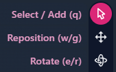
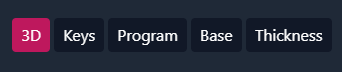
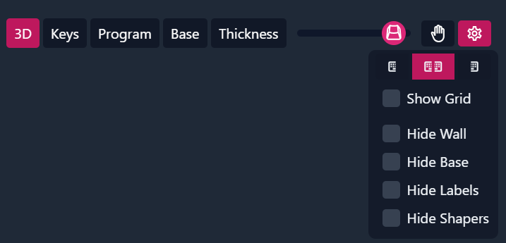
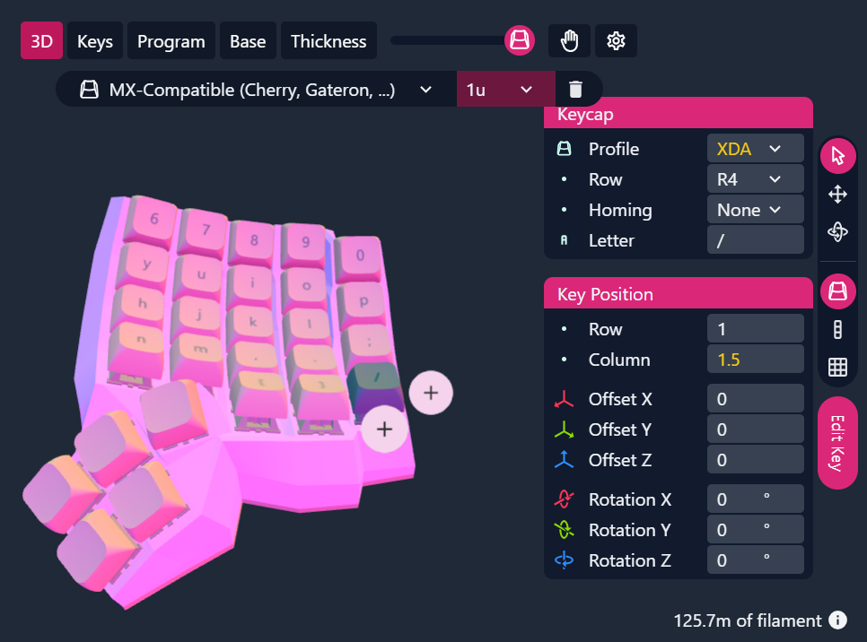
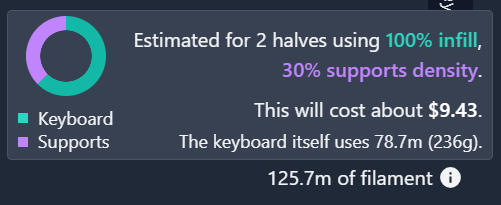

# Editor basics

## Tools

There are three tools at your disposal. They can be chosen on the right side of the preview.

{ autoplay }

## Key selection modes

There are three ways to select key. They can be chosen on the right side below the tools.

{ autoplay }

## Views

There are a couple of different views. These can be selected above the preview.

### 3D view

This is the standard view. It shows you your keyboard.

### Keys view

Shows you all the keys in a top down view.

### Program view

This view shows you how you could wire the keyboard and lets you download the KLE Layout.

### Base view

This view shows you the base of the keyboard with the screw locations for the baseplate and the board holder.

### Thickness view

This view shows you, how thick the shell is in certain places, and where it might be too thin.

## Opacity slider

This slider changes the opacity of the keys and the baseplate. You can check, how your shell and the microcontroller look here.

{ autoplay }

## Hand scanning

Allows you to [scan your hand](hand-scans.md), to show or hide your hand scan and to [fit the keyboard to your hand](hand-fitting.md).

## Settings

### Keyboard visibility

The buttons allow you to show the left, right or both halves.

### Show grid

Shows a grid. Each line is 1cm from the next. **Todo confirm spacing**

### Hide wall

Hides the walls of the keyboard, but not the top plate.

### Hide base

Hides the base plate and the microcontroller-holder.

### Hide labels

Hides the letters on the keycaps.

### Hide shapers

Hides the outline of the shaper keys.

## Edit key

### Switch and keycap size

With the bar at the top, you can select which switch you are using, and the keycap size. You can also delete the key here.

### Keycap

#### Profile

Allows you to select, what profile the keycap uses.

#### Row

Some keycap profiles have different keycaps for different rows to be more comfortable.

#### Homing

**Todo** doesn't seem to make any visual difference?

#### Letter

The letter to be shown on this keycap

### Key position

The row and column allow you to align the keys to the grid.
The offset offsetts the keys from the position given by the row and column.
The rotation rotates the key in it's position. The rotation set in the curvature panel is not shown here.
See [curvature](./configuration.md#curvature) for that.

## Filament information

Shows you how much filament printing your keyboard would take.
The cost estimation seems to be based on a price of about 40$ per kilogram.

## Adding keys

{ autoplay }

## Removing keys

{ autoplay }
