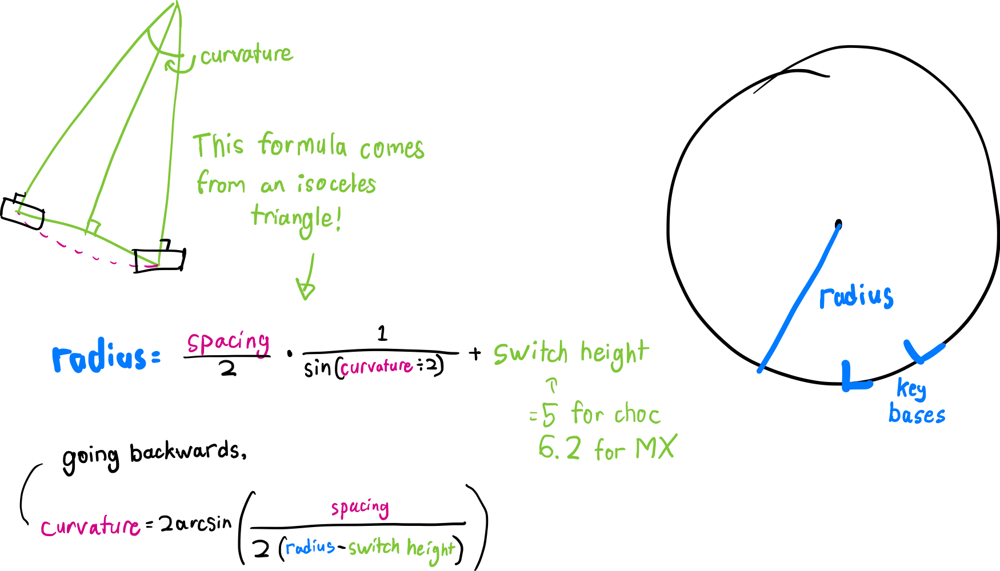
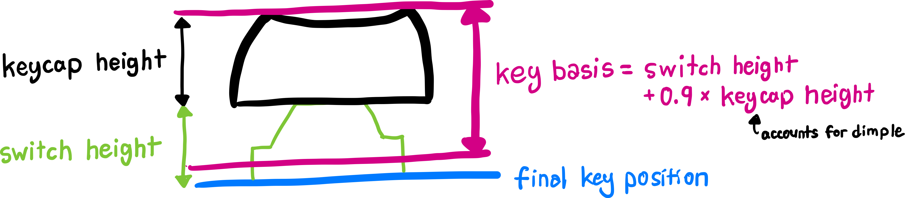

# Expert Mode

Expert Mode in Cosmos is designed to give you full control over the way keys are laid out. It also gives you low-level control over much of Cosmos's functionality, allowing you to build your own keyboard layout generators on top of the software without needing to clone the repository.

To use Expert Mode, you write [TypeScript](https://www.typescriptlang.org/) code to describe the keyboard configuration. However, because the configuration is declarative in nature, only a modest background in programming is required. The code should look approachable even if you've never written TypeScript before.

Any configuration written in Basic/Advanced Mode can be converted into code for Expert Mode. Expert Mode programs likewise can be converted into Basic/Advanced Mode unless you are really stretching the limits of the generator [in one of these ways](#limitations-of-basic-expert-conversion).

!!! tip "Parts Page"

    It's recommended you browse the [Parts Page](https://ryanis.cool/cosmos/parts) to familiarize yourself with the different key sockets Cosmos supports. The page will also tell you the name of each part within Expert mode.

## ✔ When to Use Expert Mode

1. **You Would Like to Use Different Curves for Positioning Keys.**

   Cosmos only has two types of key positioning available: [Matrix Layout](#matrix-layout) and [Sphere Layout](#sphere-layout). However, if you'd like to lay keys out on some other type of arc like an ellipse or a spiral, and if you can write out the math, you can position keys using these algorithms.

2. **Each Keyboard Half Uses Different Microcontrollers/Connectors/Rounding/Shrouding.**

   Expert Mode overcomes this [limitation](#limitations-of-basic-expert-conversion) of Basic/Advanced Configuration. _You'll need to stay in Expert mode if you do this!_

3. **You Are Importing Key Positions from Another Tool.**

   Because Expert Mode is text-based, you can copy-paste key positions from another tool, such as key positions in a 2D keyboard from Ergogen/KiCAD or 3D positions from another CAD tool. Once you have written the necessary glue to turn these positions into the configuration Expert Mode requires, you _can switch back to Basic/Advanced Mode and edit your keyboard visually_.

4. **You Want to Become Familiar with Cosmos's Codebase.**

   Expert Mode's configuration structure is the same as the configuration structures used internally in Cosmos. If you'd like to see how a setting gets processed in the source code, you can look up what it's called in Expert Mode then search for that name in the source code.

## ✘ When Not to Use Expert Mode

For most use cases, the visual editor in Basic/Advanced is both faster and easier to edit in. I recommend against using Expert mode unless one of the reasons above applies to you.

1. **You Need Precise Control over Key Positioning.**

   If you select a key in Basic/Advanced mode then click on the _Edit Key_ menu on the right-hand side, you'll be able to edit exactly the key offset and rotation. You don't need Expert Mode for this.

2. **You'd Like to Change an Individual Keycap or Legend.**

   Also possible through the _Edit Key_ menu.

3. **You are Saving Your Configuration.**

   The URLs used in Basic/Advanced are both more stable and more compact than the Expert Mode code. I recommend you use these instead.

## Structure of and Interpretation of Cosmos Programs

Expert Mode programs are laid out as configuration files. Every program must use the [`export default`](https://developer.mozilla.org/en-US/docs/web/javascript/reference/statements/export) syntax to return the desired configuration. Most configuration options map directly to the options available in basic and advanced modes. For example, `wallThickness` is configured as `Advanced -> Case -> Wall Thickness`.

```typescript
type Config = {
  keys: Key[] // Configuration for every key in the keyboard

  wallThickness: number // Thickness of walls (mm)
  wallShrouding: number // By how much keys should be shrouded (mm)
  webThickness: number // Thickness of the web between keys (mm)
  plateThickness: number // Thickness of the bottom plate
  webMinThicknessFactor: number // Controls minimum web thickness
  rounded: RoundedOptions // For configuring rounded walls
  plate: PlateOptions // For improved bottom plate
  keyBasis: Profile // Controls how spacing relates to keycaps
  shell: ShellOptions // Configure the design of the case/shell
  // This is for tilted base, stilts mode, etc.

  microcontroller: string // Which microcontroller to use
  microcontrollerAngle: number // Angle at which to affix microcontroller
  fastenMicrocontroller: boolean // Add tabs to hold in microcontroller?
  connectors: Connector[] // Which connector to use
  connectorIndex: number // Where to place the microcontroller
  flipConnectors: boolean // If true, flip connectors on this side

  screwIndices: number[] // Where to place the screw inserts
  screwType: string // Which type of screw insert to use
  screwSize: string // Which size of screw insert to use
  screwCountersink: boolean // Remove material to countersink holes?

  clearScrews: boolean // Add extra clearance for screw inserts?
  verticalClearance: number // Space between the ground and
  // the lowest point on any part

  wristRestLeft: WristRestOptions | null // Configuration for left wrist rest
  wristRestRight: WristRestOptions | null // Configuration for right wrist rest
  wristRestOrigin: Trsf | null // Where the wrist rest is placed
}

export default {
  left: Config,
  right: Config,
  // alternatively, `unibody: Config`
}
```

A "key" here refers to both your regular keyboard key as well as other parts that can be placed on the keyboard, like trackballs and encoders. The configuration for an individual key is as follows:

```typescript
type Key = {
  type: string      // The type of the key (part name or switch type)
  variant: object   // If key has multiple variants, which one to use

  keycap?: {        // Only applies to keyboard switches:
    profile: string // The profile of the keycap
    row: number     // The keycap's row (if applicable)
    letter?: string // The letter printed on the key in the preview
    home?:          // For home keys: which finger rests on the key
  }
  size?: KeycapSize // For configuring variable-size and round parts
  position: Trsf    // The key's position and orientation
  aspect: number    // Aspect ratio of the key. Use 1.5 for 1.5u keys, etc
  cluster: string   // Groups keys for wire routing (not implemented yet)
}
```

Programs are evaluated inside a [Web Worker](https://developer.mozilla.org/en-US/docs/Web/API/Web_Workers_API). This means that you have access to the full JavaScript API except for the DOM. But remember, with great power comes great responsibility.

## Key Layout

Every key has a `position` attribute that fully describes its position and orientation.(1) The following sections describe the various utilities available for positioning keys.
{ .annotate }

1. The final orientation of the key is slightly different than what the `position` attribute specifies because keys are automatically shifted around to preserve even depth and curvature. Thus, the final position of the key's socket also depends on the choice of keycap and switch. See the [How Keys are Positioned](#how-keys-are-positioned) section for more details.

### Matrix Layout

{ width=350 .center .pad }

Most keys are laid out using the `placeOnMatrix` function, looking something like this:

```typescript
new Trsf()
  .placeOnMatrix({
    curvatureOfColumn: 15, // Degree of curvature through a column (vertically)
    curvatureOfRow: 5,     // Degree of curvature through a row (horizontally)
    spacingOfRows: 20.5,   // How far apart each row is (vertically)
    spacingOfColumns: 21.5 // How far apart each column is (horizontally)
    row: -1                // Key position (vertical)
    column: -2.5,          // Key position (horizontal)
  })
```

!!! tip "Spread Syntax"

    The auto-generated Expert Mode code uses the [spread syntax](https://developer.mozilla.org/en-US/docs/Web/JavaScript/Reference/Operators/Spread_syntax#spread_in_object_literals) in JavaScript to tidy up the calls to `placeOnMatrix`. Wherever you see `...curvature` in the code, the contents of the `curvature` variable are substituted into the call to `placeOnMatrix`. This allows all keys to reference a common curvature setting.

!!! tip "Alternative Naming"

    The `spacingOfRows` option is equivalent to using `spacingInColumns`, and `spacingOfColumns` is equivalent to `spacingInRows`. The first set of names are used by default, but feel free to use whichever makes most sense to you!

This function places the key on a curved matrix, at a position determined by `row` and `column`. If the row and column curvatures are set to zero, keys will be spaced apart by exactly the specified spacing (which is in millimeters).

### Sphere Layout

{ width=300 .center .pad }

An alternative to the matrix layout is to place keys in a rotated fashion, which is useful for thumb clusters.

```typescript
new Trsf()
  .placeOnSphere({
    curvature: -10, // How much the sphere curves
    spacing: 18.75  // How far apart each row is
    angle: -40,     // Measured from the horizontal
    row: 2          // Number of spacings away from the center
  })
```

This lays keys out on a series of rows of concentric circles. The `spacing` argument determines how far apart keys lie on adjacent rows, and you can also make the keys tilt the further they are away from the center of the circle by adjusting the `curvature`. The `angle` argument determines where on the circle the key is placed.

#### An Example

The code below creates an unconventional keyboard laid out on a sphere. You'll injure yourself if you try to use this keyboard in real life, but you can play around with it virtually [in the generator](https://ryanis.cool/cosmos/beta#expert:eJxtVE2P0zAQvfdXDL00ZdNsu7AcAlxYLgihRbS3KgfXmSSmrm1sZ9vuqv+dsfOxRUKVUufN1xu/mXCtnAdtvKBDDo/dAT7DywRgj+cvzAnCZ6eSzVKCjkzKTSP4XqEj/P2ArRur21KoOodlxHB35RYhxy0ev6lScCRoW4zY5mwwh2k8g1AOrZ+OxrV4DsYf716hB90qj9YJtc/B2xaDhcqrEsscXi7hlWulkHttx1IjQhTwlMNiFdCD4FaTyVstJdocVCtlMDwRC8GZfJDILFOcSCyzGMIDsg5E3Gt516CUVBx818yO7o1PU5DC5FAx6RAuk8tkcnsLX7ESCsE3CBJ9aAS8hh2CkYxjCVoBMt5QR8cJj/LQKUiynT2f+NNOHWYpzJgrq7r5vZfh5c+R2J5boc2s6GNIO6L3Hc/bIoQWsfRDMNmW+1g9uMBR+AYqbUFqbdwknBKiBZailh/p71Msn0lUtW8IuLmZx+EYPUXnKXrPrS1GZzE4A1D1TVdz5kBXlaPIyupDZMIxCBr9OvYdEBJn97CARNwm/+ZerObz6B+ayEzrmqSrA4MCh9NiF683Dk7vypkJIhmrKyGDF801qUS5c7hPez3yoY+tKOAyRHPZumicknw1qTbmZc7QYOWwGgCjnQh7RNNEE72xrkrmvQkgizI/qrVp0OLIOpZo7RPzrcUwnUSH7uynZGdgcbg7qeJ1DX5hcA5sj7FOiU7Uyr25SugM43En7+7SK5ipOjS/TAdVrPYsEIaGGYO0/6yiVo/Mlu4qLN6SvbkboctVV56WxEnmMdlS3tWKHstiHlsgcV7nTbf/1z0miTwwuf8Ab3tbCpSOfkV/WHU514YpYNS+Z5KmCSiixNoidnwjsbhv/ThpVYk6fNUgy7L+a5fC0Qrnf6Hzj1bUQvXL3/G8TPBktPWUt2Kt9BTaKrHT5Tkf0l3+AlNanPc=).

{ width=600 .center .pad }

```typescript
// Define the letters to be placed on each row
const rows = ['zxcvbnm', 'asdfghjkl', 'qwertyuiop']
const keys: Key[] = []

// Construct the keys with for loops
for (let r = 0; r < rows.length; r++) {
  for (let i = 0; i < rows[r].length; i++) {
    // The key's offset from the center
    const center = 0.5 - (i / (rows[r].length - 1))
    keys.push({
      type: 'mx-better',
      keycap: { profile: 'xda', row: 5, letter: rows[r][i] },
      cluster: 'fingers',
      aspect: 1,
      position: new Trsf()
        .placeOnSphere({
          curvature: -15, // Play around with the curvature to make new designs!
          spacing: 22,
          angle: 0, // The rotation happens afterwards
          row: r + 2,
        })
        .translate([0, 110, 0]) // Push the keys out from the center
        .rotate(56 * center, [0, 0, 0], [0, 0, 1]), // Span a total of 56 degrees
    })
  }
}

const config = { ...options, wristRestOrigin: null, keys }
export default { unibody: config }
```

### The `Trsf` Class

All positioning in Expert Mode is performed through the `Trsf` class. It allows you to define translations, rotations, and layout operations.

At a low level, the class represents operates on a 4x4 [transformation matrix](https://learnopengl.com/Getting-started/Transformations). All operations are stored in a queue and evaluated once the generator can determine whether it is laying out keys in a 2D or 3D environment.

The various operations that can be performed on a `Trsf` are as follow:

- `translate`: Moves the object by some amount.
- `rotate`: Rotates the object around a point.
- `rotateTowards`: Rotates the object towards some orientation.
- `rotateToVertical`: Rotates the object to face upwards.
- `mirror`: Mirrors the position of an object about an axis while preserving orientation.
- `transformBy`: Applies a transformation object to this object. This is equivalent to matrix multiplication.
- `translateBy`: Applies only the translational part of a transformation object to this object.
- `placeOnMatrix` and `placeOnSphere`: Positions the object on a matrix/sphere.

### How Keys are Positioned

Key layout in Cosmos is complex due to the adaptive key placement. When keys are instructed to lie consistently across a curve, they will reposition themselves as to keep the tops of the keys a consistently curved.

{ width=440 .center .pad }

You can mix and match profiles within the same keyboard (hello oddly shaped artisans), swap around the row profiles, and expect everything to line up. The same mechanism allows you to swap out one set of keycaps for another and regenerate the model to keep the same feel. To accomplish this, key positioning in Cosmos is split into two steps:

1. **Key Basis Positioning**: The rough key positions are laid out.
2. **Adaptive Key Positioning**: Keys are repositioned to account for profile differences.

The Key Basis Positioning is controlled solely by the transformations passed to the `Trsf` class and the switch height. Switch height is included so that the arc occurs about the bottom of the keycaps. Applying the arc here helps keeps keys evenly spaced at all curvatures.

As an example, here's how keys are laid out on an arc in the matrix layout. The generator calculates the arc radius, then performs a rotation. For matrix layout, this happens twice. A rotation about the Y axis performs the columnar arc, then a rotation about the X axis applied the row arc.

{ .center .pad }

The Adaptive Key Positioning depends on the key profile and the `keyBasis` setting. The `keyBasis` determines which key profile best fits the key basis and is calculated from an R4 keycap. An example might make this most clear:

{ width=90% .center .pad }

If a `choc` key basis is used with Choc keys, then the key basis will be positioned very close to the final key position. Whatever spacings are used to compute the key bases will be similar to the final spacings in the model.

However, if an `mt3` key basis were used with Choc keys, then spacing values would not match the final spacings. For this reason it's advised to set `keyBasis` to whichever profile you use the most within the model. Basic and Advanced modes do this automatically.

If you're curious how this gets configured in the source code, [`keycaps.ts`](https://github.com/rianadon/Cosmos-Keyboards/blob/main/src/lib/geometry/keycaps.ts) defines the tilt and depth of all the keycaps. If you go the [keycaps page](https://ryanis.cool/cosmos/keycaps) and check _Developer mode_ you'll see the depth and tilt box overlaid. `applyKeyAdjustment` in [`geometry.ts`](https://github.com/rianadon/Cosmos-Keyboards/blob/main/src/lib/worker/geometry.ts) applies this adjustment.

## Microcontrollers and Screw Inserts

The position of the microcontroller and screw inserts are configured using `connectorIndex` and `screwIndices` respectively. Because the microcontroller and screw inserts must be affixed to walls, their positions cannot be set to any arbitrary point in 3D space like the keys. Instead, they are located by specifying their position along the model's perimeter.

The `connectorIndex` option defaults to `#!ts -1`, which instructs the generator to automatically place the microcontroller. Changing the `connectorIndex` to a nonnegative value will place the microcontroller next to a specific wall cross section. Every cross section is assigned an index starting at zero at some arbitrary cross section. The generator will warn you if you specify an out-of-bounds index.

Indices can also have fractional components (e.g. `#!ts 2.178`). The fractional part will be used to interpolate between the two cross sections between which the fractional index lies.

!!! warning "Read This"

    It is recommended you add a fractional component of `#!ts 0.5` to indices rather than giving them as whole numbers. This will place the microcontroller and screw inserts along flat edges of the case, rather than at the vertices where the cross sections are located.

When transferring a design from basic/advanced mode to Expert Mode, Cosmos will add a comment telling you where the microcontroller and screw inserts were placed:

```typescript
// NOTE: Screws / the connector with
// negative indices are placed automatically.
// In the basic/advanced tab, these values were:
// screwIndices: [11.5, 2.5, 20.5, 24.5, 15.5, 6.5, 34.5]
// connectorIndex: 31.2
```

### The Screw Indices Array

Screw Insert locations are configured as an array of indices, for example `#!ts [6, -1, -1, 8]`. The array is processed in sequential order and screw positions are automatically assigned if needed. The number of screw inserts in this array equals the number of screw inserts in the model.

!!! info

    If you're using a microcontroller, extra screw inserts will be placed for the microcontroller holder. Additionally, if you're using both the default or tilting base cases and a microcontroller, one of the microcontroller screw inserts will  also serve as a screw insert for attaching the bottom plate. In this case, if there are `n` elements in `screwIndices`, you will see `n+1` holes in the bottom plate.

    If you supply more negative screw indices than there are spots to place screw inserts, extra screw indices will be ignored. One way to add a maximum number of screw inserts is to set `screwIndices` to a very long array of `#!ts -1`.

The auto-assignment of screw positions takes into account where screws have already been placed and tries to evenly distribute screw inserts. For this reason the configuration `#!ts [1, 20, -1, -1]` will produce a different result than `#!ts [-1, -1, 1, 20]`. The former will place the two manually-configured screw inserts then automatically place new screw inserts far away from these locations. The latter will automatically place two screw inserts then add your manually-configured inserts, resulting in possible collisions and is probably not what you want.

A few examples:

- `#!ts [-1, -1, -1, -1]`: Automatically places 4 screw inserts
- `#!ts [1.3, 5.6, 12.4]`: Manually places 3 screw inserts
- `#!ts [0, 2, -1]`: Manually places 2 screw inserts close together, then lets the 3rd insert be automatically placed far away
- `#!ts [-1, -1, -1, 9]`: Automatically places 3 screw inserts then places 1 manually, ignoring possible collisions. _You probably don't want to do this._

## Limitations of Basic ⭤ Expert Conversion

There are a few limitations of basic/advanced mode that will result in your programs being converted incorrectly from Expert Mode to Basic/Advanced.

- **High-Precision Key Positioning.** Key translations are rounded to 100ths of a mm and rotations are rounded to 45ths of a degree in Basic/Advanced (45 results from fitting as much precision possible into 12 bits). _If you require more precision (why??) you should stick to Expert Mode._

  When converting to basic/advanced, keys are sorted into a cluster → column → key hierarchy based on the row and column numbers used in the `placeOnMatrix` and `placeOnSphere` calls. Each of these three elements in the hierarchy are assigned a position and orientation relative to its parent. For instance, a key's position will be compute by evaluating both its position and it's parent column's position, then finding the relative transformation between the two. The rounded translation and rotation are that of this relative transformation, _not the values you use in_ _**Trsf**_ _-related functions_.

- **Configuring the Left and Right Halves Differently, Apart from Keys and Wrist Rests.** In Expert mode, you can configure each half of the keyboard completely independently. You can use different wall thicknesses, connectors, and microcontrollers for each side. However, Basic/Advanced Mode assume you're using much of the same settings on both halves to save space when saving. The only properties that can be configured independently there are:
  1. `keys` - For independent key layouts
  2. `connectorIndex` - For configuring left and right connector placements independently
  3. `flipConnectors` - To control whether connectors are flipped or not on both halves.
  4. Wrist Rest configuration - `wristRestLeft` and `wristRestRight` independently control the left/right wrist rests. They are two separate properties so that unibody keyboards can also have independent wrist rests.

  For all other properties, only the settings from the right half are used when converting to Basic/Advanced.

- **Code Structure and Comments.** Basic/Advanced Mode stores only keyboard-specific data. _If your code is particularly clever, you should save it before switching to Basic/Advanced._

You generally will not run into these limitations unless you have very specific needs that Basic/Advanced does not deliver.
