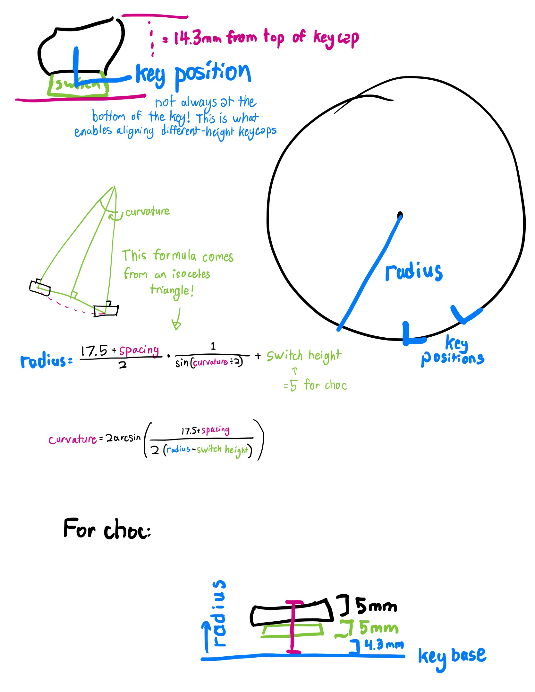

# Expert Mode

Expert Mode in Cosmos is designed to give you full control over the way keys are laid out. It also gives you low-level control over much of Cosmos's functionality, allowing you to build your own keyboard layout generators on top of the software without needing to clone the repository.

To use Expert Mode, you write [TypeScript](https://www.typescriptlang.org/) code to describe the keyboard configuration. However, because the configuration is declarative in nature, only a modest background in programming is required. The code should look approachable even if you've never written TypeScript before.

Any configuration written in Basic/Advanced mode can be converted into code for Expert Mode. However, because Expert Mode is more capable, you cannot convert an Expert Mode program to Basic/Advanced configuration.

## Structure of and Interpretation of Cosmos Programs

Every Expert Mode program must use the [`export default`](https://developer.mozilla.org/en-US/docs/web/javascript/reference/statements/export) syntax to return the desired configuration. Most configuration options map directly to the options available in basic and advanced modes. For example, `wallThickness` is configured as `Advanced -> Case -> Wall Thickness`.

```typescript
export default {
  keys: Key[] // Configuration for every key in the keyboard

  wallThickness: number   // Thickness of walls (mm)
  wallShrouding: number   // By how much keys should be shrouded (mm)
  webThickness: number    // Thickness of the web between keys (mm)
  rounded: RoundedOptions // For configuring rounded walls
  shell: ShellOptions     // Configure the design of the case/shell
                          // This is for tilted base, stilts mode, etc.

  microcontroller: string          // Which microcontroller to use
  fastenMicrocontroller: boolean   // Add tabs to hold in microcontroller?
  connector: 'usb' | 'trrs' | null // Which connector to use
  connectorIndex: number           // Where to place the microcontroller

  screwIndices: number[]           // Where to place the screw inserts
  screwType: string                // Which type of screw insert to use
  screwSize: string                // Which size of screw insert to use
  screwCountersink: boolean        // Remove material to countersink holes?

  clearScrews: boolean      // Add extra clearance for screw inserts?
  verticalClearance: number // Space between the ground and
                            // the lowest point on any part

  wristRest: WristRestOptions | null // Configuration for the wrist rest
  wristRestOrigin: Trsf | null       // Where the wrist rest is placed
}
```

A "key" here refers to both your regular keyboard key as well as other parts that can be placed on the keyboard, like trackballs and encoders. The configuration for an individual key is as follows:

```typescript
type Key = {
  type: string      // The type of the key (part name or switch type)

  keycap?: {        // Only applies to keyboard switches:
    profile: string // The profile of the keycap
    row: number     // The keycap's row (if applicable)
    letter?: string // The letter printed on the key in the preview
    home?:          // For home keys: which finger rests on the key
  }
  size?: KeycapSize // For configuring variable-size and round parts
  position: Trsf    // The key's position and orientation
  aspect: number    // Aspect ratio of the key. Use 1.5 for 1.5u keys, etc
  cluster: string   // Groups keys for wire routing (not implemented yet)
}
```

Programs are evaluated inside a [Web Worker](https://developer.mozilla.org/en-US/docs/Web/API/Web_Workers_API). This means that you have access to the full JavaScript API except for the DOM. But remember, with great power comes great responsibility.

## Key Layout

Every key has a `position` attribute that fully describes its position and orientation.(1) The following sections describe the various utilities available for positioning keys.
{ .annotate }

1. The final orientation of the key is slightly different than what the `position` attribute specifies because keys are automatically shifted around to preserve even depth and curvature. Thus, the final position of the key's socket also depends on the choice of keycap and switch. See the [How Keys are Positioned](#how-keys-are-positioned) section for more details.

### Matrix Layout

{ width=350 .center .pad }

Most keys are laid out using the `placeOnMatrix` function, looking something like this:

```typescript
new Trsf()
  .placeOnMatrix({
    curvatureOfColumn: 15, // Degree of curvature through a column (vertically)
    curvatureOfRow: 5,     // Degree of curvature through a row (horizontally)
    spacingOfRows: 20.5,   // How far apart each row is (vertically)
    spacingOfColumns: 21.5 // How far apart each column is (horizontally)
    row: -1                // Key position (vertical)
    column: -2.5,          // Key position (horizontal)
  })
```

!!! tip "Spread Syntax"

    The auto-generated Expert Mode code uses the [spread syntax](https://developer.mozilla.org/en-US/docs/Web/JavaScript/Reference/Operators/Spread_syntax#spread_in_object_literals) in JavaScript to tidy up the calls to `placeOnMatrix`. Wherever you see `...curvature` in the code, the contents of the `curvature` variable are substituted into the call to `placeOnMatrix`. This allows all keys to reference a common curvature setting.

!!! tip "Alternative Naming"

    The `spacingOfRows` option is equivalent to using `spacingInColumns`, and `spacingOfColumns` is equivalent to `spacingInRows`. The first set of names are used by default, but feel free to use whichever makes most sense to you!

This function places the key on a curved matrix, at a position determined by `row` and `column`. If the row and column curvatures are set to zero, keys will be spaced apart by exactly the specified spacing (which is in millimeters).

### Sphere Layout

{ width=300 .center .pad }

An alternative to the matrix layout is to place keys in a rotated fashion, which is useful for thumb clusters.

```typescript
new Trsf()
  .placeOnSphere({
    curvature: -10, // How much the sphere curves
    spacing: 18.75  // How far apart each row is
    angle: -40,     // Measured from the horizontal
    row: 2          // Number of spacings away from the center
  })
```

This lays keys out on a series of rows of concentric circles. The `spacing` argument determines how far apart keys lie on adjacent rows, and you can also make the keys tilt the further they are away from the center of the circle by adjusting the `curvature`. The `angle` argument determines where on the circle the key is placed.

#### An Example

The code below creates an unconventional keyboard laid out on a sphere. You'll injure yourself if you try to use this keyboard in real life, but you can play around with it virtually [in the generator](https://ryanis.cool/cosmos-beta/#expert:eJxtVE2P2jAQvfMrplyALmShLVWVtqftpaqqrQo3xME4k8TF2K7tLLAr/nvHk/CxUiUknDdvZt7kjSOtCRGsi4oOOTy2B/gKLz2AvdB6WSu5NRgo+GHcYYva26ZQpsphyhhubmgMBelx/90USiJBq/UFWx4d5tDnMygT0Mf+JbhQzyn48/0VerCNieiDMtscom8wRai9KbDI4eWUHqU1BmW0PgfTaP0KIg14yGEyS+hOSW8pFL3VGm/oTyRDSaEfNAovjCQV04xTZEIWSUm49g81ak3dIbbTbERQsj8GrVwOpdAB4dQ79Xr39/ANS2UQYo2gMaZJIFrYIDgtJBZgDaCQNY2070k2g07JgNXg+SCfNmY3GMNAhKKs6j9bnR7+7kntsVHWDdZdzhaPJO8HHlfrlLrm1g8p5BsZuXuiwF7FGkrrQVvrQi+dhiQLPGVNP9PfF26faTRVrAm4uxvxKlyYqmWqjrny6wtZnckA1H3Z9hwEsGUZKLP0dsdKJCZHmdeqb4FUOJvDBIbqfvi69mQ2GjE/DZG5JtTDtg+cHdgdJht+vbw5HVUKl0xy3pZKJ9ahEOQS1c5hPu78yM9zrNQaTudsqZvAwT7ZV5Frl7oiOFqsHGZnwNmg0q2hbaKVXvpQDkddCCBjmx/NwtXo8aKaWzT+ScTGk7AZqaFX9kuLIwhe7tYpfltnWtqbndgitykwqMqENzf1ghOS7+TsUzYf3wSEqdL00/HZFm+jSIqhFs4hXXdR0qx74Ytwk8avyd+9u0Cnm7Ei3ZKgRcThajajyum3HvEQ5M514Wzzf+O5COvA4fwjvO1iXGHhhAFB40ahaXmA4gVWHrFVxzL4euHBWR8pWIpGR169LMu6jxl/mLwK8TeG+OhVpcz1vidt497pHysDiKE=).

{ width=600 .center .pad }

```typescript
// Define the letters to be placed on each row
const rows = ['zxcvbnm', 'asdfghjkl', 'qwertyuiop']
const keys: Key[] = []

// Construct the keys with for loops
for (let r = 0; r < rows.length; r++) {
  for (let i = 0; i < rows[r].length; i++) {
    // The key's offset from the center
    const center = 0.5 - (i / (rows[r].length - 1))
    keys.push({
      type: 'mx-better',
      keycap: { profile: 'xda', row: 5, letter: rows[r][i] },
      cluster: 'fingers',
      aspect: 1,
      position: new Trsf()
        .placeOnSphere({
          curvature: 15, // Play around with the curvature to make new designs!
          spacing: 18.5,
          angle: 0, // The rotation happens afterwards
          row: r + 2,
        })
        .translate([110, 0, 0]) // Push the keys out from the center
        .rotate(56 * center), // Span a total of 56 degrees
    })
  }
}

export default { ...options, wristRestOrigin: null, keys }
```

### The `Trsf` Class

All positioning in Expert Mode is performed through the `Trsf` class. It allows you to define translations, rotations, and layout operations.

At a low level, the class represents operates on a 4x4 [transformation matrix](https://learnopengl.com/Getting-started/Transformations). All operations are stored in a queue and evaluated once the generator can determine whether it is laying out keys in a 2D or 3D environment.

The various operations that can be performed on a `Trsf` are as follow:

- `translate`: Moves the object by some amount.
- `rotate`: Rotates the object around a point.
- `rotateTowards`: Rotates the object towards some orientation.
- `rotateToVertical`: Rotates the object to face upwards.
- `mirror`: Mirrors the position of an object about an axis while preserving orientation.
- `transformBy`: Applies a transformation object to this object. This is equivalent to matrix multiplication.
- `translateBy`: Applies only the translational part of a transformation object to this object.
- `placeOnMatrix` and `placeOnSphere`: Positions the object on a matrix/sphere.

### How Keys are Positioned

Until I write some better documentation here, please accept this image that uses Choc as an example.

{ width=75% .center }

## Microcontrollers and Screw Inserts

The position of the microcontroller and screw inserts are configured using `connectorIndex` and `screwIndices` respectively. Because the microcontroller and screw inserts must be affixed to walls, their positions cannot be set to any arbitrary point in 3D space like the keys.

The `connectorIndex` option defaults to `#!ts -1`, which instructs the generator to automatically place the microcontroller. Changing the `connectorIndex` to a nonnegative value will place the microcontroller next to a specific wall cross section. Every cross section is assigned an index starting at zero at some arbitrary cross section. The generator will warn you if you specify an out-of-bounds index.

Indices can also have fractional components (e.g. `#!ts 2.178`). The fractional part will be used to interpolate between the two cross sections between which the fractional index lies.

!!! warning "Read This"

    It is recommended you add a fractional component of `#!ts 0.5` to indices rather than giving them as whole numbers. This will place the microcontroller and screw inserts along flat edges of the case, rather than at the vertices where the cross sections are located.

When transferring a design from basic/advanced mode to Expert Mode, Cosmos will add a comment telling you where the microcontroller and screw inserts were placed:

```typescript
// NOTE: Screws / the connector with
// negative indices are placed automatically.
// In the basic/advanced tab, these values were:
// screwIndices: [11.5, 2.5, 20.5, 24.5, 15.5, 6.5, 34.5]
// connectorIndex: 31.2
```

### The Screw Indices Array

Screw Insert locations are configured as an array of indices, for example `#!ts [6, -1, -1, 8]`. The array is processed in sequential order and screw positions are automatically assigned if needed. The number of screw inserts in this array equals the number of screw inserts in the model.

!!! info

    If you're using a microcontroller, extra screw inserts will be placed for the microcontroller holder. Additionally, if you're using both the default or tilting base cases and a microcontroller, one of the microcontroller screw inserts will  also serve as a screw insert for attaching the bottom plate. In this case, if there are `n` elements in `screwIndices`, you will see `n+1` holes in the bottom plate.

    If you supply more negative screw indices than there are spots to place screw inserts, extra screw indices will be ignored. One way to add a maximum number of screw inserts is to set `screwIndices` to a very long array of `#!ts -1`.

The auto-assignment of screw positions takes into account where screws have already been placed and tries to evenly distribute screw inserts. For this reason the configuration `#!ts [1, 20, -1, -1]` will produce a different result than `#!ts [-1, -1, 1, 20]`. The former will place the two manually-configured screw inserts then automatically place new screw inserts far away from these locations. The latter will automatically place two screw inserts then add your manually-configured inserts, resulting in possible collisions and is probably not what you want.

A few examples:

- `#!ts [-1, -1, -1, -1]`: Automatically places 4 screw inserts
- `#!ts [1.3, 5.6, 12.4]`: Manually places 3 screw inserts
- `#!ts [0, 2, -1]`: Manually places 2 screw inserts close together, then lets the 3rd insert be automatically placed far away
- `#!ts [-1, -1, -1, 9]`: Automatically places 3 screw inserts then places 1 manually, ignoring possible collisions. _You probably don't want to do this._
