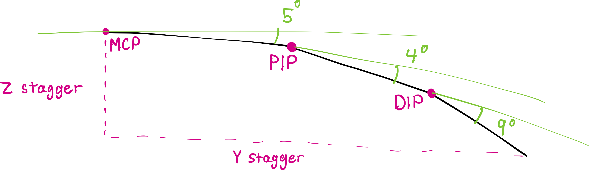

# Hand Fitting

!!! info ""

    This page will grow as the hand fitting in Cosmos advances.

The current hand fitting algorithm in Cosmos is quite primitive. However, I still recommend giving it a try since some fitting is much better than no fitting.

I'll be referring to hand bones and joints by their names, so read [the hand keypoints docs](./hand-scans.md#hand-keypoints) as background.

## The Algorithm

The data that this algorithm uses are:

1. The lengths of the proximal, intermediate, and distal phalanges (the lengths of the metacarpals are ignored). The reasoning behind this is that these are the 3 bones that make up the tip of the finger and are the parts that curl to press keys. I also notice that my MCP joints are all fairy lined up when I rest my hands on the keyboard.

Yup, that's all. The thumb shape is ignored (the thumb cluster is not yet automatically fit), and pose data is also ignored. I told you it's primitive.

Y and Z staggers are computed as follows:

1. The proximal phalanx is rotated by 5 degrees.
2. The intermediate phalanx is rotated by 4 degrees.
3. The distal phalanx is rotated by 9 degrees.
4. Stagger Y and Z are read from the position of the tip of the finger.

The staggers are positioned relative from the index finger, so that the index finger has zero stagger.

The reason for these arbitrary rotations is that your hand rests with some curl on the keycaps,

## Future Work

The algorithm serves as a primitive approximation for Y and Z stagger. Future directions include:

- Hand size has an important effect on keyboard fit. Spacing and X stagger values should be recommended based on the size of your hand.
- Ideal finger splay could be calculated from pose data.
- The thumb cluster should be positioned from hand data.
