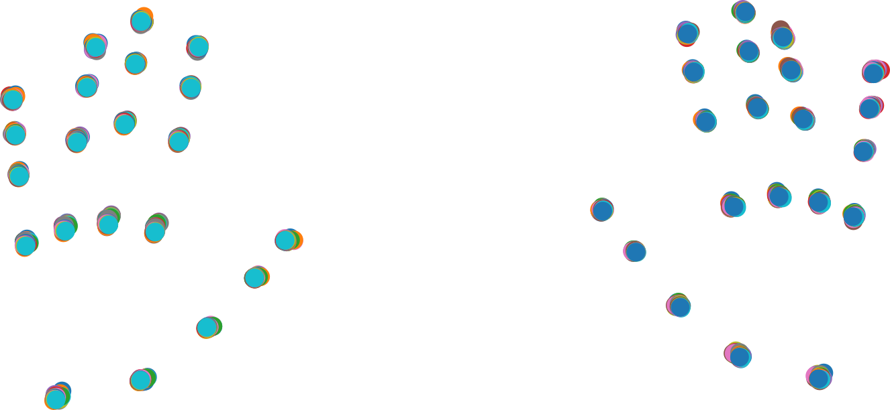
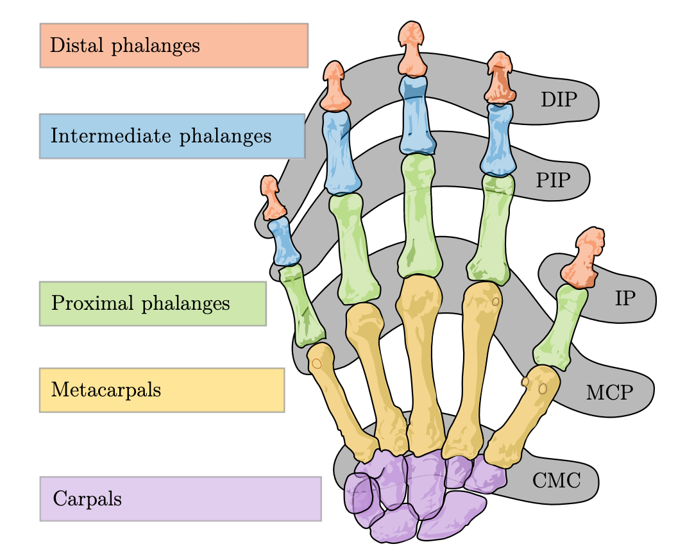

# Hand Scans

Hand Scanning in Cosmos uses the [MediaPipe Hands](https://mediapipe.readthedocs.io/en/latest/solutions/hands.html) ML model and OpenCV's [ChArUco board](https://docs.opencv.org/4.x/df/d4a/tutorial_charuco_detection.html) detection to estimate and localize joints on the hand. Each scan records the length of each bone in the finger and the pose of each finger.

Since the keypoint-detecting ML model has high accuracy when presented with top-down photos of hands and ChArUco has both high accuracy and robustness, the length measurement is in general very accurate. How accurate? The keypoints below are collected from a scan I made holding my phone in one shaky hand but keeping my other hand still on the ChArUco board. The 50 scans are composited and adjusted with ChArUco pose to correct for camera movement. You can see that the combined noise in keypoint detection and ChArUco correction is quite small.

{ width=600 .center .pad }

On the other hand 🫱, Pose is not accurate as it's estimating a 3D orientation from a 2D image. Lucky for us, the hand-fitting algorithms in Cosmos depend primarily on the length measurements, so this is not an issue.

<!-- !!! tip "How does the Scanning work?" -->

<!-- Read this blog post to learn how the entire scanning process works. -->

## Hand Keypoints

In the literature, the keypoints (joints) of the hand are given consistent names.

<figure markdown="span">
    { width=400 }
    <figcaption>DIP, PIP, IP, MCP, and CMC are the names of the joints. Image by Mariana Ruiz Villarreal and Thomas Feix.</figcaption>
</figure>

All non-thumb CMCs are tied together and assigned a single keypoint designated "the wrist". This is because these Carpal bones move very little relative to each other. However, to be consistent with [the MediaPipe model](https://mediapipe.readthedocs.io/en/latest/solutions/hands.html#hand-landmark-model), the thumb CMC is considered an independent joint attached to the wrist joint. The thumb CMC is located within the palm/meaty part of the hand and is the joint about which your thumb splays; when you stretch out your fingers 🖐️, this joint is primarily responsible for moving your thumb. The thumb MCP is located at where your thumb finger joins your palm.

I also assign each joint a number of rotational degrees of freedom (DOF) based on how they empirically move:

- Finger CMC joints have 0 DOF because they barely move.
- Finger MCP joints (excluding the thumb) have 2 DOF. They both curl and move side to side.
- The thumb CMC joint has 2 DOFs. It's very flexible.
- The thumb MCP and DIP joints have 1 DOF from curl.
- All PIP and DIP joints have 1 DOF from curl.

## Checking Your Scan

A common question that I get is how do I check that my hand scan measurements are correct? What I recommmend is you measure from your fingertip to your knuckle, then add up the 3 lengths from knuckle to fingertip that Cosmos reports. These should be about equal.

The reason for this is that individual lengths are noisy due to the difficulty of guessing where your joint is from a top-down image. However, adding together multiple lengths will reduce the significance of this error.

When measuring, try to measure from the center of your finger (where your bones are), not the top or bottom surface. This is the distance that Cosmos approximates to correctly estimate how your hand is shaped when your fingers are bent.

## Hand Scan Files

The layout of the hand scan file is as follows:

```json title="hands.json"
{
  "time": "2024-01-29T06:17:28.579Z", // Time the scan was taken
  "version": 2, // The version of the hand scanner used to make this scan
  "left": {
    "thumb": [
      {
        "length": 47.4, // Length of bone in millimeters
        "position": {}, // Ignore this
        "V": { "elements": [] }, // Inverse transformation matrix for the joint
        "Vinv": { "elements": [] }, // Transformation matrix
        "degree": 0 // Rotational degrees of freedom for this bone
      },
      { ... }, // Second bone from wrist
      { ... }, // Third bone from wrist
      { ... } // Fourth bone from wrist
    ],
    "indexFinger": [ ... ],
    "middleFinger": [ ... ],
    "ringFinger": [ ... ],
    "pinky": [ ... ],
  },
  "right": {
    // Same as left
  }
}
```

The `V` and `Vinv` matrices are confusingly named. `V` is used primarily in estimating hand pose from joint positions in world space (inverse kinematics) and is probably not what you want. `Vinv` is used for calculating world position from poses (forward kinematics) and is the matrix inverse of `V`. When I refer to "transformation matrix" in the rest of the documentation, I'm referring to `Vinv`.

### Bone Lengths

These can be read from the `length` properties in the JSON file. Compared to the transformation matrices, these are easy peasy lemon squeezy to work with. 🍋

### Transformation Matrix

The transformation matrix defines the coordinate system of the joint in terms of its parent joint. The first transformation matrix transforms from wrist-space to CMC-space, the second from CMC-space to MCP-space, etc. In other words, the transformation defines the rotation of the bone about the innermost joint it's attached to. Note there is no translational component in these matrices.

The coordinate system for each joint places X in the direction of the bone and Z in the axis of finger curl. These local coordinate frames define the resting positions of the digits when the hand is fully outstretched 🖐️. Hand curling is expressed as a rotation about the Z axis in this coordinate frame, and hand splaying is defined as a Y rotation.

It's easiest to describe this math with linear algebra and transformation matrices. My full apologies if you have permanent fear of matrices.

#### Finger MCP from CMC Joints (0 degrees)

For the case of the MCP joints, which are attached to the CMC joints with 0 degrees of freedom, the rotation represents the average rotation over every scan. Let $R^{CMC}_i$ be the rotational component of the matrix and $l^{MC}_i$ be the length of the metacarpal bone. The MCP's position in wrist frame is simply:

$^{wrist}r^{MCP}_i = R^{CMC}_i \begin{bmatrix}l^{MC}_i \\ 0 \\ 0 \end{bmatrix}$

#### Fingertip and DIP from PIP and DIP Joints (1 degree)

For the case of the fingertips and DIP joints, which are attached to the PIP and DIP joints with 1 degree of freedom, an additional Z rotation matrix is applied within the local coordinate frame to control the finger curl. Let $R_z$ be a rotation matrix of $\theta$ radians about the Z axis.
The full position of the DIP within PIP frame (and similarly fingertip within DIP frame) can be written as follows:

$^{PIP}r^{DIP}_i = R^{PIP}_i R_Z \begin{bmatrix}l^{IP}_i \\ 0 \\ 0 \end{bmatrix}$

or:

$^{PIP}r^{DIP}_i = R^{PIP}_i \begin{bmatrix}l^{IP}_i \cos(\theta) \\ l^{IP}_i \sin(\theta) \\ 0 \end{bmatrix}$

#### Finger PIP from MCP Joints (2 degrees)

For the case of the finger MCP joints, which have 0 degrees of freedom, both an additional Z and Y matrix are applied to account for finger curl and splay respectively. Let $R_Z$ and $R_Y$ be the two rotation matrices:

$^{MCP}r^{PIP}_i = R^{MCP}_i R_Y R_Z \begin{bmatrix}l^{PP}_i \\ 0 \\ 0 \end{bmatrix}$

For practical implementations, you can calculate $R_Y R_Z$ in one function call by using [Euler Angles](https://en.wikipedia.org/wiki/Euler_angles). $R_Y R_Z$ is equivalent to XYZ Euler Angles with zero rotation about X.

#### Calculating All Positions in Wrist Frame

To illustrate the slow but more intuitive method, I'll calculate finger DIP position in wrist frame by first calculating finger DIP position in MCP frame:

$^{MCP}r^{DIP}_i = R^{MCP}_i R_Y R_Z \left(\begin{bmatrix}l^{PP}_i \\ 0 \\ 0 \end{bmatrix} + R^{PIP}_i R_Z \begin{bmatrix}l^{IP}_i \\ 0 \\ 0 \end{bmatrix} \right)$

Then compute finger DIP position in wrist frame:

$^{wrist}r^{DIP}_i = R^{CMC}_i \left( \begin{bmatrix}l^{MC}_i \\ 0 \\ 0 \end{bmatrix} + R^{MCP}_i R_Y R_Z \left(\begin{bmatrix}l^{PP}_i \\ 0 \\ 0 \end{bmatrix} + R^{PIP}_i R_Z \begin{bmatrix}l^{IP}_i \\ 0 \\ 0 \end{bmatrix} \right) \right)$

This expression is ugly already and I don't even want to write $^{wrist}r^{tip}_i$!

The more elegant way is as follows: Let's define the full transformation from wrist to CMC, using the original transformation matrices `Vinv` from the `hands.json`. They can now all be defined recursively:

The full transformation matrix from wrist to MCP is:

$$
^{wrist}T^{MCP}_i = (V^{-1})^{CMC}_i + L^{MC}_i,\;\text{with}\; L^{MC}_i = \begin{bmatrix}l^{MC}_i \\ 0 \\ 0 \\ 0 \end{bmatrix}
$$

Continuing (the R matrices are now augmented to 4x4 transformation matrices):

$$
\begin{align*}
^{wrist}T^{PIP}_i &= ^{wrist}T^{CMC}_i \left((V^{-1})^{MCP}_i + R_Y R_Z L^{PP}_i\right) \\
^{wrist}T^{DIP}_i &= ^{wrist}T^{MCP}_i \left((V^{-1})^{PIP}_i + R_Z L^{IP}_i\right) \\
^{wrist}T^{tip}_i &= ^{wrist}T^{PIP}_i \left((V^{-1})^{DIP}_i + R_Z L^{DP}_i\right)
\end{align*}
$$

The position of every joint can be found by taking the first three rows of the last column of the transformation matrix. That is:

$$
\begin{bmatrix}x_i \\ y_i \\ z_i \\ 1\end{bmatrix} = T_i \begin{bmatrix}0 \\ 0 \\ 0 \\ 1\end{bmatrix}
$$

Note that the thumb is different in that its CMC has 2 degrees of freedom and its MCP has only 1 degree of freedom in splay.

That's all for the linear algebra section :) Congrats on making it through!

## An API?

I'm putting all this documentation out there in case there's any interest in building software around the hand scans that Cosmos produces.

If you're interested in building something (especially something that's also open source 👀), don't hesitate to reach out on [the Discord server](https://discord.gg/nXjqkfgtGy)! I'd be happy to work with you to make this data easier to work with.
