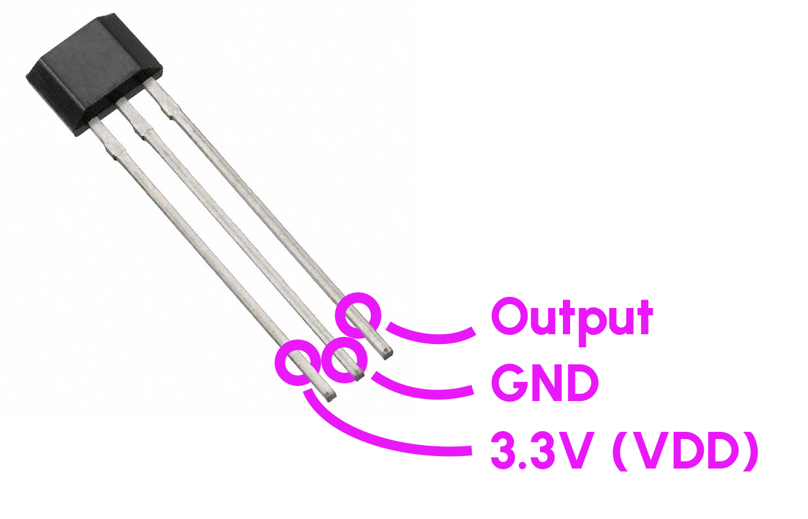
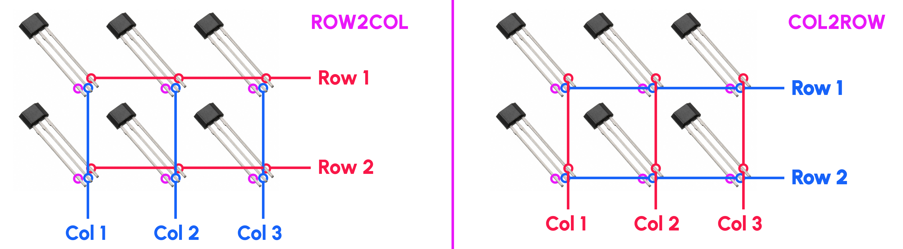

# Magnetic (NIZ) Switches

Unlike mechanical switches that detect keypresses when small metal parts come into contact, magnetic switches trigger when a magnet inside the switch comes in close proximity to a sensor sitting underneath.

Some of the advantages of this design are:

- Longer-ish lifespan (However, mechanical switches last forever. Unless you expect to write more than 500 words per day every day for 50 years, you don't need to care about this)
- Tuneable actuation point (You'll need to spend money on hardware for this though)
- More types of switches! These switches will feel different than MX switches, and whether you prefer them is personal preference.

## NIZ Switches


These switches use a hall effect sensor attached to the socket and a magnet attached to the rubber dome to detect key presses. They are along the lines of [Topre switches](https://deskthority.net/wiki/Topre_switch). These do not have a physical switch. These switches are classified as tactile (depending on the rubber dome used) and are pretty quiet. The rubber dome helps dampen the bottoming out of the keypress as well.

Traditionally, these switches have been used with capacitive switches, but this article does not cover using capacitive sensors.

### Tested Combinations

- [Beekeeb NIZ Switch](https://shop.beekeeb.com/product/niz-ec-switch/) is where the items were purchased for modeling these switches. You may or may not have luck with components from elsewhere.
- [AH3572 Hall Effect Switch](https://www.mouser.com/ProductDetail/Diodes-Incorporated/AH3572-P-B?qs=qSfuJ%252Bfl/d5Je7Vb/Cw%252B6g%3D%3D)
- [2mm x 1mm Disc Magnets](https://www.amazon.com/JUNAN-Neodymium-Magnet-Earth-Magnets/dp/B09V14FGQF)

## Hall Effect Sensors

Hall effect sensors detect magnetic fields. So to detect keypresses, we pair a small magnet with a hall effect sensor.

There are many varieties of hall effect sensors, but they fall into two main categories: binary/switch/ output (on/off) and analog (integer value).

The sensors have 3 legs: Vcc (power), Gnd (ground), and output (high/low or analog)

### Switch Style Sensors

Switch style sensors are going to be easier to implement with keyboard software since the output is just like any other switch, high or low. You may try other switches if you want a different travel before activation to suit your preferences.

### Analog Style Sensors

Analog style sensors are a bit more complicated since you need to use an ADC (Analog to Digital Converter) to read the sensor value. Then you will have to interpret key activations and releases based on the readings. This does allow you to potentially tune the switches to your liking, but make sure you know how to accomplish this with your keyboard firmware (e.g. QMK) and that you have enough ADC inputs to support your needs.

### Wiring: Switch Style Sensors

There are two wiring options: direct pin wiring and matrix wiring. The direct wiring is easier to wrap your head around, but you'll likely find yourself prefering matrix wiring as it reduces the number of pins you'll need on the microcontroller.

I'll assume for this section you're using AH3572 sensors and a microcontroller with 3.3V logic (e.g. RP2040).

#### Direct Wiring

{ width=300 .center }

Connect all of the GND pins to GND on your microcontroller and all the the VDD pins to 3.3V on the microcontroller. Connect each Output pin to a separate I/O pin on the microcontroller. The sensors will be powered all the time, but because each one typically uses less than 0.1µA, the power consumption is extremely minimal.

#### Matrix Wiring

Unlike a mechanical switch, current only flows one direction out of these switches! The AH3572 has what's called an "open drain output". This means current only flows from the Output pin to the GND pin. The output will never be driven to VDD. There's a few important takeaways here:

1. The sensor itself functions as a diode in that current only flows one direction. There is no need for any external diodes; the sensors themselves will prevent ghosting.
2. The keyboard firmware _must_ be drive output pins low, pull input pins high, and detect when input pins fall to low voltage. Luckily, this is how QMK works. If you're using ZMK, you want `GPIO_ACTIVE_LOW` and `(GPIO_ACTIVE_LOW | GPIO_PULL_UP)` for your pins, which runs contrary to what the documentation suggests. I have only tested with QMK, not ZMK.
3. When scanning, we will be turning sensors on and off in groups. These sensors do not immediately detect nearby magnets. Instead, there is a very small Power-On time you must wait before reading. The datasheet advertises this to be 10µs, but I experimentally found 20µs to be reliable. It's an extremely small timespan, but it is important the keyboard firmware wait this long before measuring.

Wire all VDD pins to 3.3V on the microcontroller. You can assign rows/cols between the GND and Output pins. To determine whether your "diode direction" is COL2ROW or ROW2COL, remember that current flows from Output to GND. Therefore, either:

- Wire all GND pins to columns and all Output pins to rows. This is ROW2COL.
- Wire all GND pins to rows and all Output pins to columns. This is COL2ROW.



If you are using QMK, make sure to add this code to your keymap to ensure that the firmware waits 20µs between powering on the sensor and reading:

```c title="keymap.c"
void matrix_output_select_delay(void) {
  wait_us(20); // Wait for magnetic sensor to turn on
}
```

## Assembly

1. Wire the hall effect sensors ([AH3572 Datasheet](https://www.mouser.com/datasheet/2/115/DIOD_S_A0006646941_1-2542859.pdf)).
1. Attach the hall effect sensor to the case. Hotglue works well.
1. (Optional) If you have a spring, put the spring into the socket.
1. Attach the magnet to the rubber dome.
1. Put the rubber dome with magnet into the socket.
1. Put the stem on the rubber dome.
1. Press the housing into the socket. It may be a tight fit.
