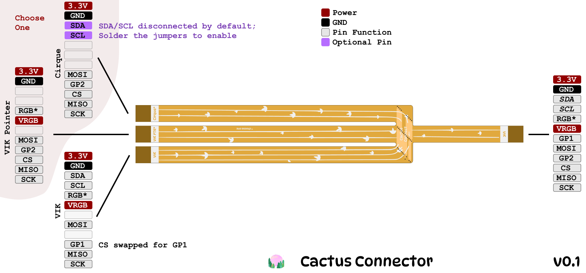
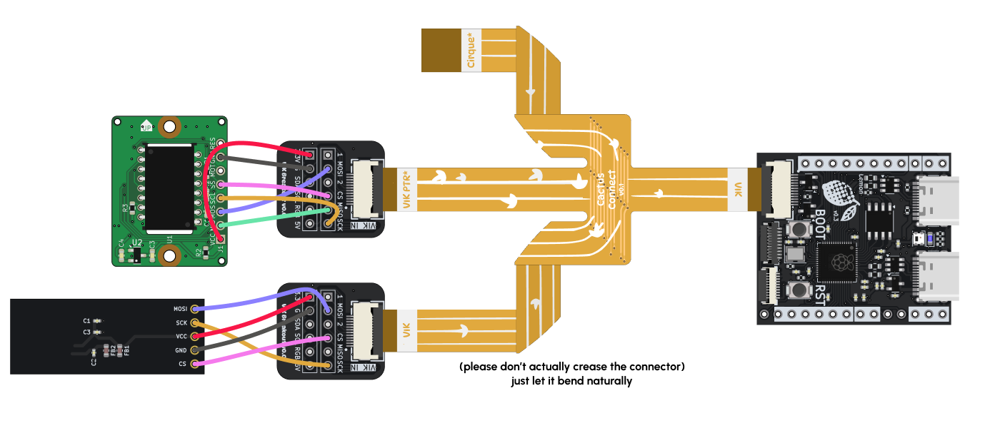
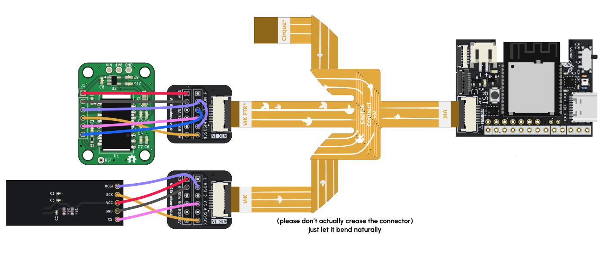
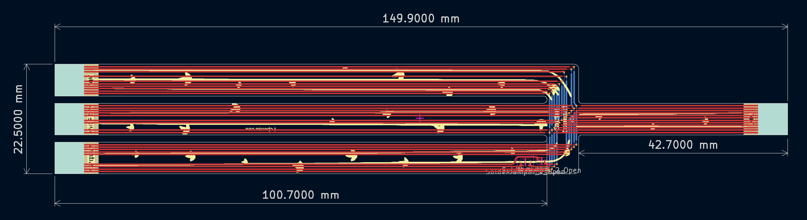

# Cactus Connector

The Cactus Connector is a specialized flexible circuit board that connects multiple peripherals to a single VIK socket! The Lemon Microcontrollers only come with a single VIK socket, so the Cactus Connector will let you simultaneously connect a trackball & display or trackpad & display to just a single microcontroller.

If you're using Cirque trackpads with Lemon microcontroller, the Cactus Connector is required. The Cirque connector is very similar to VIK, but some of its pins conflict with the LED pins on VIK. The Cactus Connect has a specialized Cirque-only branch with the correct routing to avoid these conflicts.

{ width=400 autoplay .center }

In total the Cactus Connector measures 150mm, which is more than enough for most keyboards.

--8<-- "docs/docs/pcbs/.shared/vik-info.md"

## Usage

There are three outputs on the Cactus Connector: VIK, VIK PTR (VIK Pointer), and Cirque. VIK can go to any VIK module as long as it does not use the IO pins GP1 and GP2. For pointing devices you have two options: VIK PTR and Cirque. The Cirque output is meant only for Cirque Glidepoint trackpads. Use VIK Pointer for all other pointing devices, such as trackball sensors and trackpads. GP2 is connected to the Cirque's data ready interrupt.

The Cirque connector leaves the 3 hardware input button pins on the trackpad disconnected. These aren't useful for most keyboard applications. The SDA and SCL lines are also disconnected by default to minimize reflections, but you can solder the two solder jumpers near the branching of the cactus to connect them.

The VIK Pointer connection has I2C disconnected. This was a mistake; if you are using an I2C-based trackpad like [Procyon](https://github.com/george-norton/procyon), you should instead connect it to the Cirque connector and solder the jumpers. GP2 is given to the pointing device so you can use it as an interrupt, but GP1 is not passed through.

The remaining VIK connector has all pins but GP1 and GP2 connected. This means you cannot use it with any VIK modules that require I/O pins, but any other module will work. If you use a SPI module, the CS pin is assigned the input VIK's GP1 so that both this VIK device and the pointer VIK device can be separately selected in case they both use SPI.

### Cutting the Connector

If you are sure you are not going to use a branch of the connector, you can cut it off so that it's not dangling inside your keyboard.

### Can I use 3 Peripherals?

Only if you have a mix of I2C and SPI peripherals. If all 3 use I2C or all use SPI, you can't use them all with the Cactus Connector.

What's supported is:

- An I2C device on the Cirque connector (doesn't necessarily have to be a Cirque trackpad)
- A SPI device on the VIK Pointer connector
- Either an I2C or SPI device on the VIK connector

Keep in mind each connector has limited IO (GP1/GP2) pins coming from VIK, so not all VIK modules will be compatible.

## Examples

I've included two examples here using the Cactus Connector together with VIK breakouts. Most display and trackball sensor PCBs do not support VIK, so you may find yourself having to wire like this. Compared to using a single VIK breakout and running two sets of wires to the peripherals, this way is much neater, especially when you keep the wires between the VIK breakouts and peripherals short.

### Wired Lemon: Display and Trackball through VIK Breakouts

This is how you connect a display and trackball using the same wiring pinouts in the [Lemon Wired](./lemon-wired.md) docs. This example uses the Ogen Lite PCB with a PMW3360/PMW3389.

{width=600 .center}

| Trackball PCB | VIK Breakout |
| :------------ | :----------- |
| VCC           | 3.3V         |
| MIS/MISO      | MISO         |
| MOS/MOSI      | MOSI         |
| SCL/SCK       | SCK          |
| SS            | CS           |
| MOT/MT        | n/a          |
| GND           | GND          |
| RES/RST       | n/a          |

| Display PCB | VIK Breakout |
| :---------- | :----------- |
| VIN         | 3.3V         |
| GND         | GND          |
| MOSI        | MOSI         |
| SCK         | SCK          |
| CS          | CS           |

### Wireless Lemon: Display and Trackball through VIK Breakouts

This is how you connect a display and trackball using the same wiring pinouts in the [Lemon Wireless](./lemon-wireless.md) docs. This example uses the [PMW3610 PCB](https://github.com/siderakb/pmw3610-pcb) that Skree [sells](https://skree.us/products/zmk-compatible-pmw3610-board?ref=cosmos).

If your display uses I2C instead of SPI, connect SDA/SCL instead of MOSI/SCK/CS.

{width=600 .center}

| Trackball PCB | VIK Breakout  |
| :------------ | :------------ |
| VIN           | 3.3V          |
| GND           | GND           |
| SDIO          | MOSI and MISO |
| SCLK          | SCK           |
| nCS           | CS            |
| Mot           | 2             |

| Display PCB | VIK Breakout |
| :---------- | :----------- |
| VIN         | 3.3V         |
| GND         | GND          |
| MOSI        | MOSI         |
| SCK         | SCK          |
| CS          | CS           |

## PCB Drawing and Dimensions

