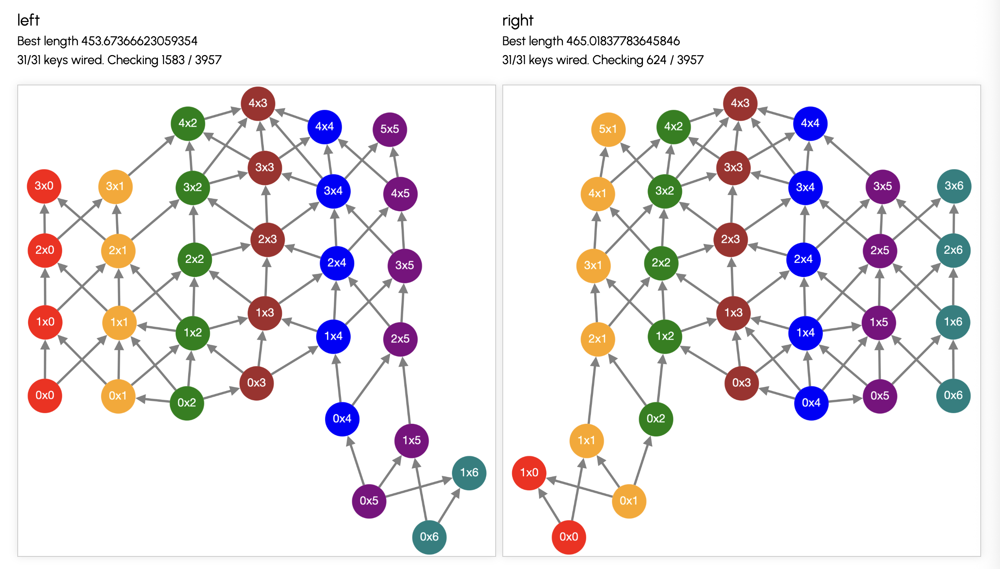
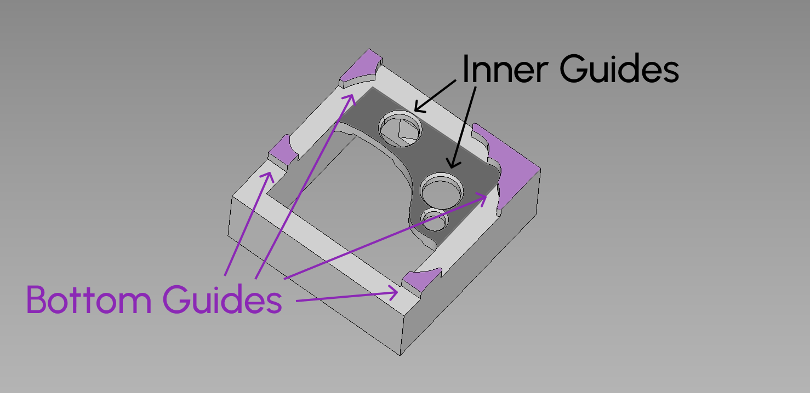
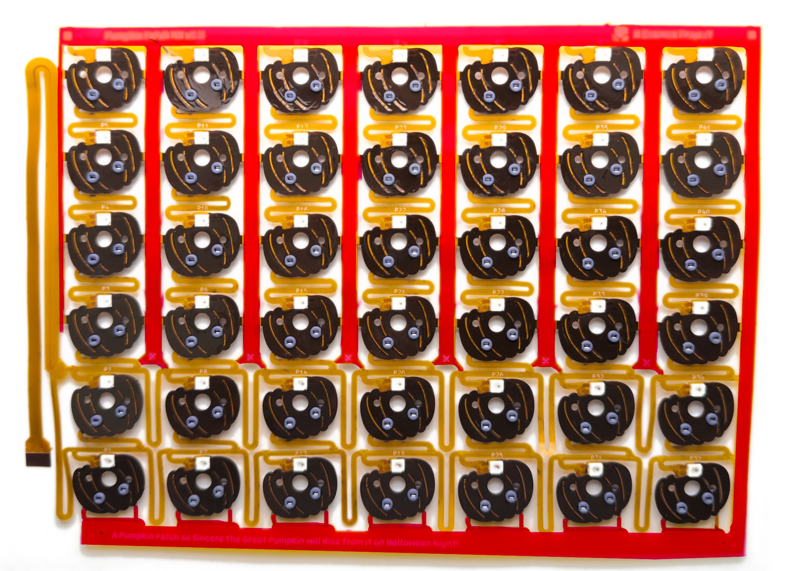
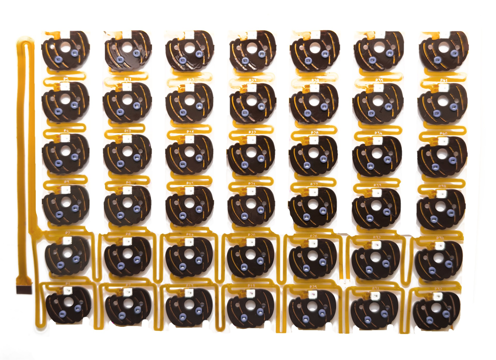
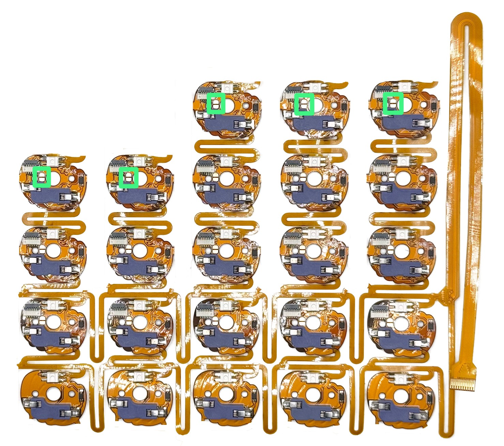
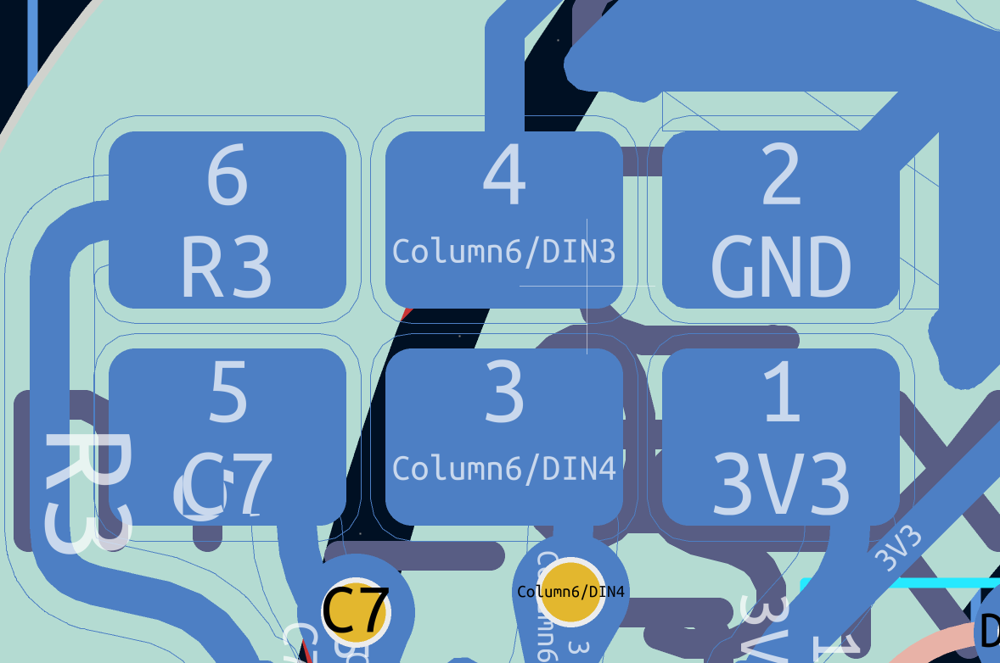

# Pumpkin Patch PCB

The Pumpkin Patch PCB is a flexible circuit board complete with diodes and RGB LEDs to connect your keyboard's switches to your chosen microcontroller with minimal soldering.

If you haven't already, I suggest you check out the [Pumpkin Landing page](https://ryanis.cool/cosmos/pumpkin/) to see it in action.

!!!tip "Fit Check"

    I've made a website for [calculating how to connect your Pumpkin Patch PCB](https://ryanis.cool/cosmos/pumpkin/wiring). It takes into account maximum stretch in all dimensions, so it's a great tool to check whether the Pumpkin Patch PCB will fit your design and to calculate the most efficient way of connecting it.

    If there are a few keys in the thumb cluster that the PCB won't reach, you can use the [Skree Toe Beans](https://cosmos-store.ryanis.cool/products/skree-toe-beans) I re-sell to wire the thumb cluster separately.

    <figure markdown>
    { width=500 .center }
    <figcaption>Here's the wiring for a pretty standard keyboard I put together. See how a Pumpkin Patch covers the whole thing, even the thumb cluster! The different colors are the columns in the PCB, and the red 0x0 is where the connector of the PCB should be.</figcaption>
    </figure>

## Specifications

### Spacing

The PCBs naturally rest at a 20mm vertical spacing and 24mm horizontal spacing. You can compress them to a minimum of 16mm vertically by 18.5mm horizontally or stretch them vertically to a whopping 42mm between centers, more than double their resting length! Each pumpkin is connected with a thin strip of polyimide and copper, so there is little resistance even at full stretch.

The bottom 2 rows are connected with polyimide as well, enabling a maximum horizontal stretch of 50mm. The other rows have no restriction.

From the first PCB to the microcontroller, there is 160mm of stretch. This is likely way longer than you will ever require.

### Sizing

The PCBs are wired under the assumption that every column will have at least 2 keys (so that both rows of vines, plus the pumpkins above and below, are always used).

The only situation where you can use only the bottom vine (1 key on a column) is if you 1) have 4 or fewer columns and 2) will not use the LEDs. For such extremely small boards, the [Plum Twists](https://ryanis.cool/cosmos/plum-twist/) or directly soldering to the switches are a better fit.

!!! info "Limitations for Older Revisions"

    **Prior to v1.1**: The PCBs are wired under the assumption that every column will have at least 3 keys (so that both rows of vines, plus the pumpkins above and below, are always used).

    If there are any columns where you need only two keys (such as in the thumb cluster), you have two options:

    1. Leave 3 keys on the column, and let the 3rd key dangle loose with no switch inside. You can tape/glue it on to secure it.
    2. Cut the column down to 2 keys. You will need to bridge the 3rd and 5th rows from the bottom (R3/R5) across the column that you have cut. Take a wire and solder each end to the hotswap pad furthest from the diode on the pumpkins. If you have cut the first column, you will need to wire the hotswap pads on R3 and R5 directly to the microcontroller.

    **Prior to v1.0**: If you are using this PCB together with a PCB for the thumb cluster, you will either have to use all 7 columns or solder a jumper wire onto the LEDs themselves. This was fixed in v1.0 by adding extra solder jumpers.

### Electrical

Pumpkin Patch PCBs are pin-compatible with TheBigSkree's flex PCBs, so you can interchange them. However, Pumpkin Patch PCBs are different in that they are wired in ROW2COL manner (this is what happens when you paste footprints from the Plum Twists while forgetting to change diode direction).

### Required Hardware

The Pumpkin Patch PCBs terminate in a flex connector. They are suited for connecting directly to the Lemon Microcontrollers. To wire them to a different microcontroller, you can use the [Skree Translator](https://cosmos-store.ryanis.cool/products/skree-translator) to connect them. You cannot solder directly to the flex connector. It is way too tiny.

If they won't cover your thumb cluster, you can use the Pumpkin Patch PCB alongside [Skree Toe Beans](https://cosmos-store.ryanis.cool/products/skree-toe-beans) to connect all your keys. Both of these flexible PCBs plug side by side into the Lemon Microcontrollers or Skree Translator.

## Cosmos Sockets

Currently, there is no backstop to prevent the PCBs from falling out when you remove a switch from your keyboard. This is a work-in-progress effort, but until it's finished, the goal of the socket is to tightly hold onto the PCB so that it does not detach when shaking/moving your keyboard.

The Cosmos socket for the Pumpkin PCB has two types of guides:

{ width=400 .center }

- **Inner Guides**: There are holes for the hotswap socket to fit into printed just below where the switch goes. In practice, I find these require very tight tolerances for a snug print. While these alone will likely not hold onto your PCBs, they provide a good area between the two holes for the hotswap socket to add a dab of glue.

      Because these guides are flush with the underside of the keyboard, I have not any any issue printing these. Supports come off easily and the holes are consistent.

- **Bottom Guides**: These are mounting guides printed on the underside of the keyboard to align the PCB. These fit pretty tightly, so they will do a good job of keeping in the PCB.

      However, because the features are very small and extruded down from the underside, print quality is mediocre. They also require more supports on the underside and make it more difficult to remove supports.

I recommend choosing _Inner Guides & Bottom Guides_, because you get the best of both. If your bottom guides print well, they will help keep in the PCBs. However, if they don't print well and you have to cut them off, you'll still have the inner guides. Before printing any keyboard, I recommend you print the test model from the downloads page so that you can examine the print quality of the socket.

## Cutting

!!!warning "Pay Attention!"

    This is the trickiest part–not because it's difficult to make the cuts, but because if you cut the wrong thing you will break your PCB! Be careful that if you are using scissors, you do not cut part where you intend.

The PCBs come attached in sheets so that everything stays together during shipping. The first step to using them is cutting out all the areas marked in red in this image. I personally like using diagonal cutters for this so you can snip real close to the edge of the pumpkin, but scissors will do. There should not leave any tab remaining: any leftover will cause the pumpkin to not fit into recessed areas.

Afterwards, the PCB should look like this (pardon my bad photoshopping–I'll get a better picture my next build).

As you cut everything out, it will become easy for the circuit to tangle itself. If you know the size to which you will cut each of your columns, I recommend you do some pruning first so it is easier to handle.

**Before cutting the PCB down to your keyboard layout, read over the [sizing](#sizing) section first for some important limitations.**

## Installation

With the switches already inserted, plug in the Pumpkin Patch from the rear. Also plug it into the FPC connector on your microcontroller.

!!!warning "Pay More Attention!"

    The connectors connecting each pumpkin are delicate. If you do crease or even snap a connector, you can handwire directly to hotswap socket side or top of the diode to create row/column connections.

Trim off any remaining unused Pumpkins. If you are cutting between the bottom (1st) or 2nd rows, or 2nd and 3rd rows, leave at least a 1mm stub. For columns that you cut down, there will be a solder jumpers on the tops of the columns that you cut. Solder these so that data signals can correctly flow from the LEDs on one column to the next. In the example below the jumpers are highlighted in green.

{ width=500 .center }

In v1.0 and onwards, there are additional solder jumpers on the second row of PCBs from the bottom. If you cut off an entire column and are using a Pumpkin Vine PCB for the thumb cluster, solder the solder jumper oriented horizontally on your last column to re-establish continuity between the Pumpkin Patch PCB and the Pumpkin Vine PCB. _Picture coming soon_.

The new version also changes out the FPC connectors on the middle two rows for solder pads.

<figure markdown>
{ width=400 }
<figcaption markdown>
From top left to right: Row, DIN, GND  
From bottom left to right: Column, DOUT, LED Voltage (5V not 3V3)
</figcaption>
</figure>

If you cut any of these PCBs off, they effectively turn into minature Plum Twist PCBs... except they don't twist. If you leave them on, you can use these pads in case you make a cut where you weren't supposed to and need to bridge signals across Pumpkins. Just be aware these pads are very small due to them being in a tight spot, so you will need either a fine soldering iron or a very steady and experienced hand.

## Revision History

**v1.1: Useful Fixes**

- Rerouted the PCB so only a minimum of 2 rows is required to connect everything (before 3 rows were needed).
- Fattened power and GND traces so LEDs can be run brighter
- Improved soldering for GND pad (On v1.0, the GND pad was fully connected to the GND fill on the top and right sides. As a result, you might find it difficult to heat up this pad and solder to it, as the pad will sink a lot of heat into the ground fill. In v1.1, it's only connected by a small trace).
- Secured the FPC cable to the frame.

**v1.0: New Connector Scheme**

- Switched middle two rows of FPC connectors to pads.
- Added solder jumpers to the 2nd row from bottom to bridge column's LED data out to PCB data out. This allows you to still have the last Pumpkin Patch LED connected to the first thumb cluster LED, even if you cut off a column from the Pumpkin Patch.
- Cleaned up remaining right-angle connections to robustify the PCB.

**v0.0: Initial Release!**

- It's a Pumpkin Patch!
- Very orange.
- Much Halloween?
