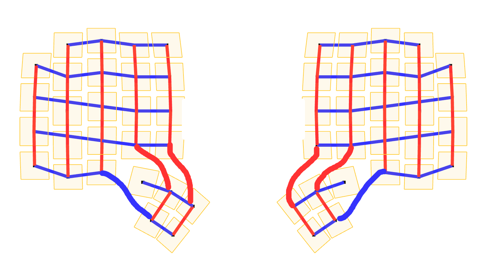
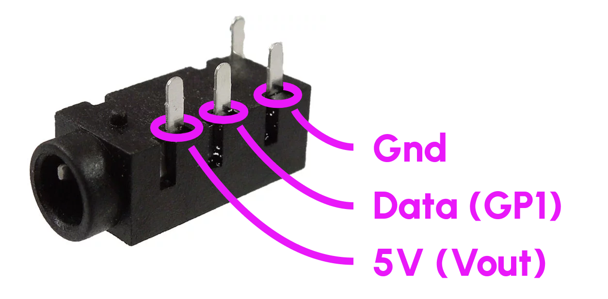
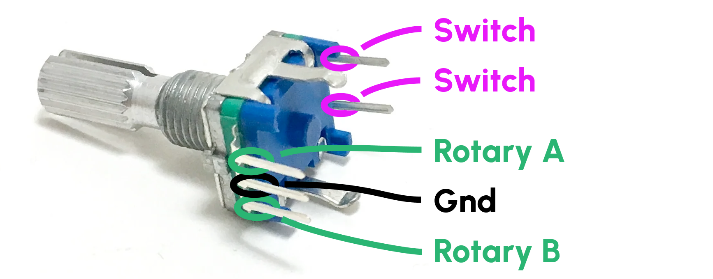
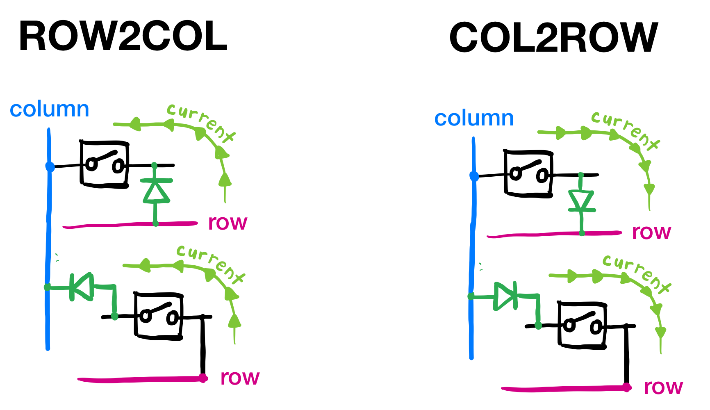
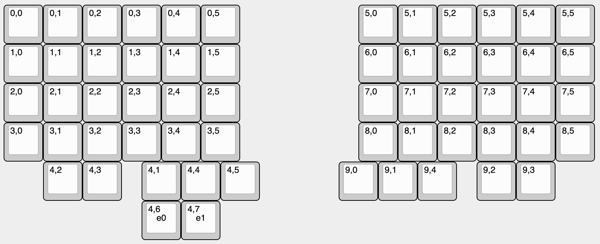
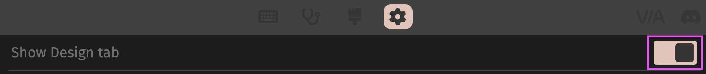
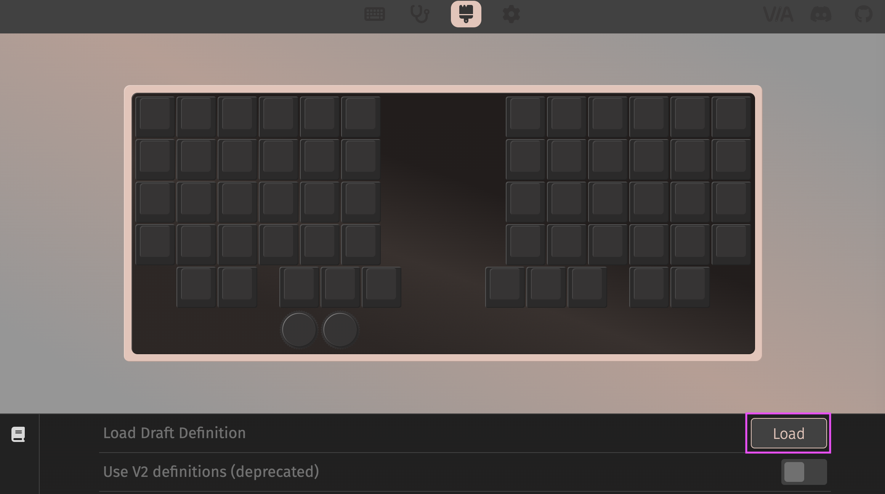

# Program & Wire: QMK on RP2040

Finding comprehensive guides on configuring QMK is rare. Guides on configuring QMK for the RP2040 are rarer. Guides covering QMK for the RP2040 with a custom keyboard configuration from Cosmos don't exist... _until now_.

This guide will take you through

- Wiring your keyboard
- Programming it
- Flashing it

!!! info "Why the RP2040?"

    It's the default microcontroller in Cosmos, and for good reason. Compared to other commonly used boards like the ATmega32U4 (used in the Pro Micro), it's faster, has larger program memory, and is cheaper. There now also exists a RP2350, but that's for another day.

!!! info "Why QMK?"

    I'm a massochist. QMK is awesome when someone else has configured it for you but a terrible pain in the behind if you are the one configuring it. However, if you're using a trackball with a PMW60XX chip, it's necessary. I also really like Via, which requires QMK. Otherwise, you might want to give ZMK (used mostly for wireless keyboards) or KMK (which uses Python as configuration) instead.

## Background: Decisions, Decisions

> QMK is nearly infinitely configurable. Wherever possible we err on the side of allowing users to customize their keyboard, even at the expense of code size. That level of flexibility makes for a daunting configuration experience
>
> \- QMK Docs, "Configuring QMK"

There are many, many different ways to create and wire a keyboard. While this guide doesn't try to force you into any specific configuration, I do have to make a few choices:

- This tutorial is for split keyboards. If yours is not split, you can still use this tutorial but please disregard all split-specific comments.

- Switches are connected with diodes. You can alternatively go diodeless if you have enough pins to connect one key per pin, but I will not cover this.

- The boards are connected via half-duplex Serial (3 wires: ground, power, and data). This makes it convenient to use TRRS connectors, since many audio cables only have 3 pins. That said, you could run these connections over another connector like XLR or USB.

- I use [Bootmagic](https://docs.qmk.fm/features/bootmagic) to enable entering flashing mode by holding down a key when plugging in the keyboard. This feature only works once your keyboard is correctly programmed, so hold off on screwing in your microcontroller for now.

- I'm using [Via](https://www.caniusevia.com/) for adjusting the keyboard layout once the microcontroller is programmed. If you wish to use [Vial](https://get.vial.today/) instead, you'll need to follow their [porting guide](https://get.vial.today/docs/).

- Whether each board is the left or right side is stored in EEPROM. The alternative is to use a pin to detect this, but for those of us using off-the-self microcontrollers flashing EEPROM is easier.

## Wire the Keyboard

Cosmos supports a few options for wiring: soldering directly to the switches, using hotswap sockets with 3D-printed housings, or using PCBs with hotswap sockets. It does not matter which one you choose.

When you wire your switches, you may use any pins but the ones used in the following applicable sections. Pin numbers are specified as `GP#`/`GPIO#`, which refers to the pin number used in the RP2040 chip. Most microcontroller boards match these numbers, so a `20` printed on your silkscreen will be connected to `GP20`. If you're using the KB2040, refer to the [pinout](https://learn.adafruit.com/adafruit-kb2040/pinouts) to learn which GPIO numbers of all the pins.

### Key Matrix

{ width=500 .center }

Cosmos will suggest a matrix in which to wire the keys under the _Programming_ tab, but it's incorrect so _you should not use it verbatim_. The rules for wiring the keys are pretty simple:

1. Every key has a row wire and column wire connected to it.
2. No two keys share _both_ the same row _and_ column wire.
3. If your microcontroller has few pins, you'll need to be creative in how you minimize the total number of rows and columns.

The image above is a Cosmos wiring diagram I fixed by adding the fatter squiggly lines. Once you've decided on a matrix, wire all the row wires to one side of the microcontroller and the column wires to the other side. I recommend you stay consistent between the two keyboard halves, so if you assign rows to D2-D8 on the left half of the keyboard, use D2-D8 for rows also on the right half.

### TRRS Interconnection

GP1 is used as the data line, so **do not wire it to switches**. If you do connect it to a switch, make sure to choose a new data pin and specify it in `info.json` (covered later).

There is no recommended way to wire a TRRS as long as you are consistent between both halves. This is how I personally do it.

{ width=250 .center }

!!! info "Notes on TRRS"

    TRRS jacks come in 4-pin and 3-pin varieties, and QMK supports using either 3 pins or all 4 pins. I choose the 3-pin wiring because it makes your keyboard work with a much larger variety of TRRS cables. Regardless of whether you choose 3 pins or 4 pins, the PJ-320A connector is the easiest to source so that's what Cosmos uses.

    Some boards have both Vin and Vout pins. Vout is directly connected to microcontroller power, whereas Vin has extra circuitry that ensures current only flows *in* to Vin. This prevents backpowering (e.g. if you've connected Vin to 4V and plugged in USB (5V), these power sources won't be shorted. Nevertheless, we'd like to be able to power our keyboards from either half, and the only power the keyboard receives is from USB, so it's safe to connect Vout to Vout.

    Vout is 5V power, and on other microcontrollers it's called **RAW** or **VBUS** or if neither of those apply then **VSYS**. I don't recommend using the 3.3V pin in its place, unless you are absolutely sure you won't be adding LEDs and have a robust cable (voltage drop from resistance within the cable/connectors is ok over the 5V wire but not ok over 3.3V).

### Encoders

Encoders have two functions: they record rotations and presses. When pressed down, the encoder behaves like a regular keyboard switch. You should wire up the two switch pins with diodes up to the matrix, just like you do for the keys. The rotational pins A and B are digital and can be assigned to any spare pins on the microcontroller.

{ width=350 .center }

### Trackball

I cover the PMW3360 and PMW3389 sensors. PCBs for these have the same pinouts and have labeled pins (how nice!) so I'll simply suggest how you wire these:

- VI: 3.3V
- MI: GP20 (labeled MISO on KB2040)
- MO: GP19 (labeled MOSI on KB2040)
- SC: GP18 (labeled SCK on KB2040)
- SS: GP10 (can be any digital pin)
- GD: GND

You do not need to connect the MT pin (motion trigger).

### LEDS

If you are using SK6812 MINI-E LEDs and following the specifications to the T, what you should do is connect the LED power to 5V and add a 3.3V-to-5V level translator between the first LED's data input and the pin on the microcontroller you've chosen for LED data. A cheap way to get a level translator is to use one of the LEDs as the level translator (referred to as a "sacrificial LED"). It might not light up, but all LEDs afterwards in the chain should.

Some microcontrollers like the [Sea Picro](https://github.com/joshajohnson/sea-picro) and the upcoming [Lemon microcontroller](https://github.com/rianadon/Cosmos-Keyboard-PCBs/?tab=readme-ov-file#lemon-microcontroller) have built-in level translators for LEDs. So just make sure you're using 5V and the proper LED pin.

The other option which I begrugingly recommend to you is to power the LEDs off of the 3V3 supply. This empirically works reliably even though it's out-of-spec. The one downside that you must take into account is that white LEDs on full brightness can consume a lot of power, but the 5V -> 3V regulator on microcontrollers are typically rated to less than 1 amp. So before you turn the LEDs up to full brightness, look up what voltage regulator your microcontroller is using and its maximum current and keep in mind that a single LED uses ~50mA when turned white on full brightness. For example, a Pi Pico's voltage regulator has an 800mA limit, so you can potentially fry your microcontroller if running more than 16 LEDs on 100% white.

Now, consider whether you really need such bright lights. Most people don't (personally I use non-white colors on 20% brightness), and so 3.3V power works just fine.

## QMK Setup

First [install QMK](https://docs.qmk.fm/newbs_getting_started). If you already use Arduino and have installed the RP2040 core, you can [simplify the install process](https://gist.github.com/rianadon/b4bb13098d2baa6c3080f4c497a537eb) (instructions are Mac-specific).

## Configuration

Navigate to the qmk home folder that `qmk setup` generated. We'll be creating a home for all your settings inside the `keyboards/handwired` folder.

1. Decide on a name for your keyboard. I'll be using `Cosmotyl` here. Make sure to replace `Cosmotyl` with the name of your keyboard wherever you see it in source code of filenames.

2. Find a configuration already in QMK that has a similar key layout to your keyboard. `keyboards/handwired/dactyl_manuform` has a lot of good ones. Copy yous chosen folder (eg `keyboards/handwired/dactyl_manuform/4x5`) to `keyboards/handwired/cosmotyl`.

3. If your folder has a `folder.c` or `folder.h` files, where `folder` is the original name of the folder you copied (eg `4x5`), delete them.

4. Edit `info.json`. We'll edit this to look like the following:

   ```json title="info.json"
   {
       "keyboard_name": "Cosmotyl",
       "manufacturer": "Cosmos",
       "url": "ryanis.cool",
       "maintainer": "rianadon",
       "usb": {
           "vid": "0x444D",
           "pid": "0x3435",
           "device_version": "0.0.1"
       },
       "processor": "RP2040",
       "bootloader": "rp2040",
       "diode_direction": "ROW2COL",
       "split": {
           "soft_serial_pin": "GP1",
           "bootmagic": {
               "matrix": [0, 0]
           }
       },
       "layouts": {
           "LAYOUT": {
               "layout": [
                   { "matrix": [0, 0], "x": 0, "y": 0 },
                   { "matrix": [0, 1], "x": 1, "y": 0 },
                   { "matrix": [0, 2], "x": 2, "y": 0 },
                   { "matrix": [0, 3], "x": 3, "y": 0 },
                   ...
               ]
           }
       }
   }
   ```

!!! info "Autogenerating info.json"

    QMK has a neat little [converter site](https://qmk.fm/converter/) that will create an `info.json` based off of the KLE data (remember, you can export KLE from Cosmos). It won't have everything we need, but it's a great time-saver.

QMK is a little confusing in that a lot of settings are configurable _both_ in `info.json` and in the C source code. The configuration you copied might be missing some of these options or might even have extra options. Either way, make it look like this.

1. Unless you plan to sell your keyboard, the `vid` and `pid` settings are arbitrary. Just try to make sure they are unique for your keyboard. I've never seen `device_version` matter in practice: it's simply a way for you to specify the version of your firmware through usb.

2. Make sure to set `diode_direction` to whichever way the current flows in your diode wiring. Remember that the bar printed on the diode is the cathode, so it's where the "current flows to". An easy way to remember this is remembering the symbol for a diode, in which the arrow is pointing to the cathode bar. If this picture doesn't make sense, just try both! Only one of these directions will work.

{ width=400 .center }

3. I recommend keeping the `split` settings as I wrote them here. I use `GP1` as the serial data line (so don't connect it to any switches!) The `[0,0]` in the `matrix` option refers to the top-left key in the left side of your keyboard. Holding it down when plugging in the keyboard will make it enter bootloader mode.

4. Underneath `layouts` is where the magic happens. Here you will list all the keys, left to right across both halves then top to bottom. The `x` and `y` values are only used by `qmk info -l` and QMK configurator, neither of which you will use in this guide. However, you should still set them! You can start them at `10` on the right side to create a gap between both sides.

   First start with the left side and list starting from `[0,0]` to `[0,C-1]`, where `C` is the number of columns in one half. Then, list from `[R,C-1]` to `[R,0]`, where `R` is the number of rows in one half. Then list the next row. Add keys with matrix positions `[1,0]` to `[1,C-1]`, then `[R+1,C-1]` to `[R+1,0]`.

   Things are this way because to QMK, the left and right sides are combined into the same matrix where they share the same rows but the right side has its own rows placed under the left side. Wouldn't it make more sense to share rows but have different columns? Beats me.

   I reverse the columns when listing the right-side keys because I assume you've wired the keyboards as mirror inverses of each other. If the left outermost key is wired to GP2, the right outermost key should also be wired to GP2. Say GP2 is column 0. You should now see why when listing a row we start with `[0,0]` and end with `[R,0]` (both column 0).

   By the end of this, you should have exactly as many items in your layout configuration as you have keys in your keyboard, including encoders. Remember, the encoder switch pins are wired like the keys.

5. Edit `config.h`, creating it if there is none. Edit it to look like this:

   ```c title="config.h"
   #pragma once

   #define EE_HANDS // Store which side I am in EEPROM

   /* Keyboard matrix assignments */
   #define MATRIX_ROW_PINS { GP29, GP28, GP27, GP26, GP22 }
   #define MATRIX_COL_PINS { GP2, GP3, GP4, GP5, GP6, GP7, GP8, GP9 }

   /* Encoders */
   #define ENCODERS_PAD_A { GP21, GP20 }
   #define ENCODERS_PAD_B { GP18, GP19 }

   /* Trackball */
   #define SPI_DRIVER SPID0
   #define SPI_SCK_PIN GP18
   #define SPI_MISO_PIN GP20
   #define SPI_MOSI_PIN GP19
   #define POINTING_DEVICE_CS_PIN GP10
   #define ROTATIONAL_TRANSFORM_ANGLE -30 // Optional: Rotates the trackball
   #define POINTING_DEVICE_INVERT_X // Optional: Inverts trackball X

   /* Reset */
   #define RP2040_BOOTLOADER_DOUBLE_TAP_RESET
   #define RP2040_BOOTLOADER_DOUBLE_TAP_RESET_LED GP17
   // This LED blinks when entering bootloader
   ```

   If you are not using a trackball or encoder, you should omit these sections.

   When listing out `MATRIX_ROW_PINS`, make sure to start at row 0, the topmost row. Likewise, when listing `MATRIX_COL_PINS`, make sure to start at column 0, the outermost column. If you need to specify a different set of row or column pins for the right side or different encoder pins for the right side, add a second set of configurations and append `_RIGHT` to the property names (eg `MATRIX_ROW_PINS_RIGHT` and `MATRIX_COL_PINS_RIGHT`).

   We could also be putting this information in `info.json`. The reason I specify it here is that `info.json` does not support using different settings for the left and right sides.

6. If you are using a trackball, add a `mcuconf.h` with these contents:

   ```c title="mcuconf.h"
   #pragma once

   #include_next <mcuconf.h>

   // Set up SPI
   #undef RP_SPI_USE_SPI0
   #define RP_SPI_USE_SPI0 TRUE
   ```

7. Edit `rules.mk`

   ```makefile title="rules.mk"
   # Build Options
   #   change yes to no to disable

   AUDIO_SUPPORTED = no
   RGB_MATRIX_SUPPORTED = yes
   RGBLIGHT_SUPPORTED = yes
   BOOTMAGIC_ENABLE = yes
   EXTRAKEY_ENABLE = yes
   SPLIT_KEYBOARD = yes
   SERIAL_DRIVER = vendor

   # Trackball
   POINTING_DEVICE_ENABLE = yes
   POINTING_DEVICE_DRIVER = pmw3389 # Change to pmw3360 if you use that

   # Encoder
   ENCODER_ENABLE = yes
   ENCODER_MAP_ENABLE = yes
   ```

   As before, omit the trackball and encoder sections if they are not applicable to you.

8. At this point you should have 6 items in your folder: `config.h`, `info.json`, `keymaps`, `mcuconf.h`, `readme.md`, and `rules.mk`. If there are any other files, delete them.

### The Keymap

Because I'll be using Via, create a folder `keymaps/via`. In it create a `keymap.c`. If you copied over a keyboard with similar key layout to yours, then you can copy whatever is its `via` folder or `keymaps/default` folder. You won't have to change much. If you're starting from scratch, here's an example to get you started:

```c title="keymap.c"
#include QMK_KEYBOARD_H

const uint16_t PROGMEM keymaps[][MATRIX_ROWS][MATRIX_COLS] = {

    [0] = LAYOUT(
        KC_ESC,  KC_1,    KC_2,    KC_3,    KC_4,    KC_5,    KC_6,    KC_7,    KC_8,    KC_9,    KC_0,    KC_MINS,
        KC_TAB,  KC_Q,    KC_W,    KC_E,    KC_R,    KC_T,    KC_Y,    KC_U,    KC_I,    KC_O,    KC_P,   KC_LBRC,
        KC_CAPS, KC_A,    KC_S,    KC_D,    KC_F,    KC_G,    KC_H,    KC_J,    KC_K,    KC_L,    KC_SCLN, KC_QUOT,
        KC_LSFT, KC_Z,    KC_X,    KC_C,    KC_V,    KC_B,    KC_N,    KC_M,    KC_COMM, KC_DOT,  KC_SLSH, KC_RSFT,
        KC_LBRC, KC_RBRC, KC_LCTL, KC_LGUI, KC_LALT, KC_ESC,  QK_BOOT,  KC_RALT, MO(1),   KC_LEFT, KC_LBRC, KC_RBRC
    ),

    [1] = LAYOUT(
        _______, KC_F1,   KC_F2,   KC_F3,   KC_F4,   KC_F5,   KC_F6,   KC_F7,   KC_F8,   KC_F9,   KC_F10,  KC_F11,
        _______, _______, _______, _______, _______, _______, _______, _______, _______, _______, _______, _______,
        _______, _______, _______, _______, _______, _______, _______, _______, _______, _______, _______, _______,
        _______, _______, _______, _______, _______, _______, _______, _______, _______, _______, _______, _______,
        _______, _______, _______, _______, _______, _______, _______, _______, _______, _______, _______, _______
    ),

    [2] = LAYOUT(
        _______, _______, _______, _______, _______, _______, _______, _______, _______, _______, _______, _______,
        _______, _______, _______, _______, _______, _______, _______, _______, _______, _______, _______, _______,
        _______, _______, _______, _______, _______, _______, _______, _______, _______, _______, _______, _______,
        _______, _______, _______, _______, _______, _______, _______, _______, _______, _______, _______, _______,
        _______, _______, _______, _______, _______, _______, _______, _______, _______, _______, _______, _______
    ),

    [3] = LAYOUT(
        _______, _______, _______, _______, _______, _______, _______, _______, _______, _______, _______, _______,
        _______, _______, _______, _______, _______, _______, _______, _______, _______, _______, _______, _______,
        _______, _______, _______, _______, _______, _______, _______, _______, _______, _______, _______, _______,
        _______, _______, _______, _______, _______, _______, _______, _______, _______, _______, _______, _______,
        _______, _______, _______, _______, _______, _______, _______, _______, _______, _______, _______, _______

    )
};

const uint16_t PROGMEM encoder_map[][NUM_ENCODERS][2] = {
  [0] =   { ENCODER_CCW_CW(KC_VOLD, KC_VOLU), ENCODER_CCW_CW(KC_RIGHT, KC_LEFT)  },
  [1] =   { ENCODER_CCW_CW(KC_VOLD, KC_VOLU), ENCODER_CCW_CW(KC_RIGHT, KC_LEFT)  },
  [2] =   { ENCODER_CCW_CW(KC_VOLD, KC_VOLU), ENCODER_CCW_CW(KC_RIGHT, KC_LEFT)  },
  [3] =   { ENCODER_CCW_CW(KC_VOLD, KC_VOLU), ENCODER_CCW_CW(KC_RIGHT, KC_LEFT)  }
};
```

This was for a 4 row / 6 column keyboard with an extra row for 2 keys below ++x++/++c++ and ++","++/++"."++, 3 modifier keys per side, and 2 encoders. In total that's 60 keys. You'll also see that this configuration has 4 layers. The encoder map also has different functions on each layer!

When adapting to your keyboard, make sure the number of items in each of the 4 layers in the `keymaps` array matches the number of keys that you have. Also make sure you do not have any trailing commas, for they will count as an extra key.

To enable Via, edit `rules.mk`.

```makefile title="rules.mk"
VIA_ENABLE = yes
```

### RGB Matrix

If you are using per-key LEDs, you will need to [configure their positions in QMK](https://docs.qmk.fm/features/rgb_matrix). First add the following to `info.json`:

```json
"rgb_matrix": {
    "driver": "ws2812"
    "split_count": [18, 18]
}
```

Then add a `cosmotyl.c` (remember to change the filename to the name of your keyboard). I've adapted this code from the BastardKB Charybdis keyboard.

```c title="cosmotyl.c"
#include "quantum.h"

#ifdef RGB_MATRIX_ENABLE
led_config_t g_led_config = { {
    /* Key Matrix to LED index. */
    // Left split.
    {      2,      3,      8,      9,     12 }, // Top row
    {      1,      4,      7,     10,     13 }, // Middle row
    {      0,      5,      6,     11,     14 }, // Bottom row
    {     17, NO_LED,     15,     16, NO_LED }, // Thumb cluster
    // Right split.
    {     20,     21,     26,     27,     30 }, // Top row
    {     19,     22,     25,     28,     31 }, // Middle row
    {     18,     23,     24,     29,     32 }, // Bottom row
    {     33, NO_LED,     34, NO_LED, NO_LED }, // Thumb cluster
}, {
    /* LED index to physical position. This is used for key effects.
       Positions range from { 0..224, 0..64 }. */
    // Left split.
    /* index=0  */ {   0,  42 }, {   0,  21 }, {   0,   0 }, // col 1 (left most)
    /* index=3  */ {  18,   0 }, {  18,  21 }, {  18,  42 }, // col 2
    /* index=6  */ {  36,  42 }, {  36,  21 }, {  36,   0 },
    /* index=9  */ {  54,   0 }, {  54,  21 }, {  54,  42 },
    /* index=12 */ {  72,   0 }, {  72,  21 }, {  72,  42 },
    /* index=15 */ {  72,  64 }, {  90,  64 }, { 108,  64 }, // Thumb cluster
    // Right split.
    /* index=18 */ { 224,  42 }, { 224,  21 }, { 224,   0 }, // col 10 (right most)
    /* index=21 */ { 206,   0 }, { 206,  21 }, { 206,  42 }, // col 9
    /* index=24 */ { 188,  42 }, { 188,  21 }, { 188,   0 },
    /* index=27 */ { 170,   0 }, { 170,  21 }, { 170,  42 },
    /* index=30 */ { 152,   0 }, { 152,  21 }, { 152,  42 },
    /* index=33 */ { 134,  64 }, { 152,  64 }, {   0,   0 },
}, {
    /* LED index to flag. */
    // Left split.
    /* index=0  */ LED_FLAG_KEYLIGHT, LED_FLAG_KEYLIGHT, LED_FLAG_KEYLIGHT, // col 1
    /* index=3  */ LED_FLAG_KEYLIGHT, LED_FLAG_KEYLIGHT, LED_FLAG_KEYLIGHT, // col 2
    /* index=6  */ LED_FLAG_KEYLIGHT, LED_FLAG_KEYLIGHT, LED_FLAG_KEYLIGHT,
    /* index=9  */ LED_FLAG_KEYLIGHT, LED_FLAG_KEYLIGHT, LED_FLAG_KEYLIGHT,
    /* index=12 */ LED_FLAG_KEYLIGHT, LED_FLAG_KEYLIGHT, LED_FLAG_KEYLIGHT,
    /* index=15 */ LED_FLAG_MODIFIER, LED_FLAG_MODIFIER, LED_FLAG_MODIFIER, // Thumb cluster
    // Right split.
    /* index=18 */ LED_FLAG_KEYLIGHT, LED_FLAG_KEYLIGHT, LED_FLAG_KEYLIGHT, // col 10
    /* index=21 */ LED_FLAG_KEYLIGHT, LED_FLAG_KEYLIGHT, LED_FLAG_KEYLIGHT, // col 9
    /* index=24 */ LED_FLAG_KEYLIGHT, LED_FLAG_KEYLIGHT, LED_FLAG_KEYLIGHT,
    /* index=27 */ LED_FLAG_KEYLIGHT, LED_FLAG_KEYLIGHT, LED_FLAG_KEYLIGHT,
    /* index=30 */ LED_FLAG_KEYLIGHT, LED_FLAG_KEYLIGHT, LED_FLAG_KEYLIGHT,
    /* index=33 */ LED_FLAG_KEYLIGHT, LED_FLAG_KEYLIGHT, LED_FLAG_KEYLIGHT, // Thumb cluster
} };
#endif
```

## QMK Debugging

I recommend turning on the debug console, as it is very useful debugging wiring issues. You'll need to change two files:

1. In your `keymap.c`, add the following lines:

```c title="keymap.c"
void keyboard_post_init_user(void) {
  debug_enable=true;
  debug_matrix=true;
}
```

2. If you have `"features"` defined in your `keyboard.json`, enable console like so:

```json title="keyboard.json"
"features": {
  ...
  "console": true
}
```

Otherwise, add `CONSOLE_ENABLE=yes` to `rules.mk`.

Upload your program to the microcontroller, then run `qmk console`. You'll see output like this whenever you press a key on your keyboard:

```
  012345
0 00000
1 01000
2 00000
3 00000
4 00000
5 00000
```

The numbers represent rows and columns of the wiring matrix, and a `1` indicates a key that is currently being pressed down. You should be able to press every key on your keyboard and see the corresponding `1` appear in the matrix. If you don't see any messages printed when you press the key, check your wiring.

_Thank you MoonDoggy for compiling these debugging instructions on the Cosmos Discord!_

## Setting up Via

Instead of reading your keyboard configuration over USB like Vial does, Via needs to be told how your keyboard is laid out. In order to do this you'll need to recreate your keyboard in the [Keyboard Layout Editor](http://www.keyboard-layout-editor.com/) website.

You can skip recreating the layout by exporting to KLE directly from Cosmos. Head to the programming page then click **Download KLE Layout**. However, this layout will not look as nice as one created by hand, so you may still wish to create the layout yourself.

In the top legends of the keyboard you'll need to enter the matrix positions, for example `0,0`. If you have any encoders, in the center legend (the center textbox) enter `e0` for the first encoder, `e1` for the second, etc. Here's what the finished layout might look like:

{ width=550 .center }

Once you're done, click the Raw Data tab in the Keyboard Layout Editor and copy the data. Then create a JSON file with the following content, in any folder you like (you can keep this file outside the firmware folder):

```javascript title="cosmotyl-via.json"
{
  "name": "Cosmotyl",
  "vendorId": "0x444D",
  "productId": "0x3435",
  "matrix": {
    "rows": 10,
    "cols": 8
  },
  "keycodes": [
    "qmk_lighting"
  ],
  "menus": [
    "qmk_rgblight"
  ],
  "layouts": {
    "keymap": [
      # PASTE YOUR RAW DATA FROM KLE HERE
    ]
  }
}
```

There are a few items to edit:

1. Make sure that `vendorId` and `productId` match the `vid` and `pid` from your `info.json`.
2. `rows` should be set to double the number of rows in your keyboard (remember that the matrix coordinates share columns but not rows).
3. `columns` should be set to the number of columns in one side of your keyboard.
4. Make sure to paste in your KLE data under `keymap`.

For more information on the options for this JSON file, refer to the [Via documentation](https://www.caniusevia.com/docs/layouts).

Once you're done, open Via and click the settings gear. Make sure that "Show Design tab" is enabled.

{ width=500 .center }

Then open the design tab and click **Load** next to "Load Draft Definition".

{ width=600 .center }

Select the JSON file you created, and if all goes well your keyboard design will now be imported into Via. You can preview it by selecting it next to "Show Keyboard Definition".

## Compiling and Flashing

I compile and flash all in one command:

```bash
qmk flash -kb handwired/cosmotyl -km via -bl uf2-split-left # For left side
qmk flash -kb handwired/cosmotyl -km via -bl uf2-split-right # For right side
```

These commands will compile the `.uf2` firmware file and write it to the microcontroller, so make sure that you've entered bootloader mode. You can either do this by holding the **boot** button when plugging in the microcontroller or pressing the **reset** button while holding down **boot**.

If you're changing the number of keys or the key mappings with Via enabled, then you will need to clear the EEPROM. This is because Via stores its keymappings in a different part of flash memory than your program, so program changes will not touch the Via keys. You can either hold down the bootmagic key when plugging in the keyboard (it both enters bootloader and clears EEPROM) or in Via assign a key to `QK_CLEAR_EEPROM` (Special->Any) then press that key. It does not matter which key you assigned because your Via configuration will be wiped. After Via's configuration is wiped, the key configuration will be copied from your program.
