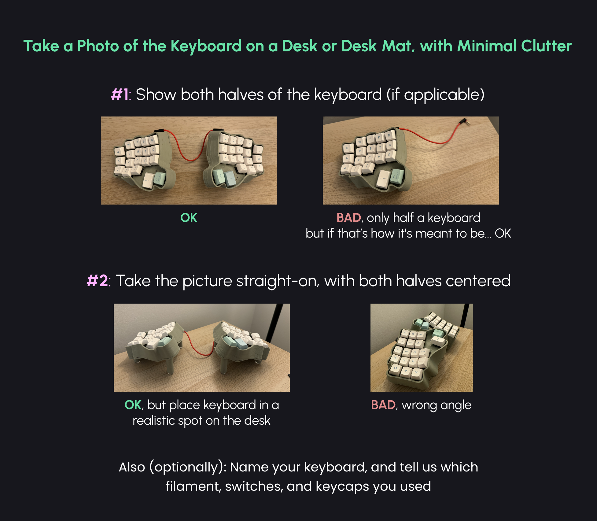

# Showcase Guidelines

{ .center width=600 }

## Requirements

The bare minimum requirements for me adding a keyboard to the showcase is:

- An image of the keyboard
- A link to the keyboard's configuration in Cosmos
- The keyboard must be unique

Additionally, things I like that you include are:

- What filament you used
- What switches you used
- What keycaps you used

And very optional things:

- Name your keyboard
- Add more than one image
- A description / any extra information that may help others (see [Limbo](http://localhost:5173/showcase/d85e682f/) for an example of what I mean)
- A different profile picture or username than what you use on Discord or GitHub

## How Things Are Added to The Showcase

Almost every keyboard in the showcase has been a result of me asking the original poster if they'd like their keyboard in the showcase, then receiving the extra required informaion.

However, if you are adventurous you can also open a pull request against the Cosmos repository to add your keyboard to the showcase. Follow the instructions [here](https://github.com/rianadon/Cosmos-Keyboards/issues/43#issuecomment-2594455810) for that.
