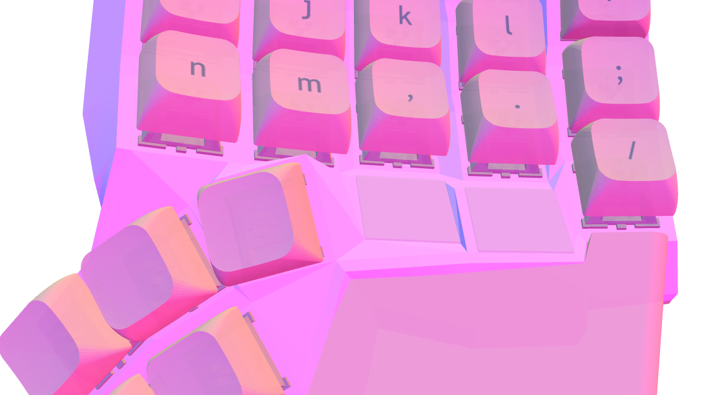
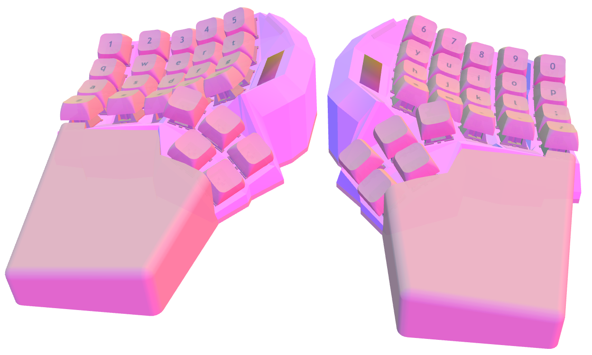
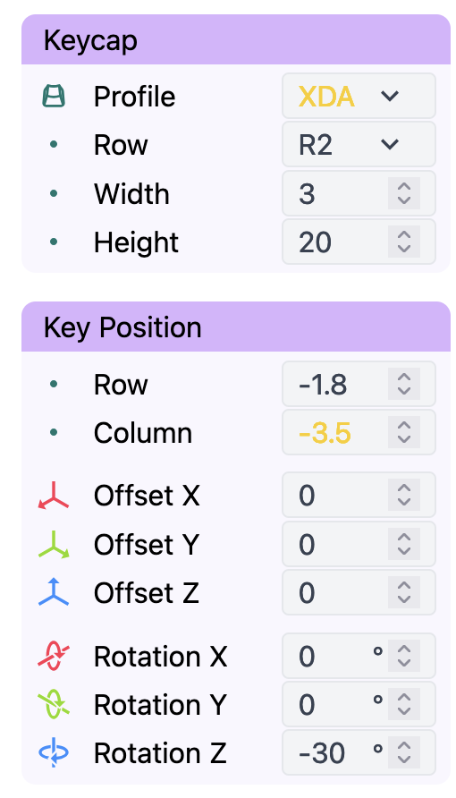
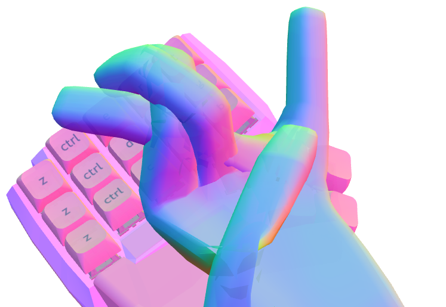

# Tips and Tricks

I wanted to write about a few little tricks that you can use to make Cosmos do what you want it to do.

## Shaper Keys

{ .center width=400 }

You can convert any key to a Shaper Key by selecting it then using the dropdown at the top. They're useful for enforcing that Cosmos makes space for a key while filling in the same area.

By default, Shaper Keys appear as a faint, elevated rectangle in Cosmos. However, they will print flat. To preview the keyboard exactly as it will print, use _⚙ → Hide Shapers_.

You can also customize the size of a shaper key by selecting it then opening the _Edit Key_ menu. This makes Shaper Keys a super powerful tool for correcting geometry issues or tweaking the shape of the case.

[Here's](https://ryanis.cool/cosmos/beta#cm:CrkBChESBRCAPyAnEgASABIAODFAAAoREgUQgEsgJxIAEgASADgdQAAKHhIFEIBXICcSABIAEgMQsC8SBQgIELBfOAlAgPC8AgobEgUQgGMgJxIAEgASAxCwOxIFCAgQsGs4CkAAChUSBRCAbyAnEgASABIAOB5AgIaKwAcKLhIRCAgQECAjKB4wyAFIgICsrAESBAgRIAASDwgIIB4oHjDIAUiAgLCsAThFQAAYAEDohaCu8FVI3PCioAEKigEKKxITEMCAAkCAgJgCSMKZoJWQvAFQQxISQICAzAJIwpmglZC8AVCGAVg6OAgKFRIQEEBAgIAgSNCVgN2Q9QNQC1CeAgonEhAQQECAgPgBSOaZ/KeQC1BXEhFAgICkA0jwmcS10DBQdFiVAVB/GAIiCgjIARDIARgAIABAy4v8n9AxSK2R3I3BkwaCAQIEAg==) an example of using shaper keys to bring out the wall boundary to smoothly incorporate OLED displays. The two shaper keys are 3 × 20mm wide. Can you see them?

{ .center width=550 }

Each of these shaper keys is configured with a modified _Row_ value so that it's placed precisely where i'd like within the column's curvature. It's also given a _Rotation Z_ so that it's rotated.

{ .center width=200 }

## Microcontroller Placement

If your microcontroller is ending up in a weird spot, you can fix it by changing _Advanced → Connector Index_. You'll need to guess-and-check to figure out this value.

The method I have to do this is:

1. Set connector index to something outrageously big, like 1000.
2. The editor will complain and tell you what the maximum connector index actually is.
3. Guess a few values between 0 and the maximum value.
4. Binary search until you find the perfect value. The connector index can be a decimal!

There's more documentation about connector index in the [Expert Mode documentation](expert.md#microcontrollers-and-screw-inserts).

## Undo

There are a two ways to undo in Cosmos: you use the browser back button, or press ++ctrl+z++ (++cmd+z++ on Mac).

{ .center width=400 }
